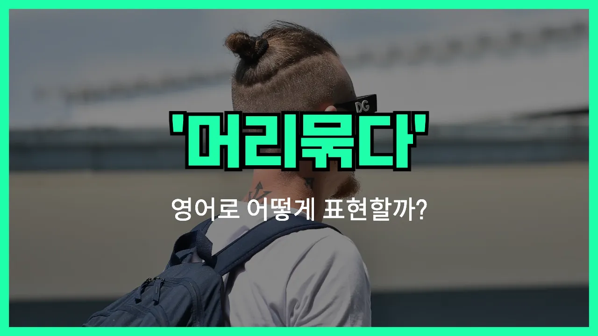

## 🌟 영어 표현 - put hair up

안녕하세요 👋 오늘은 "머리를 올리다", 즉 머리를 위로 묶거나 올린다는 뜻의 영어 표현에 대해 이야기해볼게요. 우리가 머리를 묶어서 올림머리를 하거나, 포니테일, 번 등으로 스타일을 바꿀 때 쓸 수 있는 표현이 바로 '**put hair up**'이에요.

이 표현은 머리를 그냥 풀어놓는 것이 아니라, **묶어서 위로 올리는 동작**을 설명할 때 사용해요. 예를 들어 더웠을 때, 운동하거나 일할 때, 머리가 거슬릴 때 등 다양한 상황에서 자주 쓰이고요!

일상 대화에서 "머리를 올려 묶다"라는 말을 하고 싶을 때, 그대로 "put my hair up" 또는 "put your hair up"이라고 하면 돼요. 또, 머리 스타일을 바꿀 때도 이 표현이 자연스럽게 쓰인답니다~

## 📖 예문

1. "오늘은 머리를 올려 묶었어요."

   "I put my hair up today."

2. "덥기 때문에 머리를 올릴 거예요."

   "I'm going to put my hair up because it's hot."

3. "운동할 때마다 머리를 올려요."

   "I always put my hair up when I work out."

## 💬 연습해보기

<ul data-interactive-list>

  <li data-interactive-item>
    머리에 머리카락 자꾸 눈에 들어와서 묶을 거예요.
    My hair keeps getting in my eyes, so I'm gonna put my hair up.
  </li>

  <li data-interactive-item>
    오늘 너무 더워서 머리 대충 묶을까 해요.
    It's so hot today. I think I'll just put my hair up in a <a href="/blog/in-english/352.messy/">messy</a> bun.
  </li>

  <li data-interactive-item>
    운동할 땐 항상 머리를 묶는 걸 좋아해요.
    She always likes to put her hair up when she works out.
  </li>

  <li data-interactive-item>
    머리 좀 묶어줄까?
    Do you want me to put your hair up for you?
  </li>

  <li data-interactive-item>
    요리하기 전에 보통 머리 정리해요, 안 방해되게.
    Before I start cooking, I usually put my hair up to keep it out of the way.
  </li>

  <li data-interactive-item>
    잠깐만요, 나가기 전에 머리 좀 묶고 올게요.
    <a href="/blog/in-english/388.hold/">Hold</a> on a sec, I need to put my hair up before we go out.
  </li>

  <li data-interactive-item>
    바람 불면 머리가 엉켜서 꼭 묶어야 해요.
    When it's windy, I have to put my hair up or it gets tangled everywhere.
  </li>

  <li data-interactive-item>
    습해서 머리를 스크런치로 묶었어요.
    She put her hair up with a scrunchie because it was <a href="/blog/in-english/440.humid/">humid</a>.
  </li>

  <li data-interactive-item>
    머리 풀면 집중이 안 돼서 그냥 묶었어요.
    I can't focus with my hair down, so I just put my hair up.
  </li>

  <li data-interactive-item>
    일할 땐 머리가 길면 머리 묶으라고 해요.
    At work, we're supposed to put our hair up if it's long.
  </li>

</ul>

## 🤝 함께 알아두면 좋은 표현들

### tie one's hair back

'[tie](/blog/in-english/396.tie/) one's hair back'은 "머리카락을 뒤로 묶다"는 뜻이에요. 보통 머리카락이 얼굴에 흩날릴 때 불편함을 줄이기 위해 머리를 뒤로 단정하게 묶는 상황에서 사용해요.

- "She always ties her hair back when she goes to the [gym](/blog/in-english/431.gym/)."
- "그녀는 헬스장에 갈 때 항상 머리를 뒤로 묶어요."

### let one's hair down

'let one's hair down'은 "머리를 풀다" 또는 더 비유적으로는 "긴장을 풀고 편하게 지내다"는 뜻이에요. 머리를 묶었던 상태에서 풀어서 자연스럽게 두는 것을 말하거나, 형식적인 자리를 벗어나 자유롭게 행동할 때도 사용해요.

- "After work, she lets her hair down and relaxes with her friends."
- "일 끝나고 나면 그녀는 머리를 풀고 친구들과 편하게 쉬어요."

### put hair in a bun

'put hair in a bun'은 "머리를 번(동그랗게 틀어 올린 모양)으로 올려 묶다"는 뜻이에요. 주로 깔끔하고 단정하게 머리를 정리하고 싶을 때 사용하는 표현이에요.

- "For the dance recital, everyone had to put their hair in a bun."
- "무용 발표회 때는 모두 머리를 번으로 올려 묶어야 했어요."

---

오늘은 머리를 위로 묶거나 올린다는 뜻의 영어 표현 '**put hair up**'에 대해 알아봤어요. 평소에 머리 스타일을 바꿀 때 이 표현을 기억해두시면 정말 유용할 거예요!

오늘 배운 표현과 예문들을 꼭 최소 3번씩 소리 내서 읽어보세요. 다음에도 생활 속에서 자주 쓰는 영어 표현으로 찾아올게요! 감사합니다!

