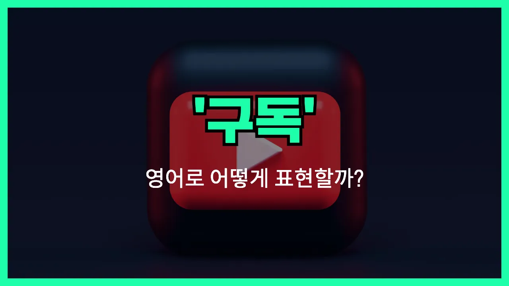

## 🌟 영어 표현 - subscribe

안녕하세요 👋 오늘은 여러분이 자주 듣는 영어 표현 중 하나인 '**subscribe**'에 대해 이야기해보려고 해요.

'**subscribe**'는 우리말로 '**구독하다**', '**신청하다**', '**따르다**'와 비슷한 의미를 가지고 있어요. 주로 유튜브 채널, 뉴스레터, 잡지 등을 정기적으로 받아보고 싶을 때 쓰는 표현이에요. 인터넷이나 앱을 사용할 때도 자주 등장하죠!

예를 들어 유튜브에서 "구독해주세요!"라는 말 많이 들어보셨죠? 이럴 때 사용하는 단어가 바로 'subscribe'예요~

뿐만 아니라 신문, 잡지, 뉴스레터 같이 정기적으로 정보를 받고 싶을 때 "I subscribe to the magazine."처럼 사용해요.

## 📖 예문

1. "이 채널을 구독해 주세요."

   "Please subscribe to this channel."

2. "저는 매주 뉴스레터를 구독하고 있어요."

   "I subscribe to the weekly newsletter."

## 💬 연습해보기

<ul data-interactive-list>

  <li data-interactive-item>
    새 동영상 소식 받고 싶으면 채널 구독만 하세요.
    If you want to get updates on new videos, just subscribe to the channel.
  </li>

  <li data-interactive-item>
    네가 추천한 팟캐스트 구독하는 걸 내가 깜빡했다니 믿기지가 않아요.
    I can't believe I <a href="/blog/in-english/023.forget/">forgot</a> to subscribe to that podcast you <a href="/blog/in-english/308.recommend/">recommended</a>.
  </li>

  <li data-interactive-item>
    그녀는 패션 영감을 위해 몇몇 월간지를 구독해요.
    She subscribes to a couple of monthly magazines for fashion inspiration.
  </li>

  <li data-interactive-item>
    멋진 뉴스레터 발견하면 항상 구독해서 놓치지 않으려고 해요.
    Whenever I find a cool newsletter, I always subscribe so I don't <a href="/blog/in-english/339.miss/">miss</a> out.
  </li>

  <li data-interactive-item>
    특별 할인 받으려면 우리 이메일 리스트 구독하는 게 좋아요.
    You should subscribe to our email list to get special deals.
  </li>

  <li data-interactive-item>
    그가 나한테 넷플릭스 같은 스트리밍 서비스 구독하는지 물어봤어요.
    He asked me if I subscribe to any streaming services like Netflix.
  </li>

  <li data-interactive-item>
    기사 무제한 보려면 꼭 구독해야 해요.
    You have to subscribe if you want unlimited <a href="/blog/vocab-1/041.access/">access</a> to the articles.
  </li>

  <li data-interactive-item>
    내 동생은 유튜브 채널 엄청 많이 구독해서 피드가 완전 난리예요.
    My brother subscribes to way too many YouTube channels, his feed is crazy.
  </li>

  <li data-interactive-item>
    멤버 혜택이 얼마나 많은지 보고 나서야 구독하기로 결심했어요.
    I <a href="/blog/in-english/182.finally/">finally</a> <a href="/blog/in-english/062.decide-to/">decided to</a> subscribe after seeing how many benefits members get.
  </li>

  <li data-interactive-item>
    온라인에서 뭘 볼 때마다 더 많은 콘텐츠 보려면 구독하라고 하네요.
    Every time I <a href="/blog/in-english/117.try-to/">try to</a> watch something online, they tell me to subscribe for more content.
  </li>

</ul>

## 🤝 함께 알아두면 좋은 표현들

### sign up for

'sign up for'는 "가입하다" 또는 "신청하다"라는 뜻이에요. 뉴스레터, 웹사이트, 서비스 등에서 계정을 만들거나 정보를 등록할 때 자주 사용돼요.

- "I decided to sign up for the free online course last night."
- "어젯밤에 무료 온라인 강좌에 가입하기로 했어요."

### unsubscribe

'unsubscribe'는 "구독을 취소하다" 또는 "수신을 거부하다"라는 의미예요. 더 이상 이메일이나 서비스를 받고 싶지 않을 때 사용해요. 'subscribe'와 반대되는 표현이에요.

- "If you don't want to receive these emails, you can unsubscribe at any time."
- "이런 이메일을 더 이상 받고 싶지 않으면 언제든 구독을 취소할 수 있어요."

### follow

'follow'는 SNS나 유튜브 등에서 "팔로우하다"라는 뜻으로 많이 써요. 특정 계정, 채널, 사람의 소식을 계속 받아보고 싶을 때 사용하는 말이에요. 'subscribe'와 원리상 비슷해요.

- "If you like her content, don't forget to follow her on Instagram."
- "그녀의 콘텐츠가 마음에 들면 인스타그램에서 꼭 팔로우해 주세요."

---

오늘은 '**구독하다**', '**신청하다**', '**따르다**'라는 뜻을 가진 영어 표현 'subscribe'에 대해 알아봤어요. 앞으로 유튜브나 각종 서비스에서 이 단어를 보면 이제 더 쉽게 이해할 수 있겠죠? 😊

오늘 배운 표현과 예문들도 꼭 최소 3번씩 소리 내서 읽어보세요. 다음에도 더 재미있고 유익한 영어 표현으로 돌아올게요! 감사합니다!
