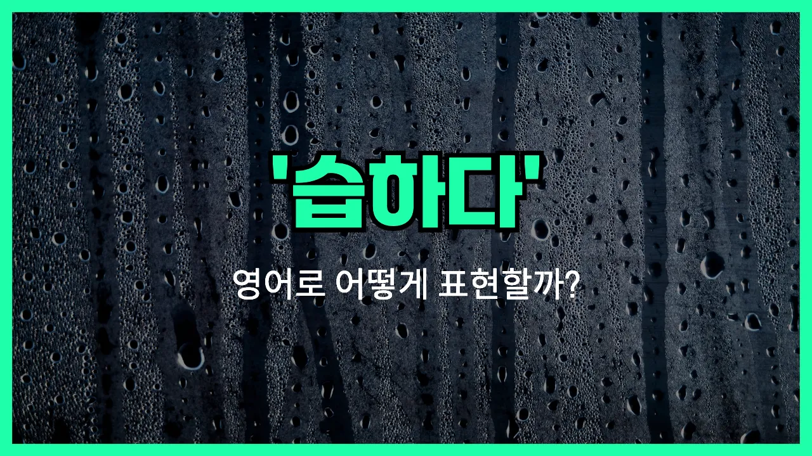

## 🌟 영어 표현 - humid

안녕하세요 👋 오늘은 날씨와 환경에서 자주 쓰이는 영어 단어인 '**humid**'에 대해 이야기해보려고 해요.

'**humid**'는 '**습하다**', '**눅눅하다**', 또는 '**축축하다**'와 같은 의미를 가지고 있어요. 주로 공기 중에 수분이 많아서 끈적거리거나 불쾌하게 느껴질 때 사용하는 표현이에요.

예를 들어 장마철처럼 비가 자주 오고, 실내에서도 바닥이나 벽이 축축하게 느껴지는 그런 날씨를 말할 때 'humid'라는 단어를 써요.

여름철에는 "It feels humid today."라고 말하면, "오늘은 습하게 느껴져요."라는 뜻이 돼요. 반대로 건조한 날씨에는 이 표현을 사용하지 않아요.

## 📖 예문

1. "오늘 정말 습해요."

   "It's really humid today."

2. "방 안이 눅눅하게 느껴져요."

   "The room feels humid."

3. "여름에는 종종 축축하고 끈적거려요."

   "In summer, it's [often](/blog/in-english/326.often/) humid and sticky."

## 💬 연습해보기

<ul data-interactive-list>

  <li data-interactive-item>
    오늘 진짜 습해서 머리가 완전 난리 났어요.
    I can't believe how humid it is today. My hair is a total mess.
  </li>

  <li data-interactive-item>
    요즘 습도가 너무 높아서 마치 국물 속을 걷는 것 같아요.
    The humidity's crazy right now. <a href="/blog/한-것-같아-영어표현/">It feels like</a> I'm walking through soup.
  </li>

  <li data-interactive-item>
    산책 갈래? 아니요, 지금 밖에 너무 습해서요.
    Do you want to go for a walk? Nah, it's way too humid outside.
  </li>

  <li data-interactive-item>
    여기 너무 습해서 한 시간마다 샤워하고 싶은 기분이에요.
    It's so humid in here, I feel like I need a shower every hour.
  </li>

  <li data-interactive-item>
    습해서 옷이 자꾸 달라붙어요.
    My clothes keep sticking to me because it's so humid.
  </li>

  <li data-interactive-item>
    우린 오후 내내 공원에 있었는데, 습한 날씨 때문에 너무 불편했어요.
    We <a href="/blog/in-english/258.spend/">spent</a> the whole afternoon at the park, but the humid weather <a href="/blog/in-english/244.make-it/">made it</a> really uncomfortable.
  </li>

  <li data-interactive-item>
    비가 온 뒤에 시원해질 줄 알았는데 아직도 엄청 습해요.
    I thought it would cool down after the storm, but it's <a href="/blog/in-english/254.still/">still</a> super humid.
  </li>

  <li data-interactive-item>
    에어컨 고장 나서 집이 더 덥고 습해졌어요.
    The air conditioner broke, and now my apartment is just hot and humid.
  </li>

  <li data-interactive-item>
    이런 습한 기후는 익숙하지 않아요. 고향이랑 완전 달라요.
    I'm not <a href="/blog/in-english/143.used-to/">used to</a> this kind of humid climate. It's way different from back home.
  </li>

  <li data-interactive-item>
    습한 공기 때문에 에너지가 다 빠져나가는 느낌이에요. 빨리 가을이 왔으면 해요.
    That humid air just drains all my energy. I can't <a href="/blog/in-english/377.wait-for/">wait for</a> fall.
  </li>

</ul>

## 🤝 함께 알아두면 좋은 표현들

### muggy

'muggy'는 특히 여름철에 공기가 덥고 습해서 불쾌한 상태를 말해요. 땀이 잘 마르지 않고 축축해서 답답하게 느껴질 때 주로 써요.

- "It was so muggy last night that I couldn't [fall asleep](/blog/in-english/075.fall-asleep/)."
- "어젯밤엔 너무 후텁지근해서 잠을 잘 수가 없었어요."

### dry

'dry'는 'humid'와 반대되는 개념으로, 공기 중에 수분이 거의 없는 상태를 뜻해요. 피부가 당기거나 입이 마를 정도로 건조할 때 많이 써요.

- "The desert air was extremely dry, making my throat feel scratchy."
- "사막 공기가 너무 건조해서 목이 까칠한 느낌이 들었어요."

### sticky

'sticky'는 습도가 높아서 몸이나 피부가 끈적끈적하게 느껴지는 상황에서 자주 쓰여요. 땀이나 습한 공기 때문에 불쾌하고 불편할 때 사용해요.

- "My clothes always feel sticky on humid summer days."
- "습한 여름날엔 옷이 항상 끈적거리는 느낌이 들어요."

---

오늘은 '**습하다**', '**눅눅하다**', '**축축하다**'라는 뜻을 가진 영어 표현 '**humid**'에 대해 알아봤어요. 무더운 여름이나 비 온 뒤에 꼭 쓰는 단어니까 오늘 배운 예문들을 꼭 연습해 보세요.

소리 내서 3번씩 읽어보면 더 쉽게 외울 수 있어요. 다음에도 더 유용한 영어 표현으로 다시 올게요! 감사합니다!
