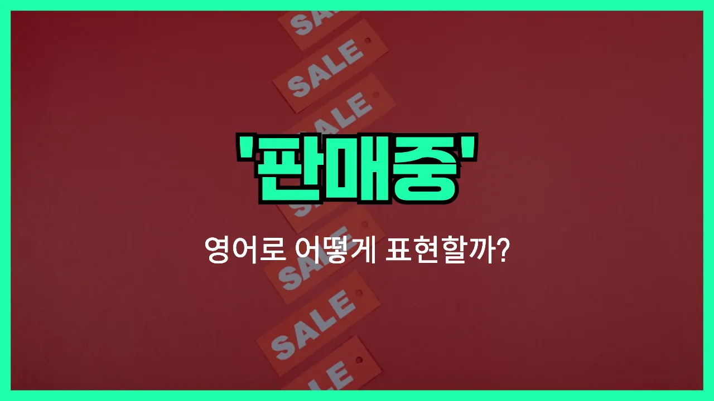

## 🌟 영어 표현 - on sale

안녕하세요 👋 오늘은 쇼핑할 때 정말 자주 볼 수 있는 영어 표현을 소개해드릴게요. 바로 '**on sale**'이에요. '**on sale**'은 우리말로 '세일 중이다', '할인 중이다', 혹은 '특가로 팔고 있다'는 의미로 자주 쓰여요. 가게에서 물건에 할인표가 붙어 있거나, 인터넷 쇼핑몰에서 특가 이벤트가 진행될 때 이 표현을 사용할 수 있어요.

보통, '이 제품 세일 중이야', '지금 세일하고 있는 제품이야'와 같이 이야기할 때 'on sale'을 활용하면 정말 자연스럽게 표현할 수 있어요. 할인가로 무언가를 샀다고 이야기할 때도 유용하게 쓰인답니다~.

## 📖 예문

1. "이 코트는 지금 세일 중이에요."

   "This coat is on sale [right now](/blog/in-english/525.right-now/)."

2. "모든 신발이 20% 할인 중이에요."

   "All shoes are on sale at 20% off."

## 💬 연습해보기

<ul data-interactive-list>

  <li data-interactive-item>
    이 신발들이 세일 중이라 얼른 샀어요.
    These shoes were on sale, so I grabbed them while I could.
  </li>

  <li data-interactive-item>
    저 노트북 세일 중이에요, 아니면 원래 가격이에요?
    Is that laptop on sale, or is this the regular <a href="/blog/in-english/640.price/">price</a>?
  </li>

  <li data-interactive-item>
    이번 주말에 가게 전체가 다 세일해요. 같이 가야 돼요!
    The whole store is on sale this weekend. We should totally go!
  </li>

  <li data-interactive-item>
    간식은 세일할 때만 사요. 아니면 너무 비싸서요.
    I only buy snacks if they're on sale. Otherwise, it's too <a href="/blog/in-english/317.expensive/">expensive</a>.
  </li>

  <li data-interactive-item>
    오늘 타겟에서 네가 좋아하는 커피 브랜드가 세일 중인 거 봤어요.
    I saw your favorite brand of coffee on sale at Target today.
  </li>

  <li data-interactive-item>
    겨울 코트가 지금 세일 중이라 한번 보러 가봐요.
    Their winter coats are on sale right now, if you want to check them out.
  </li>

  <li data-interactive-item>
    이 TV 세일 언제까지 해요? 내일 다시 올 수도 있거든요.
    How long is this TV on sale for? I might want to come back tomorrow.
  </li>

  <li data-interactive-item>
    명절 지나고 다 세일할 때까지 항상 기다려요.
    I always wait until after the <a href="/blog/in-english/517.holiday/">holidays</a> when everything goes on sale.
  </li>

  <li data-interactive-item>
    네가 좋아하는 샴푸가 드디어 온라인에서 세일해요.
    That shampoo you like is <a href="/blog/in-english/182.finally/">finally</a> on sale online.
  </li>

  <li data-interactive-item>
    가을이 다가와서 여름 상품이 다 세일 중이에요.
    All the summer stuff is on sale now that fall is coming.
  </li>

</ul>

## 🤝 함께 알아두면 좋은 표현들

### discounted

'discounted'는 "할인된" 또는 "가격이 내려간"이란 뜻이에요. 특정 상품이나 서비스의 원래 가격에서 일정 금액이나 비율만큼 금액을 깎아서 판매할 때 사용해요. 보통 세일 중인 제품이나 특별 행사 때 자주 볼 수 있어요.

- "These shoes are discounted for a limited time only."
- "이 신발은 한정된 기간 동안만 할인 중이에요."

### full price

'full price'는 "정가" 또는 "할인 없이 원래 책정된 가격"을 의미해요. 즉, 세일이나 할인이 전혀 적용되지 않은 상품의 원래 가격이에요. 보통 비교 목적으로 할인된 가격이 아닌 정가를 언급할 때 사용해요.

- "I usually [wait for](/blog/in-english/377.wait-for/) a sale because I don't want to pay full price."
- "저는 정가는 내기 싫어서 보통 세일할 때까지 기다려요."

### clearance

'clearance'는 주로 "재고 정리 세일"이나 "대폭 할인 판매"를 의미해요. 매장이나 온라인몰에서 상품을 빨리 팔아 없애기 위해 정가보다 훨씬 더 큰 폭으로 세일할 때 사용해요. 시즌이 끝났거나 오래된 상품에 주로 붙는 말이에요.

- "All winter coats are on clearance at the store this week."
- "이번 주에 그 매장에서 겨울 코트가 전부 재고 정리 세일 중이에요."

---

오늘은 쇼핑할 때 유용하게 쓸 수 있는 영어 표현 '**on sale**'에 대해 알아봤어요. 다음에 쇼핑하거나, 세일 정보를 친구에게 얘기할 때 꼭 사용해보세요 😊

오늘 배운 표현과 예문들을 최소 3번씩 소리 내어 읽어보면 입에 더 잘 익을 거예요. 앞으로 더 유익한 영어 표현으로 찾아올게요! 감사합니다~!
