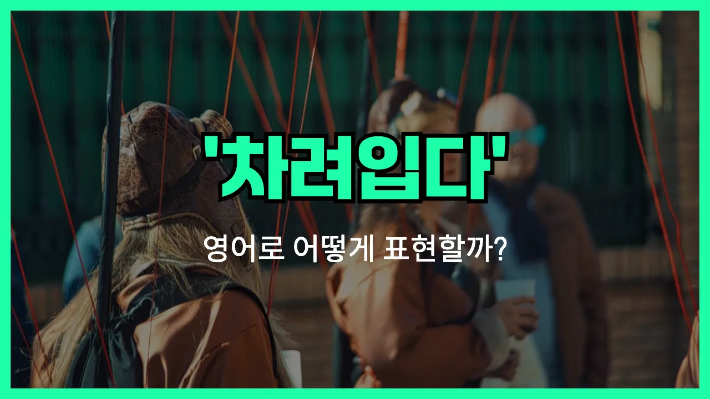

## 🌟 영어 표현 - dress up

안녕하세요 👋 오늘은 일상에서 자주 듣는 영어 표현 '**dress up**'에 대해 알아보려고 해요. '**dress up**'은 한국어로 '멋지게 차려입다', '정식으로 옷을 갖춰 입다' 또는 '잘 꾸미다'라는 뜻을 가지고 있어요.

이 표현은 평소보다 더 신경 써서 옷을 입거나, 특별한 날을 위해 단정하고 근사하게 꾸밀 때 자주 사용돼요. 예를 들어 파티, 결혼식, 면접 등 중요한 자리에 갈 때 'dress up'이라는 말을 써요!

뿐만 아니라, 할로윈이나 연극처럼 **특정 역할이나 캐릭터로 변장할 때**도 'dress up'이라는 표현을 쓸 수 있어요. 그래서 상황에 따라 '변장하다', '분장하다'라는 뜻으로도 활용돼요~

## 📖 예문

1. "오늘 파티를 위해 멋지게 차려입었어요."

   "I dressed up for the party today."

2. "직장 면접에 가려고 정장으로 갖춰 입었어요."

   "I dressed up in a suit for the job interview."

3. "아이들이 할로윈에 공주로 분장했어요."

   "The kids dressed up as princesses for Halloween."

## 💬 연습해보기

<ul data-interactive-list>

  <li data-interactive-item>
    오늘 파티에 멋지게 입고 갈 거예요? 엄청 고급스럽다면서요?
    Are you going to dress up for the party tonight? I heard it's pretty fancy.
  </li>

  <li data-interactive-item>
    여긴 옷차림 편하게 해도 돼요. 완전 캐주얼한 곳이에요.
    We don't have to dress up for this restaurant. It's super <a href="/blog/in-english/150.casual/">casual</a>.
  </li>

  <li data-interactive-item>
    그녀는 강아지에게 귀여운 옷 입히는 걸 엄청 좋아해요. 진짜 웃겨요.
    She loves to dress up her dog in little costumes. It's hilarious.
  </li>

  <li data-interactive-item>
    우리 사장님 회의 때 차려입지 말고 청바지 입으래요.
    My boss told us not to dress up for the meeting; jeans are fine.
  </li>

  <li data-interactive-item>
    할로윈 때는 다들 분장하고 사탕 받으러 다니는 거 좋아해요.
    On Halloween, everyone likes to dress up and go trick-or-treating.
  </li>

  <li data-interactive-item>
    면접 볼 땐 좀 단정하게 입고 가는 게 인상 좋아서 늘 그렇게 해요.
    I always dress up a little for job interviews, just to make a good impression.
  </li>

  <li data-interactive-item>
    여기서 멋지게 차려입고 사진 좀 멋지게 찍어요.
    Let's dress up and take some nice photos while we're here.
  </li>

  <li data-interactive-item>
    데이트할 때 멋지게 입을래요, 아니면 편하게 있을래요?
    Do you want to dress up for date night or just stay comfy?
  </li>

  <li data-interactive-item>
    그 사람은 특별한 날에도 잘 차려입으려고 안 해요.
    He never likes to dress up, even on special occasions.
  </li>

  <li data-interactive-item>
    가끔은 이유 없이 멋 부리고 기분 내는 것도 재밌어요.
    <a href="/blog/in-english/270.sometimes/">Sometimes</a> it's just fun to dress up and feel fancy for no reason.
  </li>

</ul>

## 🤝 함께 알아두면 좋은 표현들

### get dolled up

'get dolled up'은 "멋지게 꾸미다" 또는 "화려하게 차려입다"라는 뜻이에요. 보통 특별한 날을 위해 평소보다 더 신경 써서 옷차림이나 헤어, 메이크업을 준비할 때 많이 써요.

- "Everyone gets dolled up for the annual company party."
- "모두가 회사 연례 파티를 위해 멋지게 차려입어요."

### dress down

'dress down'은 "평상복을 입다" 또는 "편하게 입다"라는 뜻으로, 격식 있는 옷이 아닌, 좀 더 편하고 캐주얼한 복장을 할 때 사용해요. 학교나 직장에서 정장 대신 캐주얼 복장으로 허용되는 날에도 많이 써요.

- "On Fridays, employees are allowed to dress down at work."
- "금요일에는 직원들이 회사에서 편하게 입어도 돼요."

### go casual

'go casual'은 "격식을 차리지 않고 캐주얼하게 입다"라는 의미예요. 보통 정장이나 공식적인 복장이 필요하지 않을 때 자연스럽게 사용할 수 있는 표현이에요.

- "Let's go casual for the barbecue this weekend."
- "이번 주말 바비큐 파티에서는 캐주얼하게 입자고 해요."

---

오늘은 '멋지게 차려입다', '옷을 갖춰 입다', '특별히 꾸미다'라는 뜻의 영어 표현 'dress up'에 대해 알아봤어요. 앞으로 특별한 일이 있을 때 'dress up'이라는 표현을 자연스럽게 써보면 좋겠어요! 😊

배운 예문들은 꼭 소리 내어 3번씩 읽어보시고, 다음에도 더 유용한 영어 표현으로 찾아올게요! 감사합니다~!

