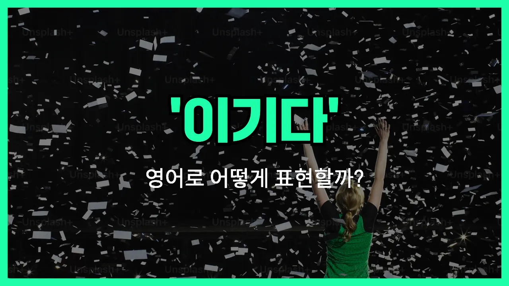

## 🌟 영어 표현 - win

안녕하세요 👋 오늘은 '**이기다**', '**승리하다**', '**우승하다**'와 관련된 영어 표현 '**win**'에 대해 알아보려고 해요.

'**win**'은 어떤 경기, 시험, 경쟁 등에서 이기거나 승리하는 상황을 설명할 때 쓰이는 아주 기본적이고 자주 쓰이는 단어예요!

예를 들어, 축구 경기에서 상대 팀을 이겼을 때 "We won the game!"이라고 할 수 있어요. 또는 시험이나 복권 같은 경쟁적인 상황에서 좋은 성과를 얻었을 때도 사용할 수 있답니다.

'**win**'은 동사로 주로 사용되고, 승리 자체를 의미하는 명사로도 쓰여요. 동사로는 '이기다', 명사로는 '승리'라는 뜻이니 상황에 맞게 사용할 수 있어요.

## 📖 예문

1. "우리는 그 경기에서 이겼어요."

   "We won the game."

2. "그녀는 대회에서 1등을 했어요."

   "She won first place in the competition."

3. "이번 시험에서 이기고 싶어요."

   "I want to win this test."

## 💬 연습해보기

<ul data-interactive-list>

  <li data-interactive-item>
    나는 온라인 래플에서 한 번도 당첨된 적 없는데, 그래도 혹시 몰라서 계속 응모해요.
    I never win anything in those online raffles, but I <a href="/blog/in-english/254.still/">still</a> enter just <a href="/blog/in-english/253.in-case/">in case</a>.
  </li>

  <li data-interactive-item>
    그가 과학 경진대회에서 1등 한 거 진짜 신나했어요. 부모님도 엄청 자랑스러워했죠.
    He was so excited to win first place in the science fair. His parents were really proud.
  </li>

  <li data-interactive-item>
    어제 밤에 그들이 챔피언십 경기에서 이겼다는 얘기 들었어요? 완전 긴장감 넘쳤대요.
    Did you hear they <a href="/blog/in-english/175.manage-to/">managed to</a> win the championship game last night? It was intense.
  </li>

  <li data-interactive-item>
    솔직히 말하면, 어떤 사람들하고는 아무리 해도 안 통하는 느낌이에요. 뭘 해도 다 틀렸다고 하니까요.
    <a href="/blog/in-english/336.honestly/">Honestly</a>, <a href="/blog/in-english/270.sometimes/">sometimes</a> <a href="/blog/한-것-같아-영어표현/">it feels like</a> you just can't win with some people. <a href="/blog/in-english/229.no-matter-what/">No matter what</a> you do, it's <a href="/blog/in-english/316.wrong/">wrong</a>.
  </li>

  <li data-interactive-item>
    복권에 당첨되면 우리 모두 휴가 보내줄 거예요. 농담 아니에요!
    If I win the lottery, I'm buying us all a vacation. No joke!
  </li>

  <li data-interactive-item>
    그녀는 승진을 위해 정말 열심히 일했어요. 모두가 그게 당연하다고 생각했죠.
    She worked really hard to win the promotion at her job. Everyone thought she <a href="/blog/in-english/206.deserve-it/">deserved it</a>.
  </li>

  <li data-interactive-item>
    말싸움에서 이기고 싶은 건가요, 아니면 진짜 내 얘기를 듣고 있는 건가요?
    Are you <a href="/blog/in-english/117.try-to/">trying to</a> win an argument, or are you actually <a href="/blog/in-english/407.listen-to/">listening to</a> me?
  </li>

  <li data-interactive-item>
    우리 아이디어가 통하려면 새 매니저 마음을 사야 해요. 걔 좀 까다로워요.
    We need to win over the new manager if we want our ideas to go through. She's pretty <a href="/blog/in-english/183.tough/">tough</a>.
  </li>

  <li data-interactive-item>
    팀이 이 경기를 이겨야 플레이오프에 갈 수 있어요. 연습을 멈추지 않고 있어요.
    The team needs to win this game to <a href="/blog/in-english/244.make-it/">make it</a> to the playoffs. They've been <a href="/blog/in-english/247.practice/">practicing</a> <a href="/blog/in-english/156.non-stop/">non-stop</a>.
  </li>

  <li data-interactive-item>
    그는 매번 이기는 것보다 그냥 재미있게 노는 게 더 중요하대요.
    He doesn't care about winning every time – he just wants to have fun playing.
  </li>

</ul>

## 🤝 함께 알아두면 좋은 표현들

### come out on top

'come out on top'은 "최종적으로 이기다" 또는 "성공하다"라는 뜻이에요. 경쟁이나 어려운 상황에서 결국에는 가장 좋은 결과를 얻거나 최고의 자리에 오르는 것을 강조할 때 써요.

- "[Despite](/blog/in-english/341.despite/) facing many challenges, our team managed to come out on top."
- "많은 어려움이 있었지만, 우리 팀이 결국엔 이겼어요."

### take the trophy

'take the trophy'는 "우승하다" 혹은 "트로피를 차지하다"라는 의미예요. 스포츠 경기나 경쟁에서 1등을 해서 상을 받는 상황에서 자주 사용해요.

- "After months of hard work, the band [finally](/blog/in-english/182.finally/) took the trophy at the music competition."
- "몇 달 동안 열심히 준비한 끝에, 그 밴드가 드디어 음악 대회에서 우승했어요."

### lose

'lose'는 'win'의 반대말로 "지다"라는 뜻이에요. 경기, 경쟁, 혹은 상황에서 승리하지 못한 경우에 써요.

- "Nobody likes to lose, but it's an [important](/blog/in-english/318.important/) part of [learning](/blog/in-english/245.learn/)."
- "아무도 지는 걸 좋아하진 않지만, 그 또한 배우는 데 중요한 과정이에요."

---

오늘은 '**이기다**', '**승리하다**', '**우승하다**'라는 의미의 영어 표현 '**win**'에 대해 알아봤어요. 경기나 시험, 대회 등에서 상대를 이기고 싶을 때 이 표현을 떠올리면 좋을 것 같아요 😊

오늘 배운 표현과 예문을 꼭 큰 소리로 따라 읽어보고 내 상황에 맞게 연습해 보세요. 다음에도 재미있고 유익한 영어 표현들로 찾아올게요! 감사합니다!
