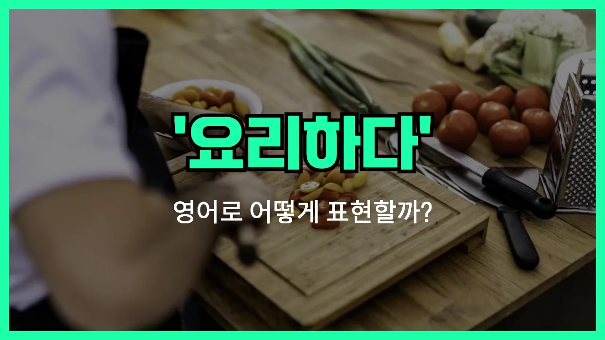

## 🌟 영어 표현 - cook

안녕하세요 👋 오늘은 우리가 일상에서 자주 쓰는 동사, '**요리하다**'의 영어 표현 '**cook**'에 대해 알아보려고 해요.

'**cook**'는 음식을 만들거나 조리하는 모든 과정을 의미해요. 즉, 재료를 준비해서 불이나 열을 이용해 음식을 완성하는 행위를 말할 때 자연스럽게 사용할 수 있어요!

이 단어는 집에서 밥을 할 때, 친구와 함께 요리할 때, 또는 레스토랑에서 셰프가 음식을 만들 때 등 다양한 상황에서 쓸 수 있어요. 예를 들어, "나는 저녁을 요리하고 있어요."라고 말하고 싶을 때 "I'm cooking dinner."라고 표현할 수 있어요.

또한, 'cook'는 주로 동사로 쓰이지만, '요리사'라는 뜻의 명사로도 사용돼요. 하지만 오늘은 동사로서의 'cook'에 집중해서 알아볼게요!

## 📖 예문

1. "나는 아침마다 계란을 요리해요."

   "I cook eggs every morning."

2. "오늘 저녁에 뭘 요리할 거예요?"

   "What will you cook for dinner tonight?"

## 💬 연습해보기

<ul data-interactive-list>

  <li data-interactive-item>
    요리 잘 몰라서 보통 배달 시켜 먹어요.
    I don't really know how to cook, so I usually order takeout.
  </li>

  <li data-interactive-item>
    우리 엄마는 일요일마다 가족들 위해 큰 밥상 차려줘요.
    My mom loves to cook big family dinners on Sundays.
  </li>

  <li data-interactive-item>
    오늘 저녁 같이 요리할래요?
    Do you want to cook dinner together tonight?
  </li>

  <li data-interactive-item>
    오늘 아침 룸메이트들한테 아침 먹여줬는데 재밌었어요.
    I cooked breakfast for my roommates this morning. It was fun.
  </li>

  <li data-interactive-item>
    대학 가서 요리 배우기 시작했어요.
    He learned to cook when he went away to college.
  </li>

  <li data-interactive-item>
    태우지 않고 요리할 수 있어요?
    Can you cook anything without burning it?
  </li>

  <li data-interactive-item>
    그분은 이탈리아 요리 진짜 잘해요. 파스타 엄청 맛있어요.
    She's really good at cooking Italian food. Her pasta is amazing.
  </li>

  <li data-interactive-item>
    스트레스 받을 때 요리하면 마음이 편해져요.
    Whenever I feel stressed, I like to cook. It's relaxing for me.
  </li>

  <li data-interactive-item>
    이번 주말 파티에 새로운 요리 해봐야겠어요.
    We should cook something new for the potluck this weekend.
  </li>

  <li data-interactive-item>
    네가 보낸 레시피 따라해봤는데 똑같이 안 됐어요.
    I tried to cook that recipe you sent me, but it didn't turn out the same.
  </li>

</ul>

## 🤝 함께 알아두면 좋은 표현들

### prepare a meal

'prepare a [meal](/blog/in-english/528.meal/)'은 "식사를 준비하다"라는 뜻이에요. 요리를 직접 하는 것뿐만 아니라 재료를 다듬거나 상을 차리는 등 식사와 관련된 모든 준비 과정을 포함해요.

- "I usually prepare a meal for my family every evening after work."
- "저는 보통 퇴근하고 나서 저녁마다 가족을 위해 식사를 준비해요."

### order takeout

'order takeout'은 "음식을 시켜 먹다"라는 뜻이에요. 직접 요리하지 않고 식당이나 배달 앱을 통해 음식을 주문해서 먹는 상황에서 자주 써요. 'cook'의 반대되는 개념이에요.

- "We were too tired to cook, so we decided to order takeout instead."
- "우리는 너무 피곤해서 요리할 힘이 없어서 그냥 음식을 시켜 먹기로 했어요."

### eat out

'eat out'은 "외식하다"라는 뜻이에요. 집에서 요리하지 않고 식당이나 카페 등에서 식사를 하는 상황을 말해요. 역시 'cook'의 반대되는 표현 중 하나예요.

- "Let's eat out tonight since no one wants to cook."
- "오늘 밤엔 아무도 요리하고 싶어하지 않으니까 외식하자고 해요."

---

오늘은 '요리하다'라는 뜻을 가진 영어 동사 '**cook**'에 대해 알아봤어요. 앞으로 음식을 만들 때 이 표현을 자연스럽게 사용해 보세요! 😊

오늘 배운 표현과 예문들을 꼭 최소 3번씩 소리 내서 읽어보세요. 다음에도 더 재미있고 유익한 영어 표현으로 찾아올게요! 감사합니다!
