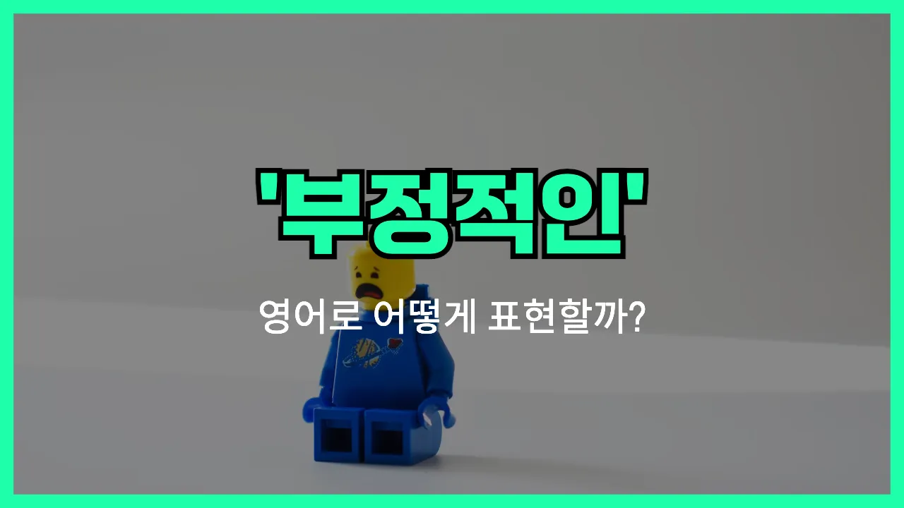

## 🌟 영어 표현 - negative

안녕하세요 👋 오늘은 우리가 자주 쓰는 표현인 '**부정적**'을 영어로 어떻게 말하는지 알아보려고 해요. 바로 '**negative**'라는 단어를 사용해요.

'**negative**'는 어떤 상황이나 생각, 감정이 긍정적이지 않고, 소극적이거나 비관적인 태도를 나타낼 때 쓰여요. 예를 들어, 누군가의 의견에 동의하지 않거나, 상황을 안 좋게 바라볼 때 'negative'라는 단어를 자연스럽게 사용할 수 있어요.

또한, 'negative'는 단순히 생각뿐만 아니라, 검사 결과(예: 코로나 검사 음성), 수학(음수), 전기(음극) 등 다양한 분야에서도 쓰여요. 하지만 일상 대화에서는 주로 **사람의 태도나 반응이 부정적일 때** 많이 사용된답니다!

## 📖 예문

1. "그는 항상 부정적인 생각을 해요."

   "He always has negative thoughts."

2. "너무 부정적으로 생각하지 마세요."

   "Don't think so negatively."

3. "그 소식에 대해 부정적인 반응이 많았어요."

   "There were many negative reactions to the news."

## 💬 연습해보기

<ul data-interactive-list>

  <li data-interactive-item>
    모든 일에 너무 부정적으로만 생각하지 말아요. 가끔은 좋은 면을 보려고 해봐요.
    Don't be so negative about everything. <a href="/blog/in-english/117.try-to/">Try to</a> look on the bright side <a href="/blog/in-english/270.sometimes/">sometimes</a>.
  </li>

  <li data-interactive-item>
    우리가 조별 과제 얘기할 때마다 걔는 항상 부정적인 태도를 보여요.
    She always has a negative attitude when we talk about group projects.
  </li>

  <li data-interactive-item>
    부정적으로 들리려던 건 아니었고, 그냥 결과가 걱정돼서 그래요.
    I didn't mean to sound negative, I'm just <a href="/blog/in-english/209.worry-about/">worried about</a> the outcome.
  </li>

  <li data-interactive-item>
    걔는 잘 된 것보다는 안 좋았던 점에 더 집중하는 편이에요.
    He <a href="/blog/in-english/259.tend-to/">tends to</a> <a href="/blog/in-english/186.focus-on/">focus on</a> the negative <a href="/blog/in-english/169.instead-of/">instead of</a> what went well.
  </li>

  <li data-interactive-item>
    선생님이 내 에세이에 대해 부정적인 피드백을 줬는데, 덕분에 더 나아질 수 있었어요.
    My teacher gave me some negative feedback on my essay, but it helped me <a href="/blog/in-english/394.improve/">improve</a>.
  </li>

  <li data-interactive-item>
    내가 내 뜻대로 안 될 때 부정적으로 되는 게 쉽다는 거 알아요.
    I know it's easy to get negative when things don't go your way.
  </li>

  <li data-interactive-item>
    SNS 보면 가끔 사람들이 자신에 대해 부정적으로 느끼게 되는 경우가 많아요.
    Social media can really make people feel negative about themselves sometimes.
  </li>

  <li data-interactive-item>
    왜 그 영화에 대해 그렇게 부정적인 생각을 해요? 저는 사실 좋았는데.
    Why do you have such a negative opinion of that movie? I actually liked it.
  </li>

  <li data-interactive-item>
    너무 빨리 부정적인 결론부터 내리지 않았으면 좋겠어요.
    <a href="/blog/in-english/118.i-wish/">I wish</a> you wouldn't jump to negative conclusions so quickly.
  </li>

  <li data-interactive-item>
    온라인에 달린 부정적인 댓글들 보면 참 힘들 수도 있겠어요.
    Seeing all those negative comments online can be <a href="/blog/in-english/183.tough/">tough</a> to <a href="/blog/in-english/157.deal-with/">deal with</a>.
  </li>

</ul>

## 🤝 함께 알아두면 좋은 표현들

### pessimistic

'pessimistic'는 "비관적인" 또는 "부정적으로 생각하는"이라는 뜻이에요. 상황이나 미래에 대해 안 좋은 쪽으로만 생각하거나 기대하지 않을 때 자주 쓰는 표현이에요.

- "She tends to be pessimistic about her chances of getting the job."
- "그녀는 그 일자리를 얻을 가능성에 대해 비관적으로 생각하는 편이에요."

### optimistic

'optimistic'는 'negative'의 반대말로, "낙관적인" 또는 "긍정적으로 생각하는"이라는 뜻이에요. 상황이 잘 풀릴 거라고 믿거나 좋은 결과를 기대할 때 쓰는 표현이에요.

- "[Despite](/blog/in-english/341.despite/) the challenges, he remains optimistic about the future."
- "어려움이 있어도 그는 미래에 대해 긍정적으로 생각하고 있어요."

### downbeat

'downbeat'는 "우울한" 또는 "침울한"이라는 뜻으로, 분위기나 태도가 부정적이고 활기가 없을 때 자주 써요. 'negative'와 비슷하게 상황을 어둡게 보는 느낌을 줄 때 사용해요.

- "The team felt downbeat after [losing](/blog/in-english/457.lose/) the match."
- "경기에서 지고 나서 팀 분위기가 좀 침울했어요."

---

오늘은 '**부정적**'이라는 뜻을 가진 영어 표현 '**negative**'에 대해 알아봤어요. 앞으로 누군가의 태도나 생각이 소극적이거나 비관적일 때 이 단어를 떠올려 보세요 😊

오늘 배운 표현과 예문들을 꼭 소리 내서 여러 번 읽어보세요. 다음에도 더 유익한 영어 표현으로 찾아올게요! 감사합니다!

