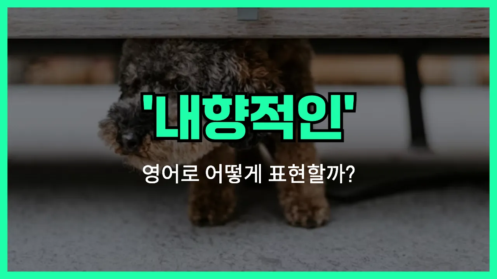

## 🌟 영어 표현 - introverted

안녕하세요 👋 오늘은 '내성적인', '소심한'이라는 뜻을 가진 영어 표현을 소개해드릴게요. 바로 '**introverted**'라는 단어예요. 이 단어는 자신의 감정이나 생각을 겉으로 잘 드러내지 않고, 조용하고 신중한 성격을 가진 사람을 표현할 때 사용해요.

'Introverted'는 보통 사람의 성격을 설명할 때 많이 쓰여요. 예를 들어, 새로운 사람을 만날 때 조금 조심스럽거나, 혼자 있는 시간을 더 좋아하는 사람을 말할 때 자연스럽게 사용할 수 있어요. 반대말로는 '외향적인'이라는 뜻의 'extroverted'가 있어요.

예를 들어, "나는 내성적인 성격이야."라고 말하고 싶을 때 "I'm introverted." 또는 "I'm an introverted person."이라고 표현할 수 있어요.

## 📖 예문

1. "그는 매우 내성적인 사람이에요."

   "He is a very introverted person."

2. "내 친구는 내성적이어서 파티를 별로 좋아하지 않아요."

   "My friend is introverted, so she doesn't really like parties."

## 💬 연습해보기

<ul data-interactive-list>

  <li data-interactive-item>
    저는 생각보다 내성적인 편인 것 같아요. 주말에는 밖에 나가기보다 집에 있는 걸 더 좋아해요.
    I think I'm pretty introverted. I usually <a href="/blog/in-english/191.prefer/">prefer</a> staying in on weekends <a href="/blog/in-english/169.instead-of/">instead of</a> going out.
  </li>

  <li data-interactive-item>
    제이크는 원래 내성적이지만, 막상 친해지면 같이 있어도 너무 재밌는 사람이에요.
    Jake's always been introverted, but he's <a href="/blog/in-english/254.still/">still</a> fun to <a href="/blog/in-english/127.hang-out/">hang out</a> with once you get to know him.
  </li>

  <li data-interactive-item>
    그녀는 회사에서는 되게 내성적이지만, 친한 친구들한테는 되게 말이 많아요.
    She's so introverted at work, but she's really talkative with close friends.
  </li>

  <li data-interactive-item>
    내성적이라고 해서 부끄러움이 많은 건 아니에요. 그냥 혼자만의 시간이 필요한 거죠.
    Being introverted doesn't mean you're shy. It just means you like your alone time.
  </li>

  <li data-interactive-item>
    저는 동생보다 더 내성적인 것 같아요. 동생은 사람 많은 파티를 좋아하지만 저는 그런 게 너무 힘들어요.
    I'm more introverted than my sister. She loves big crowds and parties, but I find them exhausting.
  </li>

  <li data-interactive-item>
    제 남자친구는 진짜 내성적이라서 하루 일과 끝나고 조용히 쉴 시간이 꼭 필요해요.
    My boyfriend is really introverted, so he needs some quiet time after a long day.
  </li>

  <li data-interactive-item>
    그 사람은 무례한 게 아니라 내성적이라 낯선 사람한테 바로 마음을 안 여는 거예요.
    He's not rude. He's just introverted and doesn't open up to new people right away.
  </li>

  <li data-interactive-item>
    내성적이면 파티가 좀 버거울 때가 있어요.
    If you're introverted, parties can feel overwhelming after a while.
  </li>

  <li data-interactive-item>
    저는 예전엔 활발한 줄 알았는데, 알고 보니까 더 내성적인 사람인 것 같아요.
    I <a href="/blog/in-english/143.used-to/">used to</a> think I was outgoing, but it <a href="/blog/vocab-1/038.turn-out/">turns out</a> I'm actually more introverted than I <a href="/blog/in-english/166.realize/">realized</a>.
  </li>

  <li data-interactive-item>
    그녀는 가족 모임 때 내성적인 모습을 보여요. 보통 조용한 장소에서 에너지를 충전하거든요.
    Her introverted side comes out during family gatherings. She usually finds a quiet spot to recharge.
  </li>

</ul>

## 🤝 함께 알아두면 좋은 표현들

### reserved

'reserved'는 "내성적이고 조용한 성격"을 나타내는 표현이에요. 자신의 감정이나 생각을 잘 드러내지 않고, 낯선 사람들과 쉽게 어울리지 않는 사람을 말할 때 자주 써요.

- "She is quite reserved and prefers to listen rather than speak in meetings."
- "그녀는 꽤 내성적이라 회의에서 말하기보다는 듣는 걸 더 좋아해요."

### shy

'shy'는 "수줍어하는" 또는 "부끄러움을 많이 타는" 성격을 의미해요. 낯선 상황이나 사람 앞에서 쉽게 긴장하거나 말을 잘 못하는 사람을 묘사할 때 사용해요.

- "He was too shy to [introduce](/blog/in-english/262.introduce/) himself to the new classmates."
- "그는 너무 수줍어서 새 반 친구들에게 자기소개를 못 했어요."

### outgoing

'outgoing'은 'introverted'의 반대말로, "외향적이고 사교적인" 성격을 뜻해요. 사람들과 어울리기를 좋아하고, 새로운 만남이나 활동에 적극적으로 참여하는 사람을 표현할 때 써요.

- "My brother is very outgoing and makes friends wherever he goes."
- "우리 오빠는 정말 외향적이라 어디를 가든 친구를 잘 사귀어요."

---

오늘은 '내성적인', '소심한'이라는 뜻을 가진 영어 표현 '**introverted**'에 대해 알아봤어요. 혹시 자신이나 주변 사람의 성격을 설명할 때 이 표현을 떠올려보면 좋겠어요 😊

오늘 배운 표현과 예문들을 꼭 최소 3번씩 소리 내서 읽어보세요. 다음에도 더 재미있고 유익한 영어 표현으로 찾아올게요! 감사합니다!

