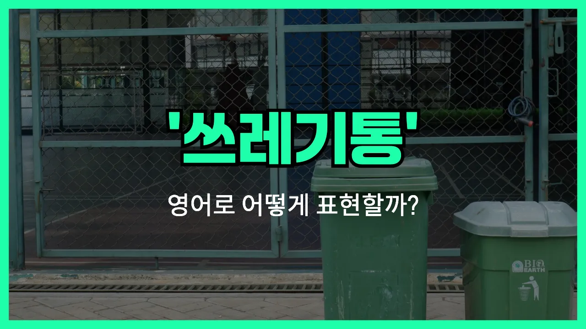

## 🌟 영어 표현 - trash can

안녕하세요 👋 오늘은 일상에서 자주 쓰는 물건인 '**쓰레기통**'을 영어로 어떻게 표현하는지 알아보려고 해요. 바로 '**trash can**'이라는 단어를 사용해요.

'**trash can**'은 집, 학교, 거리 등 어디에서나 볼 수 있는 **쓰레기를 버리는 통**을 의미해요. 미국식 영어에서는 주로 'trash can'이라고 하고, 영국식 영어에서는 'bin'이나 'rubbish bin'이라고도 해요. 하지만 미국식 표현인 'trash can'이 가장 널리 쓰여요!

이 단어는 쓰레기를 버릴 때, 청소할 때, 또는 환경에 대해 이야기할 때 자주 사용돼요. 예를 들어, "쓰레기통에 버려 주세요"라고 말하고 싶을 때 "Please [throw](/blog/in-english/458.throw/) it in the trash can."이라고 할 수 있어요.

## 📖 예문

1. "이 종이 좀 쓰레기통에 버려 줄래요?"

   "Can you throw this paper in the trash can?"

2. "쓰레기통이 꽉 찼어요."

   "The trash can is full."

## 💬 연습해보기

<ul data-interactive-list>

  <li data-interactive-item>
    나가기 전에 쓰레기통 좀 비워줄 수 있어요? 여기 냄새가 좀 심해서요.
    Can you please <a href="/blog/in-english/362.take-out/">take out</a> the trash can before you <a href="/blog/in-english/402.leave/">leave</a>? It smells kinda bad in here.
  </li>

  <li data-interactive-item>
    엘리베이터 옆에 새로 재활용 쓰레기통이랑 일반 쓰레기통이 생겼어요.
    There's a new recycling bin and a trash can right next to the elevator now.
  </li>

  <li data-interactive-item>
    점심때 실수로 열쇠를 쓰레기통에 버렸는데, 다시 꺼내느라 진짜 짜증났어요.
    I <a href="/blog/in-english/314.accidentally/">accidentally</a> threw my keys in the trash can at lunch. Had to dig them out. So gross.
  </li>

  <li data-interactive-item>
    다 끝나면 거기 있는 쓰레기통에 그냥 버리면 돼요.
    When you're done, just toss your stuff in the trash can over there.
  </li>

  <li data-interactive-item>
    왜 이 부엌 쓰레기통은 항상 넘쳐날까요?
    Why is the trash can always overflowing in this kitchen?
  </li>

  <li data-interactive-item>
    개가 쓰레기통을 자꾸 뒤져서 뚜껑 있는 걸 꼭 사야겠어요.
    My dog keeps getting into the trash can if I leave it down. I really need one with a lid.
  </li>

  <li data-interactive-item>
    가장 가까운 쓰레기통이 어디 있는지 아세요? 길에 그냥 버리고 싶지 않아서요.
    Do you know where the nearest trash can is? I don't want to just litter.
  </li>

  <li data-interactive-item>
    누가 쓰레기통 위에 커피 컵을 올려뒀는데, 그거 진짜 신경 쓰여요.
    Someone left their coffee cup on top of the trash can <a href="/blog/in-english/169.instead-of/">instead of</a> putting it in. That bugs me.
  </li>

  <li data-interactive-item>
    어젯밤에 차고에서 쓰레기통 때문에 걸려넘어졌어요. 다른 자리로 옮겨야겠어요.
    I tripped over the trash can in the garage last night. I need to find a better spot for it.
  </li>

  <li data-interactive-item>
    바람 세게 불면 우리 쓰레기통이 항상 길 쪽으로 굴러가요.
    When the wind gets strong, our trash can always rolls down the street.
  </li>

</ul>

## 🤝 함께 알아두면 좋은 표현들

### garbage bin

'garbage bin'은 'trash can'과 같은 의미로, **쓰레기를 버리는 통**을 가리켜요. 미국식 영어에서는 'trash can'을, 영국식 영어에서는 'garbage bin'이나 'rubbish bin'을 더 자주 사용해요.

- "Please take the garbage out and put it in the garbage bin outside."
- "쓰레기 좀 내다 버리고 밖에 있는 쓰레기통에 넣어주세요."

### recycling bin

'recycling bin'은 **재활용품을 따로 분리해서 버리는 통**을 의미해요. 일반 쓰레기통과는 달리, 플라스틱, 종이, 캔 등 재활용 가능한 물건만 넣는 곳이에요.

- "[Make sure](/blog/in-english/232.make-sure/) to put your plastic bottles in the recycling bin, not the trash can."
- "플라스틱 병은 쓰레기통 말고 재활용통에 꼭 넣어주세요."

### litter

'litter'는 **쓰레기를 아무 데나 버리다**라는 뜻의 동사예요. 'trash can'에 버리지 않고 길거리나 공공장소에 쓰레기를 버릴 때 주로 사용해요. 반대되는 개념이에요.

- "It's illegal to litter in the [park](/blog/in-english/463.park/), so always use the trash can."
- "공원에 쓰레기를 버리는 건 불법이니까 꼭 쓰레기통을 이용해야 해요."

---

오늘은 '**쓰레기통**'이라는 뜻을 가진 영어 표현 '**trash can**'에 대해 알아봤어요. 일상에서 꼭 필요한 단어이니 기억해 두면 좋겠죠? 😊

오늘 배운 표현과 예문들을 꼭 최소 3번씩 소리 내서 읽어보세요. 다음에도 더 재미있고 유익한 영어 표현으로 찾아올게요! 감사합니다!
