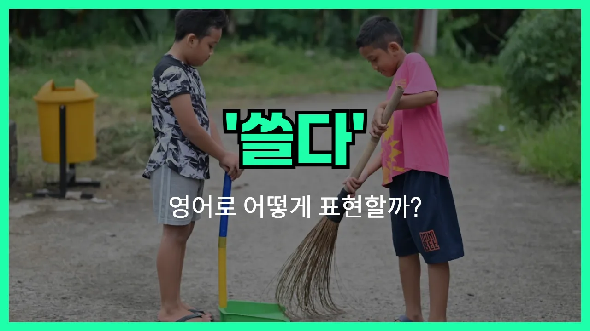

## 🌟 영어 표현 - sweep

안녕하세요 👋 오늘은 일상에서 자주 쓰는 동사 '**쓸다**'의 영어 표현 '**sweep**'에 대해 알아보려고 해요.

'**sweep**'는 바닥이나 표면에 있는 먼지, 쓰레기 등을 빗자루나 솔로 쓸어내는 행동을 말해요. 즉, **청소하다** 또는 **털다**라는 의미로도 자주 쓰여요!

이 단어는 집안일, 거리 청소, 또는 스포츠 경기 등 다양한 상황에서 자연스럽게 사용할 수 있어요. 예를 들어, 집에서 바닥을 청소할 때 "I need to sweep the floor."라고 말할 수 있어요.

또한, 'sweep'는 단순히 청소하는 것뿐만 아니라, 어떤 대회나 경기에서 상대를 완전히 이기는 상황(=싹쓸이하다)에도 쓸 수 있어요. 예를 들어, "Our team swept the series."라고 하면 "우리 팀이 시리즈를 싹쓸이했어."라는 뜻이에요.

## 📖 예문

1. "나는 매일 아침에 마당을 쓸어요."

   "I sweep the yard every morning."

2. "바닥에 먼지가 많아서 쓸어야 해요."

   "There is a lot of dust on the floor, so I need to sweep it."

3. "우리 팀이 이번 대회에서 전승을 거뒀어요."

   "Our team swept the tournament this time."

## 💬 연습해보기

<ul data-interactive-list>

  <li data-interactive-item>
    저녁 먹고 나서 부엌 바닥 좀 쓸어야 해요. 요리하고 나면 항상 지저분해지더라고요.
    I need to sweep the kitchen floor after dinner. It always gets <a href="/blog/in-english/352.messy/">messy</a> when we <a href="/blog/in-english/461.cook/">cook</a>.
  </li>

  <li data-interactive-item>
    오늘 아침에 현관 앞 낙엽 쓸었어요? 가을에는 금방 잔뜩 쌓이잖아요.
    Did you sweep the <a href="/blog/in-english/402.leave/">leaves</a> off the porch this morning? They pile up so fast in the fall.
  </li>

  <li data-interactive-item>
    이 부스러기만 얼른 쓸어치울게요. 그럼 영화 시작할 수 있어요.
    Let me just sweep up these crumbs real <a href="/blog/in-english/439.quick/">quick</a>. Then we can start the movie.
  </li>

  <li data-interactive-item>
    수업 끝나고 나오는데 관리인이 복도 쓸고 있더라고요.
    I saw the janitor sweeping the hallway when I left class.
  </li>

  <li data-interactive-item>
    소파 밑 좀 쓸어줄래요? 먼지 뭉치가 잔뜩 있어요.
    Can you sweep under the couch? There's a bunch of dust bunnies under there.
  </li>

  <li data-interactive-item>
    매주 토요일마다 엄마가 차고 쓸라고 시켜요. 진짜 못 참겠어요!
    Every Saturday, my mom makes me sweep the garage. I can't stand it!
  </li>

  <li data-interactive-item>
    한쪽 구석부터 쓸기 시작해서 다 모아서 쓸면 더 쉽거든요.
    It's easier to sweep if you start in one corner and move everything into a pile.
  </li>

  <li data-interactive-item>
    청소할 때 고양이가 항상 빗자루 쫓아다녀서 청소하는 데 두 배는 걸려요.
    My cat always chases the broom when I sweep. It takes twice as long to clean.
  </li>

  <li data-interactive-item>
    파티 끝나고 테라스에서 색종이 조각 쓸었는데 진짜 여기저기 막 있었어요.
    After the party, we had to sweep confetti off the patio. It was everywhere.
  </li>

  <li data-interactive-item>
    저는 보통 한 주에 한 번 계단 쓸어요, 근데 가끔 까먹을 때도 있죠.
    I usually sweep the stairs once a week, but <a href="/blog/in-english/270.sometimes/">sometimes</a> I <a href="/blog/in-english/023.forget/">forget</a>.
  </li>

</ul>

## 🤝 함께 알아두면 좋은 표현들

### clean up

'clean up'은 "청소하다"라는 뜻으로, 'sweep'과 비슷하게 공간을 깨끗하게 만드는 행위를 말해요. 단, 'sweep'이 주로 빗자루로 쓸어서 청소하는 것에 집중한다면, 'clean up'은 정리, 치우기, 닦기 등 더 넓은 의미로 사용돼요.

- "Let's clean up the living room before our guests [arrive](/blog/in-english/403.arrive/)."
- "손님 오기 전에 거실 좀 치우자고요."

### mess up

'mess up'은 "어질러 놓다" 또는 "엉망으로 만들다"라는 뜻이에요. 'sweep'이 청소해서 깨끗하게 만드는 것과 반대로, 'mess up'은 공간이나 물건을 지저분하게 만드는 상황에서 써요.

- "The kids messed up the kitchen while [baking](/blog/in-english/462.bake/) cookies."
- "애들이 쿠키 굽다가 주방을 엉망으로 만들어놨어요."

### tidy up

'tidy up'은 "정돈하다" 또는 "깔끔하게 정리하다"라는 뜻이에요. 'sweep'처럼 청소와 관련된 표현이지만, 빗자루질보다는 물건을 제자리에 놓거나 정리정돈하는 데 더 초점이 있어요.

- "I need to tidy up my desk before starting work."
- "일 시작하기 전에 책상 좀 정리해야겠어요."

---

오늘은 '**쓸다**', '**청소하다**', '**털다**'라는 뜻을 가진 영어 표현 '**sweep**'에 대해 알아봤어요. 집안일이나 다양한 상황에서 이 표현을 자연스럽게 써보면 좋겠어요 😊

오늘 배운 표현과 예문들을 꼭 최소 3번씩 소리 내서 읽어보세요. 다음에도 더 재미있고 유익한 영어 표현으로 찾아올게요! 감사합니다!

