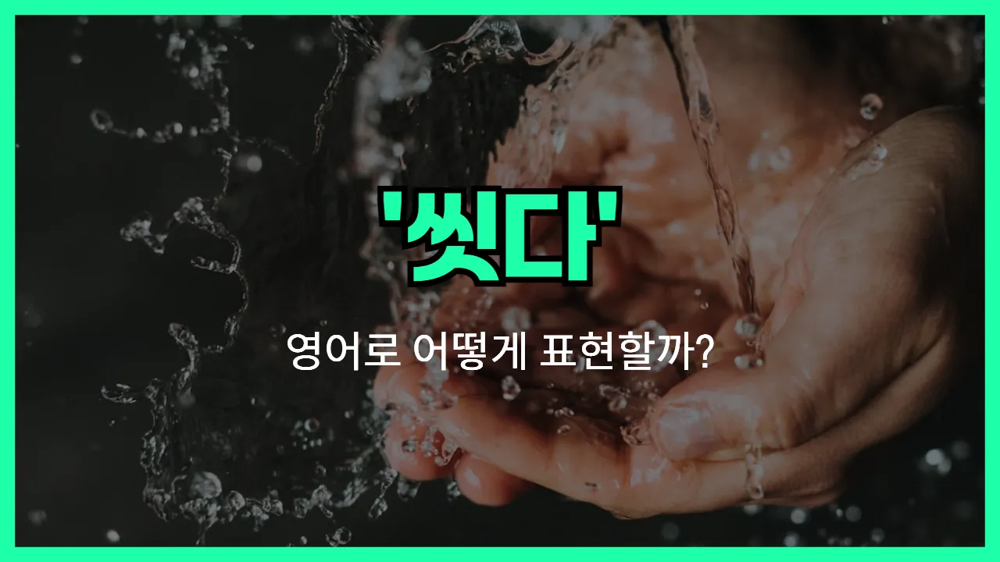

## 🌟 영어 표현 - wash

안녕하세요 👋 오늘은 일상에서 정말 자주 쓰는 표현, 바로 '**씻다**'의 영어 표현 '**wash**'에 대해 이야기해보려고 해요.

'**wash**'는 **물이나 비누 등으로 더러운 것을 깨끗하게 하는 것**을 의미해요. 우리가 손을 씻거나, 얼굴을 닦거나, 옷을 세탁할 때 모두 사용할 수 있는 아주 기본적인 단어예요!

이 단어는 손, 얼굴, 머리카락, 옷, 자동차 등 다양한 대상을 깨끗하게 할 때 자연스럽게 쓸 수 있어요. 예를 들어, "손을 씻다"는 "wash my hands"라고 하고, "옷을 세탁하다"는 "wash the clothes"라고 해요.

또한, 'wash'는 동사로 주로 사용되지만, 명사로도 '세탁'이라는 뜻이 있어요. 하지만 일상에서는 동사로 더 많이 쓰인다는 점 기억해두세요!

## 📖 예문

1. "식사 전에 손을 꼭 씻으세요."

   "Please wash your hands before eating."

2. "저는 매일 아침에 얼굴을 씻어요."

   "I wash my face every morning."

3. "이 셔츠를 세탁기에 넣고 세탁해 주세요."

   "Please put this shirt in the washing machine and wash it."

## 💬 연습해보기

<ul data-interactive-list>

  <li data-interactive-item>
    이번 주말에 차 좀 씻어야 해요. 비도 많이 와서 엄청 더러워졌거든요.
    I need to wash my car this weekend. It's gotten pretty dirty from all the rain.
  </li>

  <li data-interactive-item>
    저녁 먹고 나서 설거지 좀 해줄래요? 저는 부엌 나머지 정리할게요.
    Can you wash the dishes after dinner? I'll handle <a href="/blog/in-english/103.the-rest-of/">the rest of</a> the kitchen.
  </li>

  <li data-interactive-item>
    밥 먹기 전에 꼭 손 씻으세요. 우리 엄마가 그거 엄청 신경 써요.
    Don't <a href="/blog/in-english/023.forget/">forget</a> to wash your hands before you eat. My mom is big on that rule.
  </li>

  <li data-interactive-item>
    보통 일요일에 세탁해요. 이게 제 루틴이 됐거든요.
    I usually wash my clothes on Sundays. It's become my routine.
  </li>

  <li data-interactive-item>
    아침에 찬물로 세수하는 걸 좋아해요. 정신이 확 들거든요.
    She likes to wash her face with cold water in the morning to <a href="/blog/in-english/300.wake-up/">wake up</a>.
  </li>

  <li data-interactive-item>
    샐러드 서빙하기 전에 씻었어요? 양상추에 가끔 흙 묻어 있거든요.
    Did you wash the salad before serving it? <a href="/blog/in-english/270.sometimes/">Sometimes</a> there's dirt on the lettuce.
  </li>

  <li data-interactive-item>
    날씨 따뜻할 때 아이들이 차도에서 자전거 씻어요.
    The kids wash their bikes in the driveway when it's warm outside.
  </li>

  <li data-interactive-item>
    내일 창문 닦을게요. 지금 얼룩도 많이 보여서요.
    I'll wash the windows tomorrow. They're so streaky right now.
  </li>

  <li data-interactive-item>
    아빠가 욕실이 더러워지지 않게 밖에서 강아지 씻으래요.
    Dad said to wash the dog outside so the bathroom doesn't get all <a href="/blog/in-english/352.messy/">messy</a>.
  </li>

  <li data-interactive-item>
    베개 좀 세탁해야 할 것 같아요. 냄새가 좀 이상해지기 시작했어요.
    I think we need to wash these pillows. They're starting to smell a bit funky.
  </li>

</ul>

## 🤝 함께 알아두면 좋은 표현들

### rinse

'rinse'는 "헹구다"라는 뜻으로, 주로 비누나 세제를 사용한 후에 남아 있는 찌꺼기나 거품을 물로 깨끗이 씻어낼 때 사용해요. 'wash'가 전체적으로 씻는 행위라면, 'rinse'는 마지막 단계에서 깨끗이 물로 헹구는 것을 강조해요.

- "After washing the dishes, [make sure](/blog/in-english/232.make-sure/) to rinse them thoroughly to remove any soap."
- "설거지를 한 후에는 비눗기가 남지 않게 꼭 깨끗이 헹궈야 해요."

### scrub

'scrub'는 "문질러 닦다"라는 뜻이에요. 단순히 물로 씻는 것보다 더 세게, 때나 얼룩을 없애기 위해 힘을 줘서 닦는 상황에서 써요. 특히 오염이 심한 곳이나 때가 잘 안 지워질 때 많이 사용해요.

- "You need to scrub the bathtub to [get rid of](/blog/in-english/398.get-rid-of/) the stubborn stains."
- "고집 센 얼룩을 없애려면 욕조를 빡빡 문질러 닦아야 해요."

### stain

'stain'은 "얼룩지다" 또는 "더럽히다"라는 뜻으로, 'wash'의 반대되는 개념이에요. 무언가를 깨끗하게 하는 것이 아니라 오히려 더럽게 만드는 상황에서 사용해요. 주로 옷이나 표면에 지워지기 힘든 자국이 남을 때 써요.

- "Be careful not to stain your shirt while eating spaghetti."
- "스파게티 먹을 때 셔츠에 얼룩 묻지 않게 조심해야 해요."

---

오늘은 '**씻다**', '**세척하다**', '**청소하다**'라는 뜻을 가진 영어 표현 '**wash**'에 대해 알아봤어요. 일상에서 손이나 얼굴, 옷을 깨끗하게 할 때 이 표현을 꼭 떠올려 보세요! 😊

오늘 배운 표현과 예문들을 꼭 최소 3번씩 소리 내서 읽어보세요. 다음에도 더 재미있고 유익한 영어 표현으로 찾아올게요! 감사합니다!
