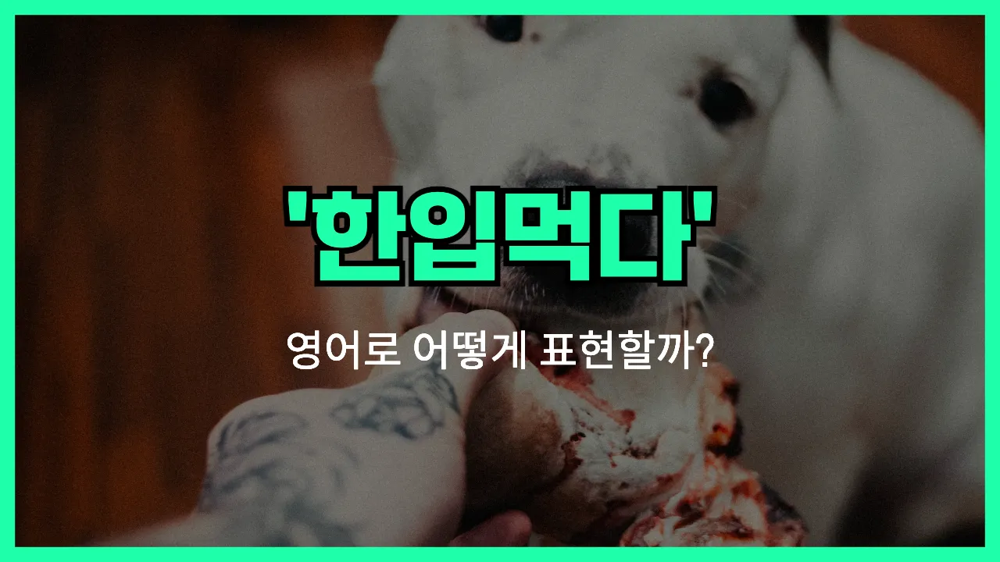

## 🌟 영어 표현 - have a bite

안녕하세요 👋 오늘은 일상에서 자주 쓰이는 표현인 '**한 입 먹다**'를 영어로 어떻게 말하는지 알아볼 거예요. 바로 '**have a bite**'라는 표현이에요!

'**have a bite**'는 말 그대로 무언가를 **한 입 먹다**, **맛보다**, 또는 **시식하다**라는 뜻으로 사용돼요. 친구가 맛있는 음식을 먹고 있을 때, "나도 한 입만 먹어봐도 돼?"라고 말하고 싶을 때 딱 어울리는 표현이에요!

이 표현은 간단하면서도 자연스럽게 쓸 수 있어서, 영어권 친구들과 식사할 때 정말 유용하게 쓰여요. 특히, 누군가의 음식을 조금만 맛보고 싶을 때 "Can I have a bite?"라고 물어보면 아주 자연스러워요.

## 📖 예문

1. "이 케이크 한 입 먹어봐도 돼요?"

   "Can I have a bite of this cake?"

2. "네 샌드위치 한 입만 먹어볼래요?"

   "Do you want to have a bite of my sandwich?"

## 💬 연습해보기

<ul data-interactive-list>

  <li data-interactive-item>
    아침을 안 먹어서 점심에 얼른 한 입 먹고 싶어요.
    I skipped breakfast, so I can't wait to have a bite at lunch.
  </li>

  <li data-interactive-item>
    가기 전에 들어와서 잠깐 뭐 좀 먹을래요?
    Do you want to come in and have a bite before you go?
  </li>

  <li data-interactive-item>
    잠깐만요, 이 피자 한 입만 먹어볼게요. 진짜 맛있어요.
    Hang on, let me just have a bite of this pizza. It's so good.
  </li>

  <li data-interactive-item>
    완전 배고파서 회의 시작 전에 그냥 한 입 먹었어요.
    I was starving, so I had to have a bite before the meeting started.
  </li>

  <li data-interactive-item>
    로드트립 중에 카페에 들러서 간단히 먹고 갔어요.
    We stopped by the cafe to have a bite on our road trip.
  </li>

  <li data-interactive-item>
    배고프면 저 새 샌드위치 가게 가서 뭐 좀 먹자요.
    If you're <a href="/blog/in-english/437.hungry/">hungry</a>, let's have a bite at that new sandwich place.
  </li>

  <li data-interactive-item>
    그녀가 쿠키를 가져와서 원하는 사람이 간단히 먹을 수 있었어요.
    She brought cookies, so everyone could have a bite if they wanted.
  </li>

  <li data-interactive-item>
    케이크 한 조각 다는 못 먹겠고, 한 입만 먹어도 될까요?
    I don't want a whole piece, but can I have a bite of your cake?
  </li>

  <li data-interactive-item>
    앉아서 준비하는 동안 간단히 뭐 좀 먹어요.
    Grab a seat and have a bite while we <a href="/blog/in-english/295.finish/">finish</a> getting ready.
  </li>

  <li data-interactive-item>
    하루 종일 쇼핑하다가 드디어 앉아서 뭐 좀 먹었어요.
    We were out shopping all day and <a href="/blog/in-english/182.finally/">finally</a> sat down to have a bite.
  </li>

</ul>

## 🤝 함께 알아두면 좋은 표현들

### grab a snack

'grab a snack'은 "간단하게 간식을 먹다"라는 뜻이에요. 식사보다는 가볍게 뭔가를 먹고 싶을 때 자주 쓰는 표현이에요. 주로 바쁘거나 출출할 때 간단히 먹는 상황에서 사용돼요.

- "I'm a bit hungry. Do you want to grab a snack before the movie?"
- "나 좀 배고픈데, 영화 보기 전에 간단히 뭐 먹을래요?"

### skip a meal

'[skip](/blog/in-english/369.skip/) a meal'은 "끼니를 거르다"라는 의미예요. 보통 바쁘거나 식욕이 없어서 식사를 하지 않을 때 쓰는 표현이에요. 'have a bite'와는 반대되는 상황에서 사용돼요.

- "I was so [busy](/blog/in-english/372.busy/) at work today that I had to skip lunch."
- "오늘 회사에서 너무 바빠서 점심을 거를 수밖에 없었어요."

### have a quick bite

'have a [quick](/blog/in-english/439.quick/) bite'는 'have a bite'와 비슷하게 "잠깐 뭔가를 먹다"라는 뜻이에요. 특히 시간이 없을 때 빠르게 먹는다는 뉘앙스가 더해져요.

- "Let's have a quick bite before the meeting starts."
- "회의 시작하기 전에 잠깐 뭐 좀 먹어요."

---

오늘은 '**한 입 먹다**', '**맛보다**', '**시식하다**'라는 뜻을 가진 영어 표현 '**have a bite**'에 대해 알아봤어요. 앞으로 친구들과 음식을 나눌 때 이 표현을 꼭 활용해 보세요! 😊

오늘 배운 표현과 예문들을 소리 내서 여러 번 연습해 보세요. 다음에도 더 재미있고 유익한 영어 표현으로 찾아올게요! 감사합니다!

