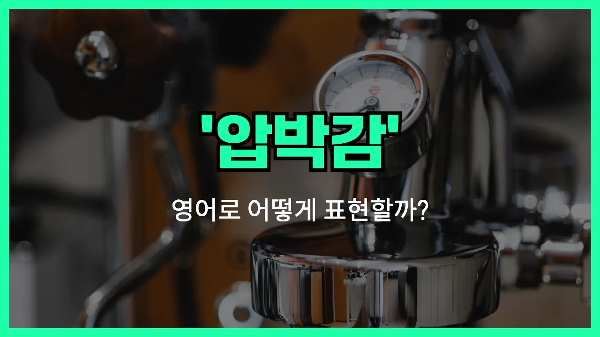

## 🌟 영어 표현 - under pressure

안녕하세요 👋 오늘은 우리가 일상에서 자주 느끼는 감정 중 하나인 '**압박을 받다**'를 영어로 어떻게 표현하는지 알아보려고 해요. 바로 '**under pressure**'라는 표현이에요.

'**under pressure**'는 말 그대로 **압력이나 스트레스, 부담을 느끼는 상황**을 나타낼 때 쓰여요. 시험, 직장, 인간관계 등 다양한 상황에서 심리적으로 부담을 느낄 때 자연스럽게 사용할 수 있는 표현이에요!

예를 들어, 마감일이 다가와서 일이 많을 때 "I'm under pressure at work."라고 말할 수 있어요. 또는, 누군가가 나에게 기대를 많이 해서 부담을 느낄 때도 쓸 수 있답니다.

## 📖 예문

1. "요즘 회사에서 압박을 많이 받고 있어요."

   "I'm under a lot of pressure at work [these days](/blog/in-english/417.these-days/)."

2. "시험 준비 때문에 압박을 느끼고 있어요."

   "I'm feeling under pressure because of exam preparation."

## 💬 연습해보기

<ul data-interactive-list>

  <li data-interactive-item>
    우리 사장님이 계속 저한테 일이 더 늘려서 항상 스트레스 받아요.
    My boss keeps giving me <a href="/blog/in-english/265.extra/">extra</a> work. I feel like I'm always under pressure.
  </li>

  <li data-interactive-item>
    마지막 몇 분 동안 쿼터백이 엄청 압박받는 게 딱 보였어요.
    You could tell the quarterback was under pressure during the last few minutes of the game.
  </li>

  <li data-interactive-item>
    그녀는 압박 속에서도 정말 잘 대처해서 진짜 대단해요.
    She handles herself really well under pressure. It's <a href="/blog/in-english/336.honestly/">honestly</a> impressive.
  </li>

  <li data-interactive-item>
    큰 시험 전에 긴장되지만 최대한 침착하게 있으려고 해요.
    I get under pressure before big exams, but I <a href="/blog/in-english/117.try-to/">try to</a> stay <a href="/blog/in-english/380.calm/">calm</a>.
  </li>

  <li data-interactive-item>
    우리 팀은 압박 받을 때 뭉쳐서 프로젝트를 제때 끝냈어요.
    Our team came <a href="/blog/in-english/374.together/">together</a> when we were under pressure and finished the project <a href="/blog/vocab-1/043.on-time/">on time</a>.
  </li>

  <li data-interactive-item>
    고객 서비스 일은 특히 명절 때 스트레스가 심할 수 있어요.
    Working in customer service can <a href="/blog/in-english/270.sometimes/">sometimes</a> put you under pressure, especially during the holidays.
  </li>

  <li data-interactive-item>
    그는 압박 받으면 실수를 하는 편이라 제가 좀 도와주려고 했어요.
    He <a href="/blog/in-english/259.tend-to/">tends to</a> make mistakes when he's under pressure, so I tried to help him relax.
  </li>

  <li data-interactive-item>
    전 세 들어 있는 집 계약 끝나기 전에 새집 구하느라 스트레스 받아요.
    I'm under pressure to find a new apartment before my lease is up.
  </li>

  <li data-interactive-item>
    그들은 압박 속에서도 기대 이상으로 잘했어요.
    They performed better under pressure than anyone expected.
  </li>

  <li data-interactive-item>
    항상 일이 많아서 스트레스 받으면 창의적인 생각하기가 힘들어요.
    <a href="/blog/in-english/111.hard-to/">It's hard to</a> stay creative when you're always under pressure at work.
  </li>

</ul>

## 🤝 함께 알아두면 좋은 표현들

### feel the heat

'feel the heat'는 "압박을 느끼다" 또는 "스트레스를 받다"라는 뜻이에요. 주로 누군가가 어려운 상황이나 기대가 큰 상황에서 부담을 느낄 때 사용해요.

- "With the deadline approaching, everyone in the office was starting to feel the heat."
- "마감일이 다가오니까 사무실에 있는 모두가 압박을 느끼기 시작했어요."

### at ease

'at ease'는 "편안하다" 또는 "긴장이 풀린 상태다"라는 의미예요. 부담이나 압박 없이 마음이 편안하고 여유로운 상태를 나타낼 때 써요. 'under pressure'의 반대되는 느낌이에요.

- "She always feels at ease when she's with her close friends."
- "그녀는 친한 친구들과 함께 있을 때 항상 마음이 편안해져요."

### crack under pressure

'crack under pressure'는 "압박을 못 이기고 무너지다" 또는 "스트레스를 이기지 못하다"라는 뜻이에요. 너무 큰 부담이나 스트레스를 받아서 실수하거나 평소처럼 행동하지 못할 때 자주 써요.

- "Some players crack under pressure during [important](/blog/in-english/318.important/) games."
- "어떤 선수들은 중요한 경기에서 압박을 못 이기고 무너질 때가 있어요."

---

오늘은 '**압박을 받다**'라는 뜻의 영어 표현 '**under pressure**'에 대해 알아봤어요. 스트레스나 부담을 느낄 때 이 표현을 떠올리면 좋겠어요 😊

오늘 배운 표현과 예문들을 꼭 소리 내서 여러 번 읽어보세요. 다음에도 더 유익한 영어 표현으로 찾아올게요! 감사합니다!
