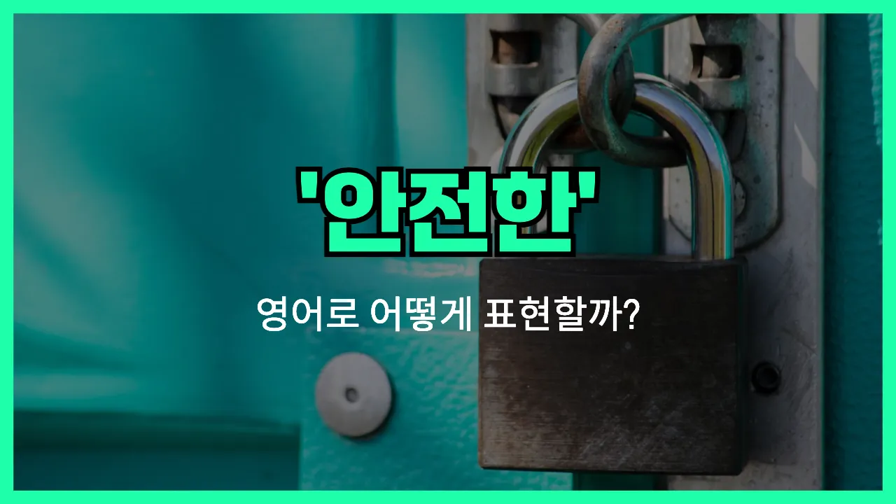

## 🌟 영어 표현 - secure

안녕하세요 👋 오늘은 우리가 자주 쓰는 단어인 '**안전한**', '**보안이 잘 된**', '**확실한**'이라는 뜻을 가진 영어 표현 '**secure**'에 대해 알아보려고 해요.

'**secure**'는 주로 **위험이나 위협으로부터 안전한 상태**를 말할 때 사용해요. 예를 들어, 문이 잘 잠겨 있어서 외부로부터 안전할 때, 또는 데이터가 해킹으로부터 보호될 때 쓸 수 있어요. 또한, 어떤 것이 확실하게 보장되어 있을 때도 'secure'라는 단어를 사용할 수 있어요!

이 단어는 일상생활뿐만 아니라 회사, 학교, IT 등 다양한 분야에서 정말 많이 쓰여요. 예를 들어, 집이나 사무실이 안전하게 잠겨 있을 때, 또는 인터넷에서 개인정보가 안전하게 보호될 때도 'secure'라는 표현을 사용해요.

## 📖 예문

1. "이 건물은 매우 안전해요."

   "This building is very secure."

2. "내 계정은 안전하게 보호되고 있어요."

   "My account is secure."

3. "우리는 안전한 장소에 있어요."

   "We are in a secure location."

## 💬 연습해보기

<ul data-interactive-list>

  <li data-interactive-item>
    새로운 직장에서 드디어 안정감을 느껴요. 여기 사람들 다 너무 잘 챙겨줘서 좋아요.
    I finally feel secure in my new job. Everyone here is so supportive.
  </li>

  <li data-interactive-item>
    저 아파트 단지, 카메라랑 경비 아저씨들 많아서 진짜 안전해 보여요.
    That apartment complex looks really secure with all those cameras and <a href="/blog/in-english/554.security/">security</a> guards.
  </li>

  <li data-interactive-item>
    여기 밤에 혼자 다니면 안전하다고 느껴져요?
    Do you feel secure walking alone at night around here?
  </li>

  <li data-interactive-item>
    동생은 야간등 켜놔야 좀 마음이 편하대요.
    My little brother sleeps with a nightlight because it makes him feel more secure.
  </li>

  <li data-interactive-item>
    우리 집 뒷마당은 별로 안전하지 않아요. 오래된 울타리가 다 무너지고 있거든요.
    Our backyard isn't very secure. The old fence is falling apart.
  </li>

  <li data-interactive-item>
    자전거 잠그지 않고 밖에 그냥 두는 게 불안해서 못 하겠대요.
    She doesn't feel secure leaving her bike outside without locking it up.
  </li>

  <li data-interactive-item>
    부모님이 항상 대학 얘기하는 이유가 안정된 미래를 원해서래요.
    My parents want me to have a secure future, so they're always talking about college.
  </li>

  <li data-interactive-item>
    돈 좀 모아 놓으면 앞으로 좀 더 든든한 기분 들어요.
    Having some money saved up makes me feel more secure about the future.
  </li>

  <li data-interactive-item>
    그 친구는 내가 어디에 있는지 확실히 아는 안정적인 관계를 좋아해요.
    He likes secure relationships where he knows where he stands.
  </li>

  <li data-interactive-item>
    문이랑 창문 다 잠그고 나서야 마음 놓고 잠들 수 있었어요.
    After locking the doors and windows, I finally felt secure enough to go to bed.
  </li>

</ul>

## 🤝 함께 알아두면 좋은 표현들

### safe

'[safe](/blog/in-english/857.safe/)'는 'secure'와 비슷하게 "안전한"이라는 뜻이에요. 위험이나 해로움으로부터 보호받고 있는 상태를 나타낼 때 자주 사용해요.

- "The children felt safe playing in the fenced backyard."
- "아이들은 울타리가 쳐진 뒷마당에서 놀 때 안전하다고 느꼈어요."

### vulnerable

'vulnerable'은 'secure'의 반대말로, "취약한" 또는 "위험에 노출된"이라는 뜻이에요. 보호받지 못해서 쉽게 다치거나 해를 입을 수 있는 상태를 말할 때 써요.

- "Without antivirus software, your computer is vulnerable to attacks."
- "백신 프로그램이 없으면 컴퓨터가 공격에 취약해져요."

### protected

'protected'는 "보호받는"이라는 뜻으로, 'secure'와 비슷하게 외부의 위험이나 위협으로부터 안전하게 지켜지는 상태를 나타낼 때 사용해요.

- "All the important [documents](/blog/in-english/824.document/) are protected in a locked cabinet."
- "모든 중요한 서류는 잠긴 캐비닛에 안전하게 보관되어 있어요."

---

오늘은 '**안전한**', '**보안이 잘 된**', '**확실한**'이라는 뜻을 가진 영어 표현 '**secure**'에 대해 알아봤어요. 앞으로 누군가에게 안전함이나 보안을 강조하고 싶을 때 이 단어를 떠올려 보세요 😊

오늘 배운 표현과 예문들을 꼭 최소 3번씩 소리 내서 읽어보세요. 다음에도 더 재미있고 유익한 영어 표현으로 찾아올게요! 감사합니다!
