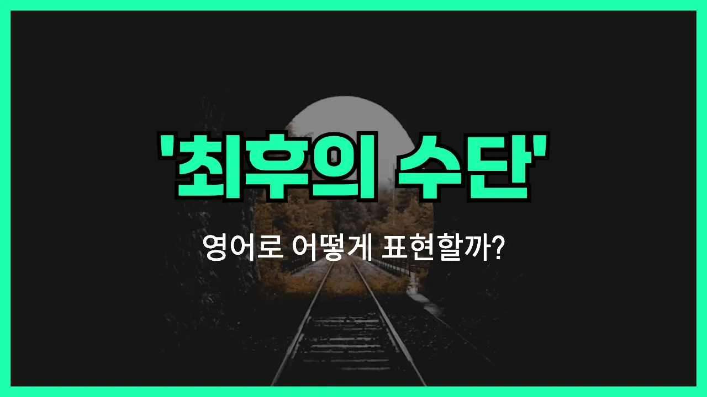

## 🌟 영어 표현 - as a last resort

안녕하세요 👋 오늘은 영어에서 '최후의 수단', '마지막 방법'이라는 뜻을 가진 표현을 소개해드리려고 해요. 바로 '**as a last resort**'라는 표현이에요.

이 표현은 **정말 다른 방법이 없을 때, 어쩔 수 없이 선택하는 마지막 방법**을 말할 때 사용해요. 즉, 여러 가지 방법을 시도해봤지만 다 실패했을 때, 마지막으로 시도하는 수단을 의미해요!

예를 들어, 문제가 계속 해결되지 않아서 더 이상 방법이 없을 때 "최후의 수단으로 이 방법을 써야겠다"라고 할 때 딱 맞는 표현이에요.

## 📖 예문

1. "최후의 수단으로 우리는 경찰에 신고했어요."

   "We called the police as a last resort."

2. "이 약은 최후의 수단으로만 사용해야 해요."

   "This medicine should only be [used](/blog/in-english/171.used/) as a last resort."

## 💬 연습해보기

<ul data-interactive-list>

  <li data-interactive-item>
    컴퓨터가 더 안 되면 마지막 수단으로 재부팅해봐야 할 것 같아요. 다른 방법은 다 안 통하는 것 같아요.
    We can try rebooting the computer as a last resort. Nothing else seems to be working.
  </li>

  <li data-interactive-item>
    약 먹는 거 싫어하는데, 이 두통이 안 사라지면 어쩔 수 없이 마지막 수단으로 먹어야겠어요.
    I <a href="/blog/in-english/392.hate/">hate</a> taking medicine, but I guess I'll do it as a last resort if this headache doesn't go away.
  </li>

  <li data-interactive-item>
    고객센터는 진짜 마지막 수단으로만 전화해야 해요. 항상 엄청 오래 대기하게 하잖아요.
    We should only call customer service as a last resort. They always put you on <a href="/blog/in-english/388.hold/">hold</a> forever.
  </li>

  <li data-interactive-item>
    택시 못 잡으면 마지막 수단으로 그냥 걸어가도 돼요. 집이 그리 멀지 않거든요.
    If we can't find a taxi, we can walk home as a last resort. It's not too far.
  </li>

  <li data-interactive-item>
    마지막 수단으로 피자 시켜먹을 수 있어요. 요리하려 했는데 냉장고에 아무것도 없네요.
    As a last resort, we can order pizza. I was hoping to <a href="/blog/in-english/461.cook/">cook</a>, but we have nothing in the fridge.
  </li>

  <li data-interactive-item>
    차가 안 켜지면 마지막 수단으로 우버 탈 수도 있어요. 먼저 누가 태워줄 수 있는지 알아볼게요.
    If the car <a href="/blog/in-english/456.win/">won</a>'t start, we might have to Uber as a last resort. Let's see if anyone else can give us a ride first.
  </li>

  <li data-interactive-item>
    도움 청하는 거 별로였는데, 진짜 방법 없어서 마지막 수단으로 도움 요청했어요. 혼자서는 도저히 못 풀겠더라고요.
    I didn't want to <a href="/blog/in-english/125.ask-for/">ask for</a> help, but I had to as a last resort. I just couldn't figure it out on my own.
  </li>

  <li data-interactive-item>
    마지막 수단으로, 혹시 갈 데 없으면 내 소파에서 자도 돼요.
    As a last resort, you could always crash on my couch if you have nowhere else to stay.
  </li>

  <li data-interactive-item>
    핸드폰 배터리 다 닳으면 마지막 수단으로 충전기 빌릴게요. 집까지 버텨주면 좋겠네요.
    If my phone battery dies, I'll <a href="/blog/in-english/466.borrow/">borrow</a> a charger as a last resort. Hopefully, it'll last until I get home.
  </li>

  <li data-interactive-item>
    이웃한테 소음 문제 얘기해봤는데, 마지막 수단으로 집주인한테 연락해야 할 수도 있어요.
    We tried <a href="/blog/in-english/359.talk-to/">talking to</a> our neighbor about the noise, but as a last resort, we might have to call the landlord.
  </li>

</ul>

## 🤝 함께 알아두면 좋은 표현들

### in a pinch

'in a pinch'는 '정말 급할 때', '어쩔 수 없을 때'라는 의미로, 상황이 여의치 않을 때 임시방편으로 어떤 것을 사용할 때 쓰는 표현이에요. 'as a last resort'와 비슷하게 최후의 수단으로 무언가를 선택할 때 자주 사용돼요.

- "We can use my car in a pinch if yours doesn't start."
- "네 차가 시동이 안 걸리면 정말 급할 때 내 차를 써도 돼요."

### first choice

'first [choice](/blog/in-english/399.choice/)'는 '최우선 선택', '가장 먼저 고르는 것'이라는 뜻이에요. 'as a last resort'가 마지막 수단을 의미한다면, 'first choice'는 반대로 가장 선호하는 선택지를 의미하는 반의어예요.

- "This restaurant is always my first choice for special occasions."
- "이 식당은 특별한 날에 내가 항상 제일 먼저 고르는 곳이에요."

### as a rule

'as a rule'은 '일반적으로', '보통은'이라는 뜻이에요. 'as a last resort'가 예외적이고 마지막에 쓰는 방법이라면, 'as a rule'은 평소에 주로 하는 방법이나 원칙을 말할 때 사용돼요. 두 표현은 상황의 일반성과 예외성을 대조할 때 쓸 수 있어요.

- "As a rule, I don't eat dessert after dinner."
- "나는 보통 저녁 먹고 나서는 디저트를 안 먹는 편이에요."

---

오늘은 '최후의 수단', '마지막 방법'이라는 뜻을 가진 영어 표현 '**as a last resort**'에 대해 알아봤어요. 정말 어쩔 수 없을 때 쓰는 표현이니, 상황에 맞게 활용해보세요 😊

오늘 배운 표현과 예문들을 꼭 최소 3번씩 소리 내서 읽어보세요. 다음에도 더 재미있고 유익한 영어 표현으로 찾아올게요! 감사합니다!
