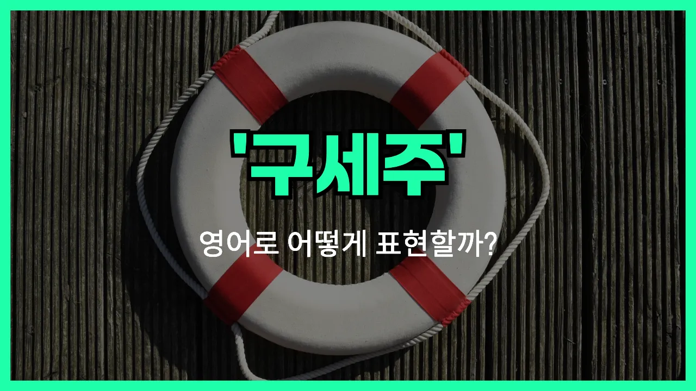

## 🌟 영어 표현 - lifesaver

안녕하세요 👋 오늘은 영어 표현 '**lifesaver**'에 대해 이야기해보려고 해요. 혹시 누군가가 큰 도움을 줘서 정말 고마웠던 적 있으신가요? 그럴 때 쓸 수 있는 표현이 바로 '**lifesaver**'예요.

'lifesaver'는 직역하면 '생명을 구해주는 사람'이라는 뜻이에요. 하지만 일상 영어에서는 꼭 실제로 생명을 구하지 않아도, **어려운 상황에서 큰 도움을 준 사람**이나 **꼭 필요할 때 도움을 준 것**을 가리킬 때 자주 사용해요!

예를 들어, 중요한 시험 전에 친구가 연필을 빌려줬거나, 갑자기 비가 올 때 우산을 빌려준 사람이 있다면 "You are a lifesaver!"라고 말할 수 있어요. 이 표현은 상대방에게 정말 고맙다는 마음을 강조할 때 쓰기 딱 좋아요.

## 📖 예문

1. "네가 이 숙제 도와줘서 정말 구세주야."

   "You are a real lifesaver for helping me with this homework."

2. "이 우산이 오늘 내 구세주였어."

   "This umbrella was a lifesaver for me today."

## 💬 연습해보기

<ul data-interactive-list>

  <li data-interactive-item>
    오늘 아침에 커피 사줘서 진짜 고마워요. 완전 생명의 은인이에요!
    Thanks for grabbing me coffee this morning. You're a lifesaver!
  </li>

  <li data-interactive-item>
    회의 바로 전에 컴퓨터 고쳐줘서 진짜 살렸어요. 완전 생명의 은인이에요.
    You fixed my computer right before the meeting. Seriously, you're a lifesaver.
  </li>

  <li data-interactive-item>
    열쇠 잃어버렸는데 룸메가 똑같은 열쇠 갖고 있어서 완전 구세주였어요.
    I <a href="/blog/in-english/457.lose/">lost</a> my keys but my roommate had a <a href="/blog/in-english/051.spare/">spare</a>. She was a total lifesaver.
  </li>

  <li data-interactive-item>
    비 올 때 가져온 우산이 완전 구세주였어요.
    That umbrella you brought was a lifesaver in this rain.
  </li>

  <li data-interactive-item>
    충전기 기억해줘서 고마워요! 폰 죽을 뻔 했는데 완전 살렸어요.
    You remembered my charger? Lifesaver! My phone was about to die.
  </li>

  <li data-interactive-item>
    솔직히 우리 여행에서 GPS가 진짜 구세주였어요. 안 그랬으면 완전 길을 잃었을 거예요.
    <a href="/blog/in-english/336.honestly/">Honestly</a>, the GPS was a lifesaver on our trip. We would've gotten so lost.
  </li>

  <li data-interactive-item>
    어제 내 근무 대신해줘서 진짜 고마웠어요. 완전 спаситель이에요!
    When you covered my shift yesterday, you were a real lifesaver.
  </li>

  <li data-interactive-item>
    요리하기 귀찮은 날에 이 냉동 피자 완전 구세주예요.
    This <a href="/blog/in-english/480.frozen/">frozen</a> pizza is such a lifesaver on nights I don't feel like <a href="/blog/in-english/461.cook/">cooking</a>.
  </li>

  <li data-interactive-item>
    지갑에 여분 현금 있어서 카드 기계 고장 났을 때 진짜 도움이 됐어요.
    Having <a href="/blog/in-english/265.extra/">extra</a> cash in my wallet <a href="/blog/vocab-1/038.turn-out/">turned out</a> to be a lifesaver when the card machine was down.
  </li>

  <li data-interactive-item>
    병원 예약 전에 보내준 그 알림 덕분에 완전 기억했어요. 안 그랬으면 깜빡할 뻔 했어요.
    That reminder you <a href="/blog/in-english/292.send/">sent</a> before my doctor's appointment was a lifesaver. I totally would've <a href="/blog/in-english/023.forget/">forgotten</a>.
  </li>

</ul>

## 🤝 함께 알아두면 좋은 표현들

### a godsend

'a godsend'는 "하늘이 내려준 선물" 또는 "뜻밖의 큰 도움"이라는 뜻이에요. 예상치 못한 순간에 큰 도움이 되는 사람이나 물건, 상황을 말할 때 써요. 'lifesaver'와 비슷하게 정말 고마운 존재를 강조할 때 자주 사용해요.

- "That extra battery [pack](/blog/in-english/301.pack/) was a godsend during our camping trip."
- "캠핑 갔을 때 그 보조 배터리가 정말 하늘이 내려준 선물이었어요."

### come to the rescue

'come to the rescue'는 "구하러 오다" 또는 "도와주러 오다"라는 뜻이에요. 누군가가 어려움에 처했을 때 나타나서 도와주는 상황을 표현할 때 써요. 'lifesaver'처럼 누군가의 도움으로 위기를 벗어났을 때 자주 사용해요.

- "Just when I thought I was [stuck](/blog/in-english/389.stuck/), my friend came to the rescue with a solution."
- "정말 막막하다고 생각했는데, 친구가 해결책을 들고 도와주러 왔어요."

### let someone down

'[let someone down](/blog/in-english/120.let-someone-down/)'은 "누군가를 실망시키다"라는 뜻이에요. 기대했던 도움을 받지 못하거나, 누군가가 기대에 미치지 못해 실망할 때 쓰는 표현이에요. 'lifesaver'와는 반대되는 의미로, 도움을 주지 못했을 때 자주 사용해요.

- "I really needed his support, but he let me down when it mattered most."
- "정말 그의 도움이 필요했는데, 가장 중요한 순간에 날 실망시켰어요."

---

오늘은 '**구세주**', '**생명의 은인**', '**도움의 손길**'이라는 뜻을 가진 영어 표현 '**lifesaver**'에 대해 알아봤어요. 누군가에게 큰 도움을 받았을 때 이 표현을 꼭 한 번 써보세요! 😊

오늘 배운 표현과 예문들을 꼭 최소 3번씩 소리 내서 읽어보세요. 다음에도 더 재미있고 유익한 영어 표현으로 찾아올게요! 감사합니다!~요
