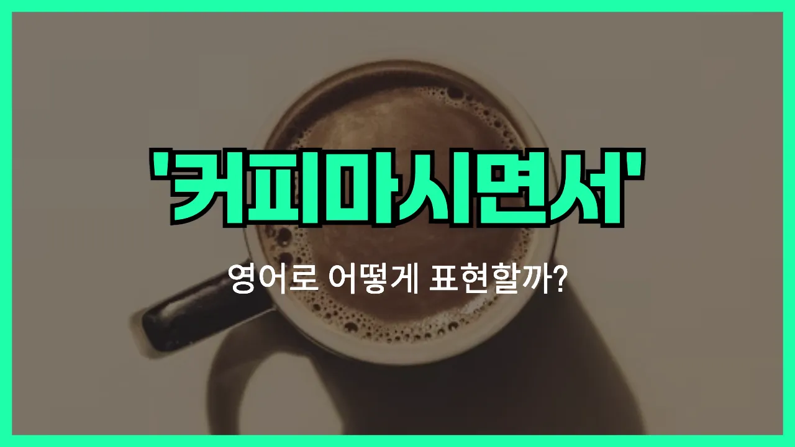

## 🌟 영어 표현 - over coffee

안녕하세요 👋 오늘은 일상에서 자주 쓰이는 표현인 '**커피 마시면서**'를 영어로 어떻게 말하는지 알아보려고 해요. 바로 '**over coffee**'라는 표현이에요.

'**over coffee**'는 말 그대로 커피를 마시는 동안, 또는 커피를 함께 하면서 어떤 일을 한다는 의미로 사용돼요. 주로 **대화하거나, 만남을 갖거나, 중요한 이야기를 나눌 때** 자연스럽게 쓸 수 있는 표현이에요!

예를 들어, 친구와 오랜만에 만나서 얘기할 때 "Let's [catch up](/blog/in-english/021.catch-up-on/) over coffee!"라고 할 수 있어요. 이 말은 "커피 마시면서 얘기하자!"라는 뜻이에요.

또는, 비즈니스 미팅이나 상담을 좀 더 편안한 분위기에서 하고 싶을 때도 "We discussed the project over coffee."처럼 쓸 수 있어요. 즉, **커피를 마시며 자연스럽게 대화하는 상황**에 딱 맞는 표현이에요.

## 📖 예문

1. "우리 커피 마시면서 얘기할래요?"

   "Shall we talk over coffee?"

2. "그들은 커피를 마시면서 중요한 결정을 내렸어요."

   "They made an [important](/blog/in-english/318.important/) decision over coffee."

## 💬 연습해보기

<ul data-interactive-list>

  <li data-interactive-item>
    다음 주에 커피 마시면서 수다 떨기로 했어요. 그녀랑 이야기하는 게 그리웠거든요.
    We made plans to catch up over coffee next week. I've <a href="/blog/in-english/339.miss/">missed</a> chatting with her.
  </li>

  <li data-interactive-item>
    오늘 아침에 커피 마시면서 프로젝트 세부 사항 얘기했어요. 직접 만나서 하니까 훨씬 편하더라고요.
    We discussed the project details over coffee this morning. It's so much easier <a href="/blog/vocab-1/007.face-to-face/">face to face</a>.
  </li>

  <li data-interactive-item>
    커피 마시면서 이력서 같이 봐줄래요? 몇 가지 아이디어가 있어요.
    Do you want <a href="/blog/in-english/450.to-go/">to go</a> over your resume over coffee? I have some ideas.
  </li>

  <li data-interactive-item>
    그녀가 커피랑 디저트 먹으면서 휴가 이야기를 다 해줬어요.
    She told me all about her vacation over coffee and pastries.
  </li>

  <li data-interactive-item>
    커피 마시면서 이벤트 아이디어 좀 같이 생각해봐요.
    Let's meet over coffee and <a href="/blog/in-english/227.brainstorm/">brainstorm</a> some ideas for the event.
  </li>

  <li data-interactive-item>
    커피 마시면서 이별했는데, 뭔가 멋있더라고요.
    They broke up over coffee, which is actually kind of classy.
  </li>

  <li data-interactive-item>
    미래 상사랑 커피 마시면서 입사 제안 받았어요.
    I got the job offer over coffee with my future boss.
  </li>

  <li data-interactive-item>
    점심시간에 커피 마시면서 소문 얘기하는 게 대부분이에요.
    We do most of our gossiping over coffee during lunch breaks.
  </li>

  <li data-interactive-item>
    엄마랑 일요일마다 커피 마시면서 그냥 수다 떨어요.
    My mom and I love to just <a href="/blog/in-english/127.hang-out/">hang out</a> and talk over coffee on Sundays.
  </li>

  <li data-interactive-item>
    그가 좋은 소식 커피 마시면서 전해줬는데, 그 순간이 특별하게 느껴졌어요.
    He shared the good news over coffee. It made the <a href="/blog/in-english/490.moment/">moment</a> feel special.
  </li>

</ul>

## 🤝 함께 알아두면 좋은 표현들

### chat over lunch

'chat over lunch'는 점심을 먹으면서 대화를 나누는 상황을 의미해요. 친구나 동료와 식사를 하면서 자연스럽게 이야기를 나누는 경우에 자주 쓰여요.

- "We caught up on each other's lives while chatting over lunch."
- "우리는 점심 먹으면서 서로의 근황을 이야기했어요."

### meet after work

'meet after work'는 퇴근 후에 만나는 것을 뜻해요. 주로 동료나 친구와 업무가 끝난 뒤에 모여서 시간을 보내거나 이야기를 나눌 때 사용해요.

- "Let's meet after work to discuss the project in more detail."
- "퇴근하고 나서 프로젝트에 대해 더 자세히 얘기해봐요."

### talk on the phone

'talk on the phone'은 직접 만나지 않고 전화로 대화하는 상황을 나타내요. 바쁘거나 멀리 떨어져 있을 때 주로 쓰는 표현이에요.

- "We couldn't meet [in person](/blog/in-english/070.in-person/), so we talked on the phone instead."
- "직접 만날 수 없어서 대신 전화로 얘기했어요."

---

오늘은 '**커피 마시면서**'라는 뜻을 가진 영어 표현 '**over coffee**'에 대해 알아봤어요. 친구, 동료, 또는 새로운 사람과 만날 때 이 표현을 활용해보면 좋겠어요 😊

오늘 배운 표현과 예문들을 꼭 최소 3번씩 소리 내서 읽어보세요. 다음에도 더 재미있고 유익한 영어 표현으로 찾아올게요! 감사합니다!
