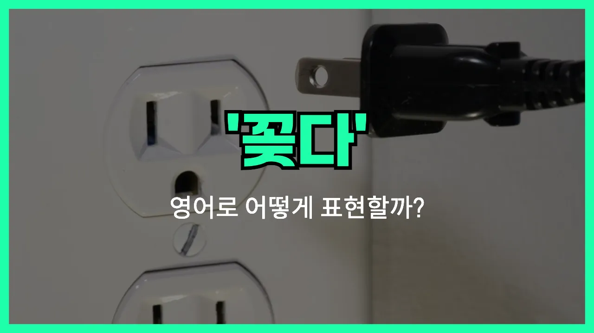

## 🌟 영어 표현 - plug in

안녕하세요 👋 오늘은 전자기기나 전원을 사용할 때 자주 쓰는 영어 표현 '**plug in**'에 대해 알아보려고 해요.

'**plug in**'은 우리말로 '**꽂다**', '**연결하다**', '**삽입하다**'라는 뜻을 가지고 있어요. 주로 전기 코드나 기기를 콘센트에 연결할 때 사용하는 표현이에요!

예를 들어, 핸드폰 충전기를 콘센트에 꽂을 때 "Can you plug in my phone charger?"라고 말할 수 있어요. 또는 노트북을 사용할 때 전원이 부족하면 "I need to plug in my laptop."이라고 할 수 있죠.

이 표현은 일상생활에서 정말 자주 쓰이기 때문에 꼭 알아두면 좋아요!

## 📖 예문

1. "컴퓨터를 콘센트에 꽂아 주세요."

   "Please plug in the computer."

2. "헤어드라이어를 사용하려면 먼저 꽂아야 해요."

   "You need to plug in the hair dryer before using it."

## 💬 연습해보기

<ul data-interactive-list>

  <li data-interactive-item>
    야, 내 폰 충전기 꽂아줄래? 배터리가 거의 없거든요.
    Hey, can you plug in my phone charger? The battery's getting low.
  </li>

  <li data-interactive-item>
    새로 램프 샀는데 아직 어디에 꽂아야 될지 모르겠어요.
    I just bought a new lamp, but I don't know where to plug it in yet.
  </li>

  <li data-interactive-item>
    커피메이커 쓰기 전에 꼭 콘센트에 꽂아야 해요.
    <a href="/blog/in-english/232.make-sure/">Make sure</a> you plug in the coffee maker before you <a href="/blog/in-english/117.try-to/">try to</a> use it.
  </li>

  <li data-interactive-item>
    헤드폰은 완전히 꽂아야 작동해요.
    My headphones <a href="/blog/in-english/456.win/">won</a>'t work unless I plug them in all the way.
  </li>

  <li data-interactive-item>
    여기서 와이파이 쓰려면 라우터를 꽂아야 해요.
    You need to plug in the router to get WiFi in here.
  </li>

  <li data-interactive-item>
    저기서 멀티탭 좀 꽂아줄래요?
    Could you plug in the extension cord over there?
  </li>

  <li data-interactive-item>
    노트북 하룻밤 충전하려면 꼭 꽂아놔야 해요.
    Don't <a href="/blog/in-english/023.forget/">forget</a> to plug in your laptop if you want it to charge <a href="/blog/in-english/134.overnight/">overnight</a>.
  </li>

  <li data-interactive-item>
    헤어드라이어 꽂을 때마다 차단기가 내려가요.
    Every time I plug in my hair dryer, it trips the breaker.
  </li>

  <li data-interactive-item>
    전기 스쿠터 어디에 꽂을 수 있는지 알아요?
    Do you know where I can plug in my electric scooter?
  </li>

  <li data-interactive-item>
    크리스마스 조명 꽂으면 진짜 예뻐요!
    After I plug in the Christmas lights, they look so pretty!
  </li>

</ul>

## 🤝 함께 알아두면 좋은 표현들

### unplug

'unplug'은 전자기기나 전원을 콘센트에서 뽑는다는 뜻이에요. 즉, 'plug in'의 반대말로, 기기의 전원을 차단하거나 사용을 멈출 때 자주 써요.

- "Don't forget to unplug the coffee maker before you [leave](/blog/in-english/402.leave/) the house."
- "집에서 나가기 전에 커피메이커 플러그 뽑는 거 잊지 마세요."

### power up

'power up'은 전자기기나 기계를 켜거나 작동시키는 것을 의미해요. 'plug in'과 비슷하게, 기기를 사용할 준비를 하는 상황에서 자주 쓰여요.

- "Once you plug in the computer, press the button to power it up."
- "컴퓨터를 콘센트에 꽂은 다음에 전원 버튼을 눌러서 켜세요."

### disconnect

'disconnect'는 연결을 끊거나 분리한다는 뜻이에요. 전기뿐만 아니라 인터넷, 전화선 등 다양한 연결을 해제할 때도 사용해요. 'plug in'의 반대 상황을 나타낼 때 자주 써요.

- "Please disconnect the printer from your laptop after you're done."
- "작업 끝나면 프린터를 노트북에서 분리해 주세요."

---

오늘은 '**꽂다**', '**연결하다**', '**삽입하다**'라는 뜻을 가진 영어 표현 '**plug in**'에 대해 알아봤어요. 전자기기를 사용할 때 이 표현을 자연스럽게 써보면 좋겠어요 😊

오늘 배운 표현과 예문들을 꼭 최소 3번씩 소리 내서 읽어보세요. 다음에도 더 재미있고 유익한 영어 표현으로 찾아올게요! 감사합니다!

