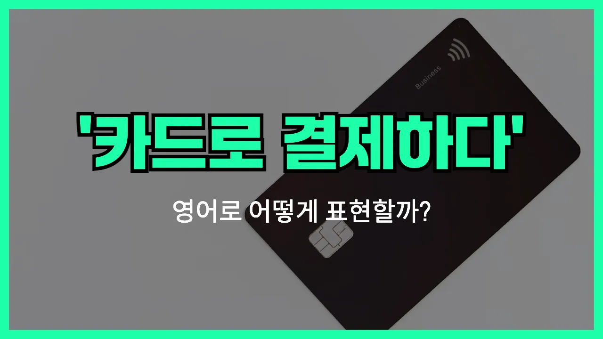

## 🌟 영어 표현 - pay by card

안녕하세요 👋 오늘은 일상에서 정말 자주 쓰는 표현, '**카드로 결제하다**'를 영어로 어떻게 말하는지 알아볼 거예요. 바로 '**pay by card**'라는 표현이에요!

'**pay by card**'는 말 그대로 **현금이 아니라 신용카드나 체크카드 등 카드로 돈을 지불하는 상황**에서 사용해요. 식당, 카페, 마트 등 어디서든 결제할 때 쓸 수 있는 아주 실용적인 표현이에요.

예를 들어, 계산대에서 "카드로 결제할게요"라고 말하고 싶을 때 "I will pay by card."라고 하면 돼요. 또, 누군가 결제 방법을 물어볼 때 "Can I pay by card?"라고 물어볼 수도 있어요.

이 표현은 'pay with a card', 'pay using a card'처럼 조금 다르게도 쓸 수 있지만, 가장 자연스럽고 많이 쓰는 표현은 바로 'pay by card'예요!

## 📖 예문

1. "카드로 결제할 수 있나요?"

   "Can I pay by card?"

2. "저는 카드로 결제할게요."

   "I will pay by card."

3. "이 가게는 카드 결제가 가능해요."

   "This store accepts card payments."

## 💬 연습해보기

<ul data-interactive-list>

  <li data-interactive-item>
    여기 현금 받나요, 아니면 카드로도 결제할 수 있어요?
    Do you guys take cash or can I pay by card?
  </li>

  <li data-interactive-item>
    죄송해요, 여기서는 카드 결제만 가능해요.
    Sorry, we only accept payment by card here.
  </li>

  <li data-interactive-item>
    지갑을 깜빡했는데, 휴대폰으로 카드 결제해도 될까요?
    I <a href="/blog/in-english/023.forget/">forgot</a> my wallet, can I just pay by card on my phone?
  </li>

  <li data-interactive-item>
    요즘은 거의 다 카드 결제 가능해서 현금은 거의 안 들고 다녀요.
    Most places let you pay by card nowadays, so I rarely <a href="/blog/in-english/464.carry/">carry</a> cash.
  </li>

  <li data-interactive-item>
    카드로 결제할 수 있어요, 아니면 현금만 받나요?
    Can I pay by card or is it cash only?
  </li>

  <li data-interactive-item>
    그녀는 카드로 결제해서 잔돈 신경 쓸 필요가 없었어요.
    She paid by card so she didn't have to <a href="/blog/in-english/209.worry-about/">worry about</a> change.
  </li>

  <li data-interactive-item>
    급할 때는 카드로 결제하는 게 훨씬 편해요.
    It's much easier to pay by card when you're in a rush.
  </li>

  <li data-interactive-item>
    요즘 자판기들도 카드 결제 되는 곳이 많아요.
    A lot of vending machines accept payment by card now.
  </li>

  <li data-interactive-item>
    저는 거의 항상 카드로 결제해요—저한텐 훨씬 편하거든요.
    I almost always pay by card—it's just more <a href="/blog/in-english/323.convenient/">convenient</a> for me.
  </li>

  <li data-interactive-item>
    동전 없을 때는 주차 미터기에서 카드로도 결제할 수 있어요.
    You can pay by card at the parking meter if you don't have coins.
  </li>

</ul>

## 🤝 함께 알아두면 좋은 표현들

### pay in cash

'pay in cash'는 "현금으로 결제하다"라는 뜻이에요. 카드가 아니라 지폐나 동전을 직접 내고 계산할 때 쓰는 표현이에요. 카드 결제와 반대되는 개념으로, 현금을 선호하는 가게나 상황에서 자주 사용돼요.

- "Some small shops only allow you to pay in cash."
- "어떤 작은 가게들은 현금으로만 결제할 수 있게 해요."

### swipe a card

'swipe a card'는 "카드를 긁다"라는 뜻으로, 카드 결제기에서 카드를 긁어서 결제하는 상황을 말해요. 'pay by card'와 비슷하지만, 카드 결제 방식 중 하나를 구체적으로 나타내는 표현이에요.

- "Just swipe your card at the machine and enter your PIN."
- "기계에 카드를 긁고 비밀번호만 입력하면 돼요."

### go contactless

'go contactless'는 "비접촉 결제를 하다"라는 뜻이에요. 카드를 단말기에 대기만 해도 결제가 되는 방식으로, 최근에 많이 쓰이는 카드 결제 방법이에요. 'pay by card'의 현대적이고 간편한 버전이라고 볼 수 있어요.

- "It's much faster [to go](/blog/in-english/450.to-go/) contactless when you're [in a hurry](/blog/in-english/174.in-a-hurry/)."
- "바쁠 때는 비접촉 결제가 훨씬 더 빨라요."

---

오늘은 '**카드로 결제하다**'라는 뜻의 영어 표현 '**pay by card**'에 대해 알아봤어요. 앞으로 결제할 때 이 표현을 꼭 활용해 보세요! 😊

오늘 배운 표현과 예문들을 소리 내서 여러 번 연습해 보세요. 다음에도 더 유용한 영어 표현으로 찾아올게요! 감사합니다!

