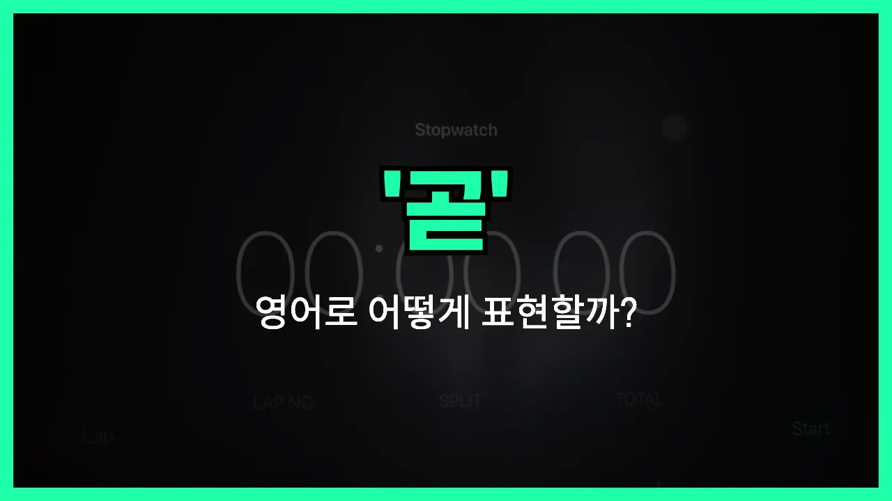

## 🌟 영어 표현 - shortly

안녕하세요 👋 오늘은 영어에서 '곧', '금방', '머지않아'라는 뜻을 가진 표현 '**shortly**'에 대해 알아보려고 해요.

'**shortly**'는 어떤 일이 **아주 가까운 미래에 일어날 것**임을 말할 때 자주 쓰는 단어예요. 즉, '곧', '머지않아', '잠시 후에'라는 의미로 자연스럽게 사용할 수 있어요!

이 표현은 일상 대화, 비즈니스 이메일, 안내 방송 등 다양한 상황에서 활용돼요. 예를 들어, 비행기나 기차 안내 방송에서 "The train will depart shortly."라고 하면 "기차가 곧 출발합니다."라는 뜻이에요.

또한, 누군가에게 "곧 연락드릴게요."라고 말하고 싶을 때 "I will contact you shortly."라고 표현할 수 있어요.

## 📖 예문

1. "회의가 곧 시작될 거예요."

   "The meeting will start shortly."

2. "곧 답변을 드릴게요."

   "I will reply shortly."

## 💬 연습해보기

<ul data-interactive-list>

  <li data-interactive-item>
    회의 곧 시작해요. 필요하면 커피 좀 가져와도 돼요.
    The meeting will begin shortly. Grab some coffee if you want.
  </li>

  <li data-interactive-item>
    내 택배 곧 도착할 거 같아요. 방금 배송 조회했거든요.
    My package should <a href="/blog/in-english/403.arrive/">arrive</a> shortly. I just got the tracking update.
  </li>

  <li data-interactive-item>
    곧 다시 전화할게요. 이 이메일만 마무리하면 돼요.
    I'll call you back shortly. I just need to <a href="/blog/in-english/295.finish/">finish</a> this email.
  </li>

  <li data-interactive-item>
    버스 곧 도착할 거예요. 오래 기다릴 필요 없어요.
    The bus should be here shortly. We don't have to wait long.
  </li>

  <li data-interactive-item>
    걔 곧 올 거예요. 차 주차하고 있었거든요.
    She's going to join us shortly. She just had to <a href="/blog/in-english/463.park/">park</a> her car.
  </li>

  <li data-interactive-item>
    저녁 곧 준비될 거예요. 식탁 좀 차려줄래요?
    Dinner will be ready shortly. Can you set the table?
  </li>

  <li data-interactive-item>
    여기서 잠깐 기다려 주세요. 금방 누가 갈 거예요.
    Please wait here. Someone will be with you shortly.
  </li>

  <li data-interactive-item>
    영화 곧 시작할 거라서 자리 찾아 앉으세요.
    We're going to start the movie shortly, so find your seat.
  </li>

  <li data-interactive-item>
    음식 곧 나올 거예요. 오늘 주방이 좀 바쁘네요.
    Your food will come out shortly. The kitchen is a little backed up tonight.
  </li>

  <li data-interactive-item>
    서류 곧 보낸다고 했으니까 메일함 자주 확인하세요.
    They said they'd <a href="/blog/in-english/292.send/">send</a> the documents shortly, so <a href="/blog/in-english/225.keep-an-eye-on/">keep an eye on</a> your inbox.
  </li>

</ul>

## 🤝 함께 알아두면 좋은 표현들

### soon

'soon'은 '곧', '머지않아'라는 뜻으로, 'shortly'와 비슷하게 가까운 미래에 어떤 일이 일어날 것임을 나타내는 표현이에요. 일상 대화에서 자주 쓰이고, 시간적으로 멀지 않은 시점을 의미해요.

- "The bus will arrive soon, so let's get ready."
- "버스가 곧 도착할 거니까 준비하자고요."

### in a moment

'in a [moment](/blog/in-english/490.moment/)'는 '잠시 후에', '곧'이라는 뜻으로, 아주 짧은 시간 안에 어떤 일이 일어날 것임을 강조할 때 사용해요. 'shortly'와 거의 같은 의미로 쓸 수 있어요.

- "I'll call you back in a moment."
- "잠시 후에 다시 전화할게요."

### eventually

'eventually'는 '결국', '마침내'라는 뜻으로, 시간이 좀 더 지난 후에 어떤 일이 일어날 때 사용해요. 'shortly'와는 반대로, 금방이 아니라 시간이 흐른 뒤에 일어나는 일을 말할 때 써요.

- "She struggled [at first](/blog/in-english/184.at-first/), but eventually she passed the exam."
- "처음에는 힘들어했지만 결국 시험에 합격했어요."

---

오늘은 '곧', '금방', '머지않아'라는 뜻을 가진 영어 표현 '**shortly**'에 대해 알아봤어요. 앞으로 가까운 미래에 일어날 일을 말할 때 이 표현을 떠올려 보세요 😊

오늘 배운 표현과 예문들을 꼭 최소 3번씩 소리 내서 읽어보세요. 다음에도 더 재미있고 유익한 영어 표현으로 찾아올게요! 감사합니다!

