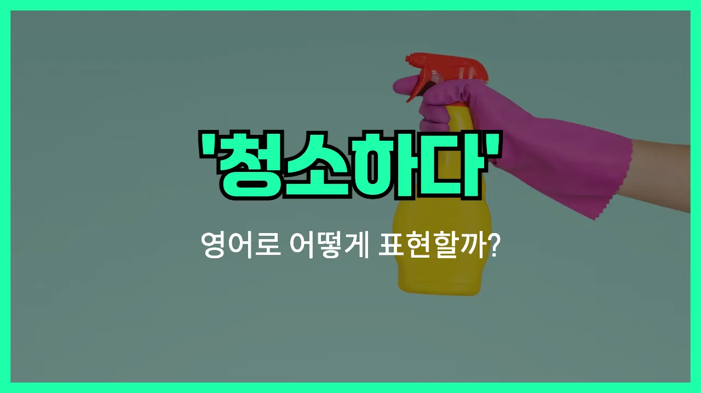

## 🌟 영어 표현 - clean (verb)

안녕하세요 👋 오늘은 일상에서 정말 자주 쓰는 동사, 바로 '**청소하다**'의 영어 표현 '**clean**'에 대해 알아보려고 해요.

'**clean**'은 집, 방, 사무실 등 다양한 공간이나 물건을 **깨끗하게 만들다**, **정리하다**라는 의미로 사용돼요. 먼지를 닦거나, 쓰레기를 치우거나, 어질러진 곳을 정돈할 때 모두 쓸 수 있는 아주 기본적이고 유용한 단어예요!

예를 들어, 방을 청소할 때 "I need to clean my room."이라고 말할 수 있어요. 또, 주방을 정리할 때는 "Can you clean the kitchen?"이라고 부탁할 수 있답니다.

'**clean**'은 동사로 쓸 때 '청소하다', '깨끗이 하다'라는 뜻이니, 일상에서 자주 활용해 보세요~

## 📖 예문

1. "나는 매주 토요일에 집을 청소해요."

   "I clean the house every Saturday."

2. "식사 후에 접시를 깨끗이 씻어야 해요."

   "You need to clean the dishes after eating."

## 💬 연습해보기

<ul data-interactive-list>

  <li data-interactive-item>
    친구들 오기 전에 주방 좀 치워야 해요. 지금 완전 엉망이에요.
    I need to clean the kitchen before my friends come over. It's a total mess <a href="/blog/in-english/525.right-now/">right now</a>.
  </li>

  <li data-interactive-item>
    오늘 방 좀 청소해줄래요? 점점 지저분해지고 있거든요.
    Could you please clean your room today? It's starting to get pretty messy.
  </li>

  <li data-interactive-item>
    이번 주말에 차 청소할 거예요. 오래된 커피잔이 다 들어있거든요.
    I'm going to clean out my car this weekend. It's full of old coffee cups.
  </li>

  <li data-interactive-item>
    샤워하는 동안 제가 욕실 청소해도 될까요? 금방 끝낼게요.
    Do you mind if I clean the bathroom while you're in the shower? I'll be quick.
  </li>

  <li data-interactive-item>
    파티 끝나고 정리하겠다고 했는데, 진짜 착했어요.
    He offered to clean up after the party, which was really nice of him.
  </li>

  <li data-interactive-item>
    그녀는 요리하면서 청소하는 걸 좋아해서 주방이 별로 지저분해지지 않아요.
    She likes to clean as she cooks, so the kitchen never gets too messy.
  </li>

  <li data-interactive-item>
    매주 금요일에 책상 청소하려고 해요. 다음 주를 상쾌하게 시작하려고요.
    I try to clean my desk every Friday so I can start the next week fresh.
  </li>

  <li data-interactive-item>
    창문 좀 닦아줄 수 있어요? 좀 더러워 보이거든요.
    Can you help me clean the windows? They're looking kind of grimy.
  </li>

  <li data-interactive-item>
    핸드폰 화면 좀 닦아야 해요. 지문으로 다 덮였어요.
    I need to clean my phone screen. It's covered in fingerprints.
  </li>

  <li data-interactive-item>
    냉장고 청소해서 유통기한 지난 거 다 버리자요.
    Let's clean out the fridge and get rid of anything that's expired.
  </li>

</ul>

## 🤝 함께 알아두면 좋은 표현들

### tidy up

'tidy up'은 "정돈하다" 또는 "깔끔하게 치우다"라는 뜻이에요. 주로 방이나 책상처럼 어질러진 공간을 정리정돈할 때 많이 쓰는 표현이에요. 'clean'이 먼지나 때를 닦아내는 것에 더 초점이 있다면, 'tidy up'은 물건을 제자리에 놓고 정돈하는 데 더 중점을 둬요.

- "I need to tidy up my desk before I start working."
- "일 시작하기 전에 책상을 좀 정돈해야겠어요."

### scrub

'scrub'은 "문질러 닦다"라는 뜻으로, 때나 얼룩을 없애기 위해 세게 닦는 상황에서 써요. 'clean'보다 더 강하게, 힘을 줘서 청소하는 느낌을 줄 때 사용해요.

- "She had to scrub the kitchen floor to get rid of the stains."
- "그녀는 얼룩을 없애려고 부엌 바닥을 세게 문질러 닦았어요."

### mess up

'mess up'은 "어지럽히다" 또는 "지저분하게 만들다"라는 뜻이에요. 'clean'의 반대말로, 정돈되어 있던 곳을 다시 어질러 놓거나 더럽히는 상황에서 사용해요.

- "The kids messed up the living room after their playdate."
- "아이들이 놀다가 거실을 완전 어질러 놨어요."

---

오늘은 '**청소하다**'라는 뜻의 영어 동사 '**clean**'에 대해 알아봤어요. 집안일이나 정리정돈할 때 꼭 필요한 표현이니, 오늘 배운 예문을 소리 내어 여러 번 연습해 보세요~

다음에도 더 유용한 영어 표현으로 찾아올게요! 감사합니다!

