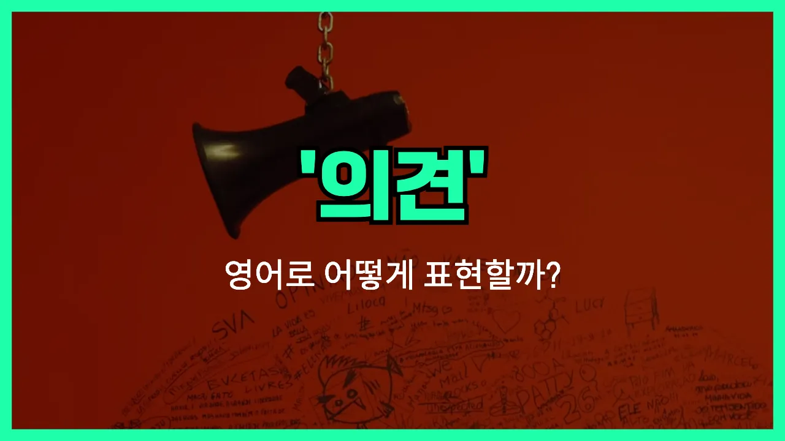

## 🌟 영어 표현 - opinion

안녕하세요 👋 오늘은 우리가 자주 쓰는 단어인 '**의견**'을 영어로 어떻게 표현하는지 알아보려고 해요. 바로 '**opinion**'이라는 단어인데요~

'**opinion**'은 어떤 주제나 상황에 대해 자신이 생각하거나 느끼는 바, 즉 **생각**이나 **견해**를 의미해요. 누군가의 주장이나 판단, 또는 토론에서 자신의 입장을 말할 때 자주 쓰이는 단어예요~

예를 들어, 친구와 영화에 대해 이야기할 때 "내 생각에는 그 영화가 정말 재미있었어"라고 말하고 싶다면, 영어로는 "In my opinion, the movie was really interesting."라고 할 수 있어요~

또한, 누군가에게 의견을 물어볼 때는 "What's your opinion?" 또는 "Do you have any opinions on this?"처럼 자연스럽게 사용할 수 있어요~

## 📖 예문

1. "내 의견을 말해도 될까요?"

   "Can I [share](/blog/in-english/248.share/) my opinion?"

2. "그 문제에 대한 너의 의견이 궁금해요."

   "I'm [curious](/blog/in-english/327.curious/) about your opinion on that issue."

## 💬 연습해보기

<ul data-interactive-list>

  <li data-interactive-item>
    내 생각에 이 동네 피자집 중에서 여기가 제일 맛있어요. 다들한테 추천하고 있어요.
    In my opinion, this is the best pizza place in town. I tell everyone about it.
  </li>

  <li data-interactive-item>
    이 드레스에 대한 내 생각 듣고 싶어요, 아니면 그냥 말 안 하는 게 나을까요? 가끔은 사람들이 진짜 듣고 싶지 않을 때가 있더라고요.
    Do you want my opinion on this dress, or should I keep quiet? <a href="/blog/in-english/270.sometimes/">Sometimes</a> people don't really want to hear it.
  </li>

  <li data-interactive-item>
    솔직히 말하면, 네 의견은 걔네한테 별로 중요하지 않은 것 같아요. 어차피 자기 하고 싶은 대로 할 거니까요.
    <a href="/blog/in-english/336.honestly/">Honestly</a>, I don't think your opinion really matters to them. They're going to do what they want anyway.
  </li>

  <li data-interactive-item>
    새 마블 영화 어땠어요? 난 그냥 그랬던 것 같아요.
    What's your opinion on the new Marvel movie? I thought it was just okay.
  </li>

  <li data-interactive-item>
    다들 어디서 밥 먹을지 의견이 다 달라서 결정을 못 하겠어요!
    Everyone has a different opinion about where we should eat. It's impossible to decide!
  </li>

  <li data-interactive-item>
    네 의견은 존중하지만, 나는 동의하지 않아요. 그냥 서로 의견 다르다고 하죠 뭐.
    I <a href="/blog/in-english/469.respect/">respect</a> your opinion, but I just don't <a href="/blog/in-english/342.agree/">agree</a>. Let's agree to disagree.
  </li>

  <li data-interactive-item>
    내 이력서 좀 봐줄래요? 충분히 괜찮은지 잘 모르겠어요.
    Can I get your opinion on my resume? I'm not sure if it's strong enough.
  </li>

  <li data-interactive-item>
    내 생각엔 이 프로젝트 빨리 끝내는 게 좋을 것 같아요. 마감일은 항상 스트레스라서요.
    In my opinion, the <a href="/blog/in-english/397.earlier/">earlier</a> we <a href="/blog/in-english/295.finish/">finish</a> this project, the better. Deadlines always stress me out.
  </li>

  <li data-interactive-item>
    걔는 별로 잘 알지도 못하면서 무조건 자기 생각만 있어요.
    He's always got an opinion about everything, even if he doesn't know much about it.
  </li>

  <li data-interactive-item>
    당신 이야기 듣고 나서 내 생각이 바뀌었어요. 설명해줘서 고마워요.
    You know, I changed my opinion after hearing your side of the story. Thanks for explaining.
  </li>

</ul>

## 🤝 함께 알아두면 좋은 표현들

### point of view

'point of view'는 "관점"이나 "시각"을 의미해요. 어떤 상황이나 문제를 바라보는 개인의 생각이나 입장을 강조할 때 자주 사용돼요.

- "From her point of view, the project needs more time to be completed."
- "그녀의 관점에서는, 그 프로젝트가 완성되려면 시간이 더 필요하대요."

### perspective

'perspective'는 "관점" 또는 "시각"이라는 뜻으로, 어떤 사안에 대해 바라보는 방식이나 생각을 나타낼 때 써요. 특히 다양한 의견이나 시각이 있을 때 자주 사용돼요.

- "[Try to](/blog/in-english/117.try-to/) see the situation from a different perspective."
- "상황을 다른 시각에서 보려고 해봐요."

### fact

'fact'는 "사실"이라는 뜻으로, 개인의 의견(opinion)과는 달리 객관적으로 증명할 수 있는 진실을 의미해요. 의견과 반대되는 개념으로 자주 비교돼요.

- "It's a fact that water boils at 100 degrees Celsius."
- "물이 100도에서 끓는 건 사실이에요."

---

오늘은 '**의견**', '**생각**', '**견해**'라는 뜻을 가진 영어 표현 '**opinion**'에 대해 알아봤어요. 앞으로 누군가와 대화할 때 이 단어를 활용해보면 좋겠어요~ 😊

오늘 배운 표현과 예문들을 꼭 소리 내서 여러 번 읽어보세요. 다음에도 더 유익한 영어 표현으로 찾아올게요! 감사합니다~
