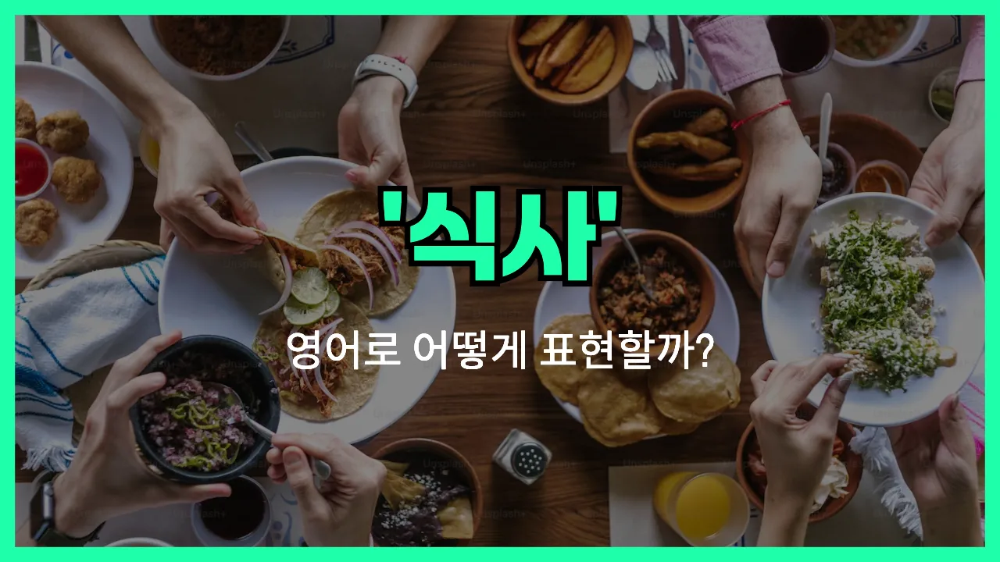

## 🌟 영어 표현 - meal

안녕하세요 👋 오늘은 일상에서 자주 쓰는 단어인 '**식사**'를 영어로 어떻게 표현하는지 알아보려고 해요. 바로 '**meal**'이라는 단어인데요. 이 단어는 우리가 하루에 먹는 아침, 점심, 저녁과 같은 **끼니** 또는 **밥**을 의미해요.

'**meal**'은 특정 시간에 먹는 음식을 통틀어 말할 때 사용해요. 예를 들어, 아침 식사는 'breakfast', 점심은 'lunch', 저녁은 'dinner'라고 하죠. 하지만 이 모든 것을 포괄해서 말할 때는 'meal'이라는 단어를 쓰면 돼요!

예를 들어, 친구와 "식사했어?"라고 물어보고 싶을 때 "Did you have a meal?"이라고 할 수 있어요. 또는 "식사 시간이 언제예요?"라고 할 때는 "When is meal time?"이라고 표현할 수 있답니다.

## 📖 예문

1. "오늘 저녁 식사는 정말 맛있었어요."

   "The meal tonight was really delicious."

2. "하루에 세 번 식사를 해요."

   "I have three meals a day."

## 💬 연습해보기

<ul data-interactive-list>

  <li data-interactive-item>
    우린 그 새로 생긴 시내 이탈리안 집에서 완전 맛있는 식사 했어요. 꼭 한 번 가봐야 해요.
    We had such a great meal at that new Italian place downtown. You have to try it sometime.
  </li>

  <li data-interactive-item>
    힘든 하루 끝나고는 따뜻한 한 끼랑 쉬는 시간이 최고예요.
    After a long day, I just want a hot meal and some time to relax.
  </li>

  <li data-interactive-item>
    일요일에 걔가 가족 위해 진짜 큰 식사 준비했어요. 음식이 엄청 많더라고요!
    She made a huge meal for her family on Sunday. There was so much food!
  </li>

  <li data-interactive-item>
    너희 학교 식단에 점심도 포함되어 있어?
    Is lunch <a href="/blog/in-english/522.include/">included</a> as part of the meal plan at your school?
  </li>

  <li data-interactive-item>
    건강하게 먹으려고 이번 주 식단 미리 짜고 있어요.
    I'm <a href="/blog/in-english/117.try-to/">trying to</a> eat healthier, so I plan out my meals for the week.
  </li>

  <li data-interactive-item>
    영화 시작하기 전에 간단히 밥 먹고 가요.
    Let's grab a <a href="/blog/in-english/439.quick/">quick</a> meal before the movie starts.
  </li>

  <li data-interactive-item>
    아침 식사 거르고 출근하느라 바빴대요.
    He skipped his morning meal because he was running <a href="/blog/in-english/391.late/">late</a> for work.
  </li>

  <li data-interactive-item>
    솔직히 올해 먹은 식사 중에 그게 최고였어요.
    That was <a href="/blog/in-english/336.honestly/">honestly</a> the best meal I've had all year.
  </li>

  <li data-interactive-item>
    할머니가 만드신 추수감사절 식사는 우리 가족에 유명해요.
    My grandma's Thanksgiving meal is legendary in our family.
  </li>

  <li data-interactive-item>
    이번 주말에 같이 요리해볼래요? 재밌을 것 같아요.
    Do you want to <a href="/blog/in-english/461.cook/">cook</a> a meal <a href="/blog/in-english/374.together/">together</a> this weekend? It could be fun.
  </li>

</ul>

## 🤝 함께 알아두면 좋은 표현들

### dine

'dine'은 "식사하다"라는 뜻으로, 특히 저녁 식사나 격식 있는 식사를 할 때 자주 쓰여요. 일상적인 'meal'보다 조금 더 격식 있고 우아한 느낌을 줘요.

- "We plan to dine at a fancy restaurant for our anniversary."
- "우리는 결혼기념일에 근사한 레스토랑에서 식사할 계획이에요."

### snack

'snack'은 "간식" 또는 "간단히 먹는 음식"을 의미해요. 'meal'이 보통 아침, 점심, 저녁처럼 정식 식사를 뜻하는 반면, 'snack'은 식사 사이에 간단히 먹는 것을 말해요.

- "I usually have a small snack in the afternoon to keep my energy up."
- "저는 보통 오후에 에너지를 유지하려고 간단히 간식을 먹어요."

### skip a meal

'[skip](/blog/in-english/369.skip/) a meal'은 "식사를 거르다"라는 뜻이에요. 보통 바쁘거나 입맛이 없어서 아침, 점심, 저녁 중 한 끼를 먹지 않을 때 사용해요. 'meal'의 반대되는 상황을 나타내는 표현이에요.

- "She had to skip a meal because she was running late for work."
- "그녀는 회사에 늦을까 봐 식사를 거를 수밖에 없었어요."

---

오늘은 '**식사**', '**끼니**', '**밥**'이라는 뜻을 가진 영어 표현 '**meal**'에 대해 알아봤어요. 앞으로 영어로 식사에 대해 이야기할 때 이 단어를 꼭 활용해 보세요 😊

오늘 배운 표현과 예문들을 꼭 최소 3번씩 소리 내서 읽어보세요. 다음에도 더 재미있고 유익한 영어 표현으로 찾아올게요! 감사합니다!
