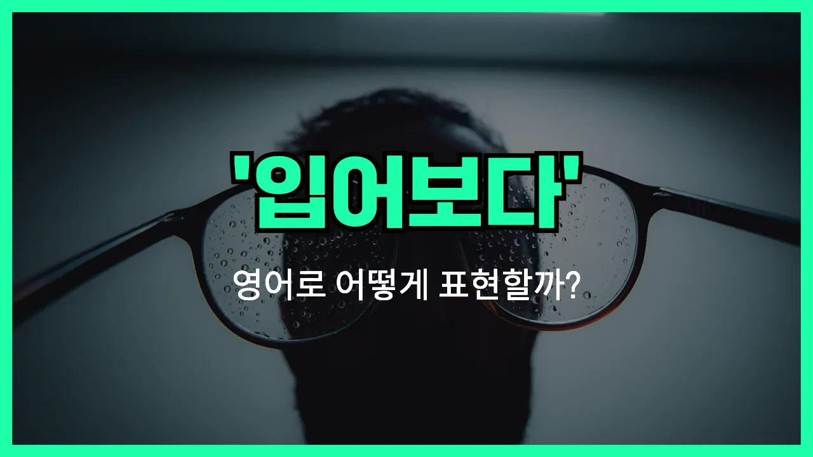

## 🌟 영어 표현 - try on

안녕하세요 👋 오늘은 옷이나 신발을 '입어보다', '착용해보다'라는 뜻을 가진 영어 표현을 소개해드릴게요. 바로 '**try on**'이에요!

'**try on**'은 옷, 신발, 모자 등 어떤 물건을 실제로 입거나 써보면서 나에게 맞는지, 어울리는지 확인할 때 쓰는 표현이에요. 예를 들어, 쇼핑할 때 "이 옷 한번 입어봐도 될까요?"라고 말하고 싶을 때 바로 이 표현을 사용할 수 있어요.

또한, '시험해보다'라는 의미로도 쓸 수 있어서, 단순히 옷뿐만 아니라 액세서리, 안경 등 다양한 물건에도 활용할 수 있어요!

## 📖 예문

1. "이 재킷을 입어봐도 될까요?"

   "Can I try on this jacket?"

2. "그녀는 새 신발을 신어보고 있어요."

   "She is trying on new shoes."

## 💬 연습해보기

<ul data-interactive-list>

  <li data-interactive-item>
    퇴근하고 쇼핑 가요. 새 청바지 좀 입어보고 싶거든요.
    I'm going shopping after work. I want to try on some new jeans.
  </li>

  <li data-interactive-item>
    당신 재킷 입어봐도 될까요? 진짜 편해 보이네요.
    Do you mind if I try on your jacket? It looks really comfy.
  </li>

  <li data-interactive-item>
    보통 신발 살 때 사이즈 맞는지 입어보고 사요.
    I usually try on shoes before I buy them to <a href="/blog/in-english/232.make-sure/">make sure</a> they fit.
  </li>

  <li data-interactive-item>
    파티용 드레스 고르려고 대여섯 벌은 입어봤어요.
    She tried on like ten different dresses before picking one for the party.
  </li>

  <li data-interactive-item>
    새 안경 써보고 어떤지 볼게요.
    Let me try on my new glasses and see how they look.
  </li>

  <li data-interactive-item>
    가게에서 모자 여러 개 써봤어요, 그냥 재미로요.
    He tried on a bunch of hats at the store just for fun.
  </li>

  <li data-interactive-item>
    솔직히 콘택트 렌즈는 한 번도 안 써봤는데 좀 떨려요.
    <a href="/blog/in-english/336.honestly/">Honestly</a>, I've never tried on contacts before. I'm kind of <a href="/blog/in-english/115.nervous/">nervous</a>.
  </li>

  <li data-interactive-item>
    이 스웨터 한 번 입어봐요. 잘 어울릴 것 같아요.
    Try on this sweater. I think it would look great on you.
  </li>

  <li data-interactive-item>
    옷 빌릴 때 미리 입어봐도 된다더라고요.
    They told me I could try on the costume before renting it.
  </li>

  <li data-interactive-item>
    온라인 쇼핑은 옷 입어볼 수 없어서 너무 싫어요.
    I <a href="/blog/in-english/392.hate/">hate</a> shopping online because you can't try on the clothes first.
  </li>

</ul>

## 🤝 함께 알아두면 좋은 표현들

### put on

'[put on](/blog/in-english/261.put-on/)'은 "입다" 또는 "착용하다"라는 뜻이에요. 'try on'이 옷이나 신발 등을 시험 삼아 입어보는 것이라면, 'put on'은 실제로 옷을 입거나 액세서리를 착용하는 행동 자체를 말해요.

- "She put on her coat before [leaving](/blog/in-english/402.leave/) the house."
- "그녀는 집을 나서기 전에 코트를 입었어요."

### take off

'take off'은 "벗다"라는 뜻으로, 옷이나 신발, 액세서리 등을 몸에서 제거하는 행동을 말해요. 'try on'과는 반대되는 의미로, 입거나 착용한 것을 다시 벗는 상황에서 사용해요.

- "As soon as he got home, he took off his shoes and relaxed."
- "그는 집에 오자마자 신발을 벗고 쉬었어요."

### fit

'fit'은 "(옷이) 맞다"라는 뜻이에요. 'try on'으로 옷을 입어본 후, 그 옷이 몸에 잘 맞는지 확인할 때 주로 쓰여요. 옷이나 신발이 크거나 작지 않고 딱 맞을 때 사용해요.

- "These jeans fit me perfectly after I tried them on."
- "이 청바지는 입어보니까 나한테 딱 맞아요."

---

오늘은 '입어보다', '착용해보다'라는 뜻을 가진 영어 표현 '**try on**'에 대해 알아봤어요. 쇼핑할 때나 새로운 물건을 시험해볼 때 꼭 써보면 좋겠어요 😊

오늘 배운 표현과 예문들을 꼭 최소 3번씩 소리 내서 읽어보세요. 다음에도 더 재미있고 유익한 영어 표현으로 찾아올게요! 감사합니다!

