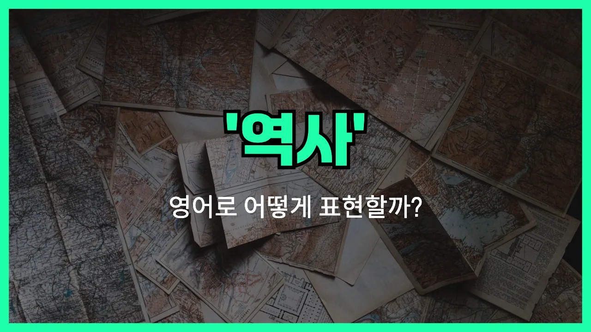

## 🌟 영어 표현 - history

안녕하세요 👋 오늘은 우리가 자주 듣는 단어, '**역사**'를 영어로 어떻게 표현하는지 알아보려고 해요. 바로 '**history**'라는 단어인데요. 이 단어는 **과거에 일어난 사건들**이나 **인류의 발자취**를 의미할 때 사용돼요.

'**history**'는 단순히 오래된 이야기뿐만 아니라, 나라의 역사, 가족의 역사, 혹은 어떤 사물이나 장소의 연대기까지 모두 포괄할 수 있는 단어예요. 예를 들어, 학교에서 배우는 세계사, 한국사 모두 'history'라고 부를 수 있어요.

또한, 'history'는 개인적인 경험이나 사건의 기록을 말할 때도 쓸 수 있어요. 예를 들어, "내가 이 회사에서 일한 이력"도 'work history'라고 표현할 수 있답니다!

## 📖 예문

1. "한국의 역사는 매우 오래됐어요."

   "The history of Korea is very long."

2. "나는 역사 공부를 좋아해요."

   "I like studying history."

3. "이 건물은 오랜 역사를 가지고 있어요."

   "This building has a long history."

## 💬 연습해보기

<ul data-interactive-list>

  <li data-interactive-item>
    학교 다닐 때는 역사 별로 안 좋아했는데, 지금은 진짜 재밌다고 느껴져요.
    I never liked history in school, but now I find it really interesting.
  </li>

  <li data-interactive-item>
    대학 때 같이 역사 수업 들었던 거 기억나? 그때가 참 즐거웠죠.
    Do you remember when we took that history class <a href="/blog/in-english/374.together/">together</a> in college? That was a good time.
  </li>

  <li data-interactive-item>
    아빠는 항상 TV에서 역사 다큐멘터리 보는 걸 좋아하세요. 진짜 빠져들어서 끊질 못해요.
    My dad's always watching history documentaries on TV. He can't get enough of them.
  </li>

  <li data-interactive-item>
    오늘 우승해서 처음으로 역사를 만들었어요!
    We made history today by <a href="/blog/in-english/456.win/">winning</a> the championship for the first time.
  </li>

  <li data-interactive-item>
    나가기 전에 브라우저 기록 꼭 지우는 거 잊지 마세요.
    Don't <a href="/blog/in-english/023.forget/">forget</a> to clear your browser history before you <a href="/blog/in-english/402.leave/">leave</a>.
  </li>

  <li data-interactive-item>
    그녀는 우리 지역사회에서 오랜 기간 자원봉사해온 경력이 있어요.
    She has a long history of volunteering in our community.
  </li>

  <li data-interactive-item>
    역사의 실수를 반복하지 맙시다. 이제는 더 잘 알잖아요.
    Let's not repeat the mistakes of history. We should know better now.
  </li>

  <li data-interactive-item>
    그가 역사 과목에서 나쁜 성적을 받아서 부모님이 걱정하시기 시작했어요.
    His bad grades in history are starting to worry his parents.
  </li>

  <li data-interactive-item>
    그 작은 식당은 역사가 깊어서 들어가면 분위기가 확 느껴져요.
    That little restaurant has a lot of history. You can really feel it when you walk in.
  </li>

  <li data-interactive-item>
    창피한 일이 생길 때마다 그 일이 역사에서 지워졌으면 좋겠다고 생각해요.
    Whenever something embarrassing <a href="/blog/in-english/041.happen-to/">happens to</a> me, I just wish it could be erased from history.
  </li>

</ul>

## 🤝 함께 알아두면 좋은 표현들

### the past

'the past'는 '과거'를 의미하며, 'history'와 비슷하게 이전에 일어난 일이나 시간, 사건을 가리킬 때 사용해요. 일상 대화에서는 공식적인 역사보다는 개인적이거나 일반적인 과거를 말할 때 자주 써요.

- "We shouldn't dwell on the past, but [learn](/blog/in-english/245.learn/) from it."
- "우리는 과거에 집착하지 말고, 거기서 배워야 해요."

### current events

'current events'는 '현재 일어나고 있는 사건들'을 의미해요. 'history'가 과거에 초점을 맞춘다면, 'current events'는 지금 이 순간에 일어나고 있는 일들에 집중하는 표현이에요. 둘은 시간적으로 반대되는 개념이에요.

- "I like to [keep up with](/blog/vocab-1/027.keep-up-with/) current events by [reading](/blog/in-english/436.read/) the news every morning."
- "나는 매일 아침 뉴스를 읽으면서 현재 일어나는 일들을 챙겨봐요."

### make history

'make history'는 '역사를 만들다', 즉 아주 중요한 일을 해서 역사에 남는다는 뜻이에요. 평범한 일이 아니라 특별하고 의미 있는 성과를 이룰 때 자주 쓰는 표현이에요.

- "The team made history by winning the championship for the first time."
- "그 팀은 처음으로 챔피언십에서 우승하면서 역사를 썼어요."

---

오늘은 '**역사**'라는 뜻을 가진 영어 표현 '**history**'에 대해 알아봤어요. 앞으로 과거의 이야기나 연대기를 말할 때 이 단어를 떠올려보면 좋겠어요 😊

오늘 배운 표현과 예문들을 꼭 소리 내서 여러 번 읽어보세요. 다음에도 더 유익한 영어 표현으로 찾아올게요! 감사합니다!
