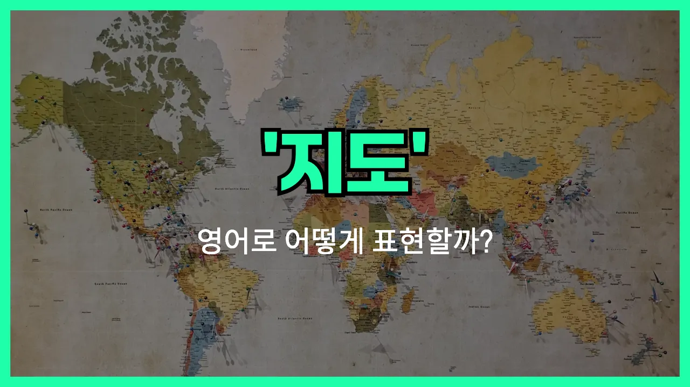

## 🌟 영어 표현 - map

안녕하세요 👋 오늘은 우리가 자주 쓰는 단어인 '**지도**'의 영어 표현에 대해 알아보려고 해요. 바로 '**map**'이라는 단어인데요. 이 단어는 **어떤 지역이나 공간의 위치, 지형, 길 등을 그림이나 도표로 나타낸 것**을 의미해요.

'**map**'은 여행을 하거나, 새로운 곳을 찾을 때, 또는 길을 안내할 때 정말 많이 쓰이는 단어예요. 예를 들어, 스마트폰에서 지도를 볼 때도 'map'이라는 단어가 자주 등장하지요.

또한, 'map'은 종이로 된 지도뿐만 아니라, 온라인 지도, 약도, 위치도 등 다양한 상황에서 사용할 수 있어요. 그래서 일상생활에서 아주 유용하게 쓸 수 있는 단어랍니다!

## 📖 예문

1. "이 근처의 지도를 보여줄 수 있어요?"

   "Can you show me a map of this area?"

2. "구글 지도를 사용해서 길을 찾았어요."

   "I found the way using Google Maps."

## 💬 연습해보기

<ul data-interactive-list>

  <li data-interactive-item>
    새로 생긴 식당 봤어요? 가기 전에 길 어떻게 가는지 미리 확인해봐야겠어요.
    Did you see the new restaurant? I have to map out how to get there before we go.
  </li>

  <li data-interactive-item>
    진짜 도시에서 길 잃어서 구글 지도 켜서 길 찾았어요.
    I totally got <a href="/blog/in-english/457.lose/">lost</a> in the city, so I pulled up Google Maps to find my way.
  </li>

  <li data-interactive-item>
    이번 주말 계획 같이 짜줄 수 있어요? 할 거 너무 많아서요.
    Can you help me map out a plan for this weekend? There's so much to do.
  </li>

  <li data-interactive-item>
    함께 앉아서 대학 지원 계획 짜봐요. 계획 세우면 덜 스트레스 받을 거예요.
    Let's sit down and map out your college applications <a href="/blog/in-english/374.together/">together</a>. It's less stressful if you have a plan.
  </li>

  <li data-interactive-item>
    우리 로드트립 멈추는 곳 다 정리해서 리스트로 보내줬어요.
    He mapped out all the stops on our road trip and <a href="/blog/in-english/292.send/">sent</a> us the list.
  </li>

  <li data-interactive-item>
    운동할 때 달리기 코스 미리 정해두면 앱으로 진도 체크하기 좋아요.
    I like to map my runs so I can track my progress with my fitness app.
  </li>

  <li data-interactive-item>
    오늘 중요한 경기 전에 전략 미리 잘 세워야 해요.
    We gotta map out our strategy before the big game tonight.
  </li>

  <li data-interactive-item>
    출퇴근길 교통 체증 피하려고 가능한 모든 길을 다 알아보려고 해요.
    She's <a href="/blog/in-english/117.try-to/">trying to</a> map every possible <a href="/blog/in-english/519.route/">route</a> to avoid rush hour <a href="/blog/in-english/384.traffic/">traffic</a>.
  </li>

  <li data-interactive-item>
    지출 내역 미리 정리해보면 어디에 돈을 가장 많이 쓰는지 알 수 있어요.
    You should map out your expenses to see where you're <a href="/blog/in-english/258.spend/">spending</a> the most money.
  </li>

  <li data-interactive-item>
    교수님이 이야기 줄거리를 단계별로 정리해 오라고 하셨어요.
    Our professor wants us to map the story's plot, <a href="/blog/in-english/239.step-by-step/">step by step</a>.
  </li>

</ul>

## 🤝 함께 알아두면 좋은 표현들

### chart a course

'chart a course'는 "진로를 계획하다" 또는 "방향을 정하다"라는 뜻이에요. 주로 어떤 목표를 향해 나아가기 위해 구체적인 계획이나 경로를 세울 때 사용해요. 지도(map)처럼 길을 정하는 느낌이 들어요.

- "Before starting the project, the team charted a course to [ensure](/blog/in-english/356.ensure/) everyone knew their responsibilities."
- "프로젝트를 시작하기 전에 팀이 각자의 역할을 명확히 알 수 있도록 진로를 계획했어요."

### get lost

'get lost'는 "길을 잃다"라는 뜻이에요. map(지도)와는 반대되는 개념으로, 지도가 없거나 제대로 활용하지 못해서 방향을 잃었을 때 자주 써요.

- "Without a map, we got lost in the city and had to [ask for](/blog/in-english/125.ask-for/) directions."
- "지도가 없어서 도시에서 길을 잃고 결국 길을 물어봐야 했어요."

### navigate

'navigate'는 "길을 찾다" 또는 "방향을 잡다"라는 뜻이에요. map(지도)을 사용해서 목적지까지 가는 방법을 찾거나, 복잡한 상황을 헤쳐나갈 때도 쓸 수 있어요.

- "She [used](/blog/in-english/171.used/) her phone to navigate through the [unfamiliar](/blog/in-english/337.unfamiliar/) streets."
- "그녀는 익숙하지 않은 거리에서 휴대폰을 이용해 길을 찾았어요."

---

오늘은 '**지도**', '**약도**', '**위치도**'라는 뜻을 가진 영어 표현 '**map**'에 대해 알아봤어요. 앞으로 길을 찾거나 여행할 때 이 단어를 떠올리면 좋겠어요 😊

오늘 배운 표현과 예문들을 꼭 소리 내서 여러 번 읽어보세요. 다음에도 더 유익한 영어 표현으로 찾아올게요! 감사합니다!
