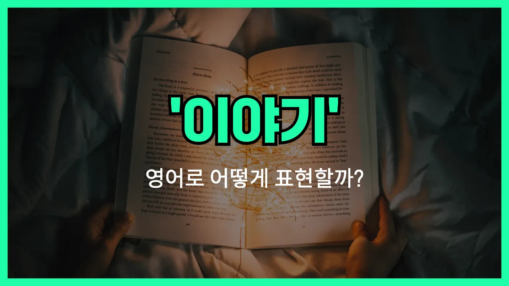

## 🌟 영어 표현 - story

안녕하세요 👋 오늘은 우리가 자주 쓰는 단어인 '**이야기**'의 영어 표현 '**story**'에 대해 알아보려고 해요.

'**story**'는 누군가의 경험, 상상, 또는 사건을 말이나 글로 풀어내는 것을 의미해요. 즉, **사람들이 겪은 일이나 만들어낸 내용을 전달할 때** 자주 쓰이는 단어예요!

이 단어는 동화, 소설, 영화, 뉴스 등 다양한 상황에서 자연스럽게 사용돼요. 예를 들어, 친구에게 재미있는 경험을 들려줄 때 "Let me tell you a story."라고 할 수 있어요.

또는, "That movie is [based on](/blog/in-english/272.based-on/) a true story."라고 말하면 "그 영화는 실화에 바탕을 두고 있어요."라는 의미예요.

'**story**'는 명사로 주로 쓰이며, '이야기', '사연', '스토리' 등 다양한 뜻을 담고 있어요. 상황에 따라 적절하게 활용해 보세요!

## 📖 예문

1. "그녀는 흥미로운 이야기를 들려줬어요."

   "She told an interesting story."

2. "이 책은 감동적인 이야기를 담고 있어요."

   "This [book](/blog/in-english/447.book/) contains a touching story."

## 💬 연습해보기

<ul data-interactive-list>

  <li data-interactive-item>
    오늘 회사에서 진짜 믿기 힘든 일이 있었어요. 완전 미친 이야기예요.
    I can't believe what happened at work today. It's such a crazy story.
  </li>

  <li data-interactive-item>
    사라가 남편 만난 이야기 들었어요? 진짜 귀여워요.
    Did you hear Sarah's story about how she met her husband? It's adorable.
  </li>

  <li data-interactive-item>
    그건 좀 긴 이야기인데, 커피 마시면서 다 얘기해 줄게요.
    That's a long story. I'll tell you all about it <a href="/blog/in-english/504.over-coffee/">over coffee</a>.
  </li>

  <li data-interactive-item>
    걔는 파티에서 항상 웃긴 이야기 한두 개쯤은 있어요.
    He always has a funny story to <a href="/blog/in-english/248.share/">share</a> at parties.
  </li>

  <li data-interactive-item>
    솔직히 그가 복권 당첨 이야기 하는 거 믿기 어려워요.
    <a href="/blog/in-english/336.honestly/">Honestly</a>, I don't know if I believe his story about <a href="/blog/in-english/456.win/">winning</a> the lottery.
  </li>

  <li data-interactive-item>
    가기 전에 짧은 이야기 하나 해 줄게요.
    Let me tell you a <a href="/blog/in-english/439.quick/">quick</a> story before we go.
  </li>

  <li data-interactive-item>
    이 노래 들으면 고등학교 시절 이야기 생각나요.
    This song <a href="/blog/in-english/114.remind/">reminds</a> me of a story from high school.
  </li>

  <li data-interactive-item>
    상처 하나하나 다 자기만의 이야기가 있잖아요?
    Every scar has its own story, you know?
  </li>

  <li data-interactive-item>
    그 이야기 저 안 믿어요. 말이 안 맞아요.
    I'm not buying your story. It doesn't add up.
  </li>

  <li data-interactive-item>
    할머니가 예전엔 매일 밤 자장가 대신에 동화책 읽어 주셨어요.
    My grandma <a href="/blog/in-english/143.used-to/">used to</a> <a href="/blog/in-english/436.read/">read</a> me a bedtime story every night.
  </li>

</ul>

## 🤝 함께 알아두면 좋은 표현들

### tale

'tale'은 '이야기'나 '동화'를 의미하는 단어로, 특히 상상력이나 허구가 가미된 이야기를 말할 때 자주 사용돼요. 'story'와 비슷하지만, 좀 더 옛날 이야기나 전설, 혹은 꾸며낸 이야기에 초점을 맞출 때 많이 써요.

- "My grandmother [used](/blog/in-english/171.used/) to tell me a tale about a magical forest."
- "할머니께서 마법의 숲에 대한 이야기를 자주 들려주셨어요."

### truth

'truth'는 '진실'이나 '사실'을 의미해요. 'story'가 때로는 꾸며낸 이야기나 허구일 수 있는 반면, 'truth'는 실제로 일어난 일이나 거짓이 없는 사실을 강조할 때 사용해요. 그래서 'story'의 반대 개념으로 볼 수 있어요.

- "I want to hear the truth, not just [another](/blog/in-english/513.another/) story."
- "나는 또 다른 이야기 말고 진실을 듣고 싶어요."

### rumor

'rumor'는 '소문'이나 '풍문'을 의미해요. 'story'와 비슷하게 누군가가 전하는 이야기이지만, 사실이 아닐 수도 있고, 확인되지 않은 정보일 때 주로 써요. 누군가에 대해 떠도는 이야기나 근거 없는 말을 말할 때 사용해요.

- "There was a rumor going around that the company would close down."
- "회사 문을 닫는다는 소문이 돌고 있었어요."

---

오늘은 '**이야기**', '**사연**', '**스토리**'라는 뜻을 가진 영어 표현 '**story**'에 대해 알아봤어요. 누군가의 경험이나 상상 속 이야기를 전할 때 이 표현을 떠올리면 좋겠어요 😊

오늘 배운 표현과 예문들을 꼭 최소 3번씩 소리 내서 읽어보세요. 다음에도 더 재미있고 유익한 영어 표현으로 찾아올게요! 감사합니다!
