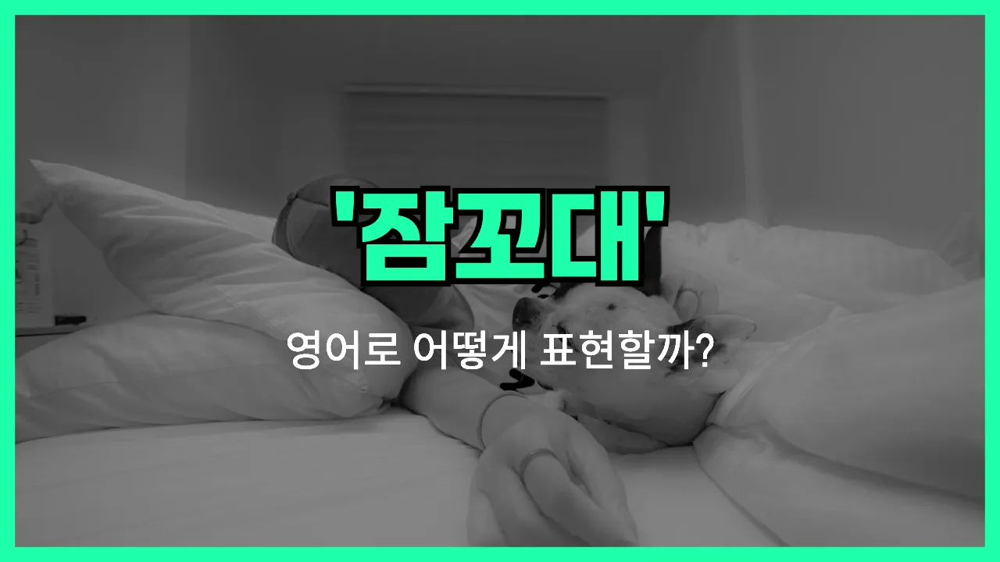

## 🌟 영어 표현 - talk in one's sleep

안녕하세요 👋 오늘은 '**잠꼬대하다**'라는 뜻을 가진 영어 표현을 소개해드릴게요. 바로 '**talk in one's sleep**'라는 표현이에요.

'talk in one's sleep'는 말 그대로 **잠자는 동안 무의식적으로 말을 하는 것**을 의미해요. 우리가 깊이 잠들었을 때 자신도 모르게 말을 할 때가 있죠? 그럴 때 바로 이 표현을 사용할 수 있어요!

이 표현은 일상 대화에서 가족이나 친구가 잠꼬대를 할 때 자연스럽게 쓸 수 있어요. 예를 들어, 누군가 밤새 이상한 말을 했다고 할 때 "He talks in his sleep."라고 말할 수 있어요.

또한, 'sleep talking'이라는 명사형 표현도 자주 사용돼요. 둘 다 같은 의미로 쓰이니 상황에 맞게 골라서 사용해 보세요.

## 📖 예문

1. "내 동생은 잠꼬대를 자주 해요."

   "My younger brother often talks in his sleep."

2. "어젯밤에 네가 잠꼬대하는 걸 들었어요."

   "I heard you talking in your sleep last night."

## 💬 연습해보기

<ul data-interactive-list>

  <li data-interactive-item>
    우리 언니는 항상 꿈속에서 말해요. 어젯밤엔 꿈에서 누군가랑 싸우고 있더라고요.
    My sister always talks in her sleep. Last night she was arguing with someone in her dreams.
  </li>

  <li data-interactive-item>
    자기 꿈속에서 말하는 거 알고 있었어요? 새벽 2시에 제 이름 막 부르더라고요!
    Did you know you talk in your sleep? You said my name at like 2 a.m.!
  </li>

  <li data-interactive-item>
    남자친구가 또 꿈속에서 말하는 걸 들었어요. 이번엔 완전 웃으면서 말하더라고요.
    I caught my boyfriend talking in his sleep again. This time he was laughing like crazy.
  </li>

  <li data-interactive-item>
    가끔 꿈속에서 말하는데 다음 날 아침에는 전혀 기억이 안 나요.
    Sometimes I talk in my sleep, but I have no memory of it the next morning.
  </li>

  <li data-interactive-item>
    룸메가 꿈속에서 피자 얘기하면서 말하기 시작했다고 했어요. 그래서 피자가 땡기네요!
    My roommate told me that I started talking in my sleep about pizza. Now I want some!
  </li>

  <li data-interactive-item>
    애들이 꿈속에서 말하면 진짜 웃겨요. 제 동생은 '아이스크림'만 계속 말했어요.
    It can be funny when kids talk in their sleep. My little brother kept saying 'ice cream' over and over.
  </li>

  <li data-interactive-item>
    자기 전에 내가 꿈속에서 말하는지 궁금해서 녹음해봐요.
    I record myself at night because I'm curious if I talk in my sleep.
  </li>

  <li data-interactive-item>
    걔는 스트레스 받으면 꿈속에서 말하는데 보통 중얼중얼, 가끔은 제대로 문장으로 말해요.
    She talks in her sleep whenever she's stressed. It's usually just mumbling, but sometimes it's full sentences.
  </li>

  <li data-interactive-item>
    아내가 꿈속에서 말해서 한밤중에 이상한 이야기 듣는 게 일상이에요.
    My wife talks in her sleep, so I hear some pretty weird <a href="/blog/in-english/537.story/">stories</a> at midnight.
  </li>

  <li data-interactive-item>
    자기 꿈속에서 말해본 적 있어요? 친구들은 제가 항상 그런대 전 안 믿겠어요.
    Have you ever talked in your sleep? My friends say I do it all the time, but I don't believe them.
  </li>

</ul>

## 🤝 함께 알아두면 좋은 표현들

### sleep talker

'sleep talker'는 잠자는 동안 말을 하는 사람을 가리키는 표현이에요. 즉, 'talk in one's sleep'를 자주 하는 사람을 지칭할 때 사용해요.

- "My brother is a sleep talker, and sometimes he says the funniest things at night."
- "우리 오빠는 잠꼬대를 자주 해서, 가끔 밤에 정말 웃긴 말을 하기도 해요."

### sleep like a log

'sleep like a log'는 아주 깊이, 꿈도 꾸지 않고 푹 자는 상태를 의미해요. 잠꼬대나 뒤척임 없이 조용히 자는 것을 강조하는 표현이라 'talk in one's sleep'의 반대되는 의미로 볼 수 있어요.

- "After the long hike, I slept like a log and didn't wake up once during the night."
- "긴 등산을 하고 나서 정말 푹 자서 밤새 한 번도 안 깼어요."

### toss and turn

'toss and turn'은 잠을 잘 때 뒤척이며 쉽게 잠들지 못하는 상태를 말해요. 잠꼬대처럼 잠자는 동안 평온하지 않은 모습을 나타내는 표현이에요.

- "I was so worried about the exam that I tossed and turned all night."
- "시험이 너무 걱정돼서 밤새 뒤척이기만 했어요."

---

오늘은 '**잠꼬대하다**'라는 뜻의 영어 표현 '**talk in one's sleep**'에 대해 알아봤어요. 혹시 가족이나 친구가 잠꼬대를 할 때 이 표현을 떠올려 보세요 😊

오늘 배운 표현과 예문들을 꼭 최소 3번씩 소리 내서 읽어보세요. 다음에도 더 재미있고 유익한 영어 표현으로 찾아올게요! 감사합니다!
