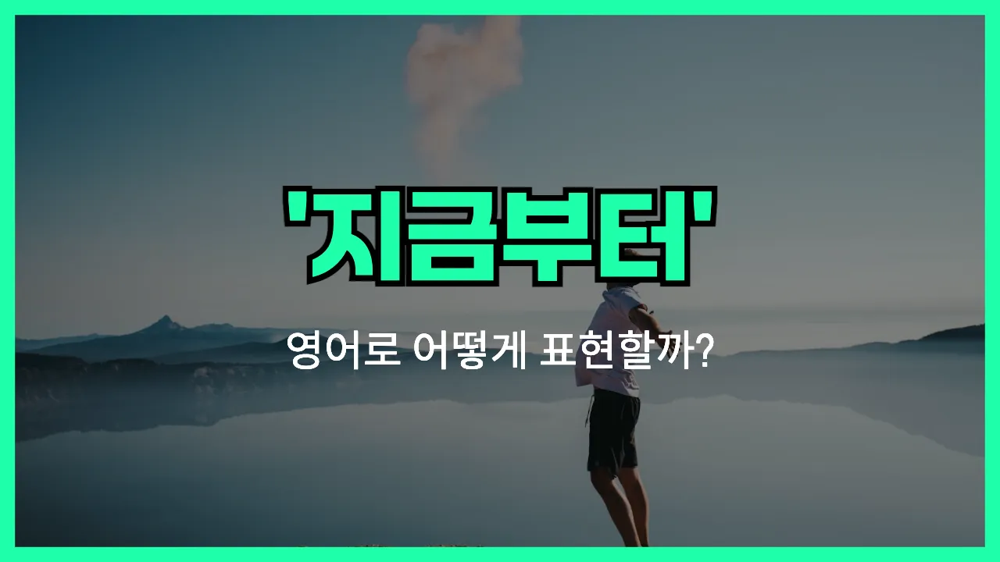

## 🌟 영어 표현 - from now on

안녕하세요 👋 오늘은 일상에서 정말 자주 쓰는 표현인 '**지금부터**'를 영어로 어떻게 말하는지 알아볼 거예요. 바로 '**from now on**'이라는 표현이에요!

'**from now on**'은 말 그대로 '지금 이 순간부터 앞으로'라는 의미를 가지고 있어요. 즉, 어떤 행동이나 상황이 지금 이 시점부터 시작되어 앞으로 계속된다는 뜻을 전할 때 사용해요.

예를 들어, 새로운 규칙을 적용하거나, 습관을 바꿀 때, 또는 앞으로의 계획을 말할 때 자연스럽게 쓸 수 있어요. 일상 대화, 회사, 학교 등 다양한 상황에서 정말 유용하게 쓰인답니다!

## 📖 예문

1. "지금부터 영어 공부를 매일 할 거예요."

   "From now on, I will study English every day."

2. "지금부터는 늦지 않을게요."

   "From now on, I [won](/blog/in-english/456.win/)'t be [late](/blog/in-english/391.late/)."

## 💬 연습해보기

<ul data-interactive-list>

  <li data-interactive-item>
    앞으로는 더 건강한 음식 먹으려고 해요. 요즘 좀 피곤했거든요.
    From now on, I'm going to <a href="/blog/in-english/117.try-to/">try to</a> eat healthier. I've been feeling pretty tired lately.
  </li>

  <li data-interactive-item>
    앞으로는 퇴근 전에 꼭 문자할게요. 그래야 언제 오나 알 수 있잖아요.
    From now on, I'll text you before I <a href="/blog/in-english/402.leave/">leave</a> work. That way you know when to expect me.
  </li>

  <li data-interactive-item>
    앞으로는 주중에는 배달 음식 안 시키기로 했어요. 돈이 너무 많이 들더라고요.
    We decided from now on, we're not ordering takeout during the week. It just gets too <a href="/blog/in-english/317.expensive/">expensive</a>.
  </li>

  <li data-interactive-item>
    앞으로 나갈 때는 문 꼭 잠가줘요, 알겠죠?
    From now on, can you please remember to lock the door when you leave?
  </li>

  <li data-interactive-item>
    앞으로는 그냥 커피숍에서 만나요. 거기 주차가 훨씬 편하거든요.
    Hey, from now on, let's just meet at the coffee shop. Parking is way easier there.
  </li>

  <li data-interactive-item>
    앞으로 알람 맞춰서 일찍 일어나려고 해요.
    From now on, I'm going to set an alarm to help me <a href="/blog/in-english/300.wake-up/">wake up</a> <a href="/blog/in-english/397.earlier/">earlier</a>.
  </li>

  <li data-interactive-item>
    앞으로 점심은 직접 싸갈게요. 구내식당 음식은 좀 별로더라고요.
    From now on, I'm bringing my own lunch. The cafeteria food is just not for me anymore.
  </li>

  <li data-interactive-item>
    앞으로 집안일은 공평하게 나누기로 했어요. 좀 더 나은 시스템 필요해요.
    From now on, let's split the chores evenly. I feel like we need a better <a href="/blog/in-english/432.system/">system</a>.
  </li>

  <li data-interactive-item>
    앞으로 일정 관리를 좀 더 잘하고 싶어요. 중요한 거 자꾸 까먹어서요.
    From now on, I really want to be more <a href="/blog/in-english/355.organize/">organized</a> with my schedule. I keep <a href="/blog/in-english/339.miss/">missing</a> <a href="/blog/in-english/318.important/">important</a> things.
  </li>

  <li data-interactive-item>
    앞으로 늦을 거면 그냥 전화해줘요. 지난번에는 걱정되었어요.
    From now on, you should just call me if you're going to be late. I was starting to get worried last time.
  </li>

</ul>

## 🤝 함께 알아두면 좋은 표현들

### going forward

'going forward'는 '앞으로', '이후로'라는 뜻으로, 앞으로의 시간이나 미래에 일어날 일에 대해 이야기할 때 자주 쓰는 표현이에요. 공식적인 자리나 비즈니스 상황에서도 많이 사용돼요.

- "Going forward, we will have weekly meetings every Monday."
- "앞으로는 매주 월요일마다 주간 회의를 할 거예요."

### up until now

'up until now'는 '지금까지', '여태까지'라는 뜻이에요. 과거부터 현재까지의 기간을 강조할 때 쓰는 표현으로, 'from now on'과는 반대되는 의미예요.

- "Up until now, we have never missed a deadline."
- "지금까지 우리는 한 번도 마감일을 놓친 적이 없어요."

### from this point onward

'from this point onward'는 '이 시점부터', '지금 이 순간부터'라는 뜻이에요. 'from now on'과 거의 같은 의미로, 어떤 변화나 새로운 시작을 강조할 때 자주 사용돼요.

- "From this point onward, you are responsible for your own work."
- "이제부터는 네가 네 일에 책임을 져야 해요."

---

오늘은 '**지금부터**', '**앞으로**'라는 뜻을 가진 영어 표현 '**from now on**'에 대해 알아봤어요. 앞으로 새로운 시작이나 다짐을 할 때 이 표현을 꼭 활용해 보세요! 😊

오늘 배운 표현과 예문들을 소리 내서 여러 번 읽어보면 더 자연스럽게 쓸 수 있을 거예요. 다음에도 더 유익한 영어 표현으로 찾아올게요! 감사합니다!

