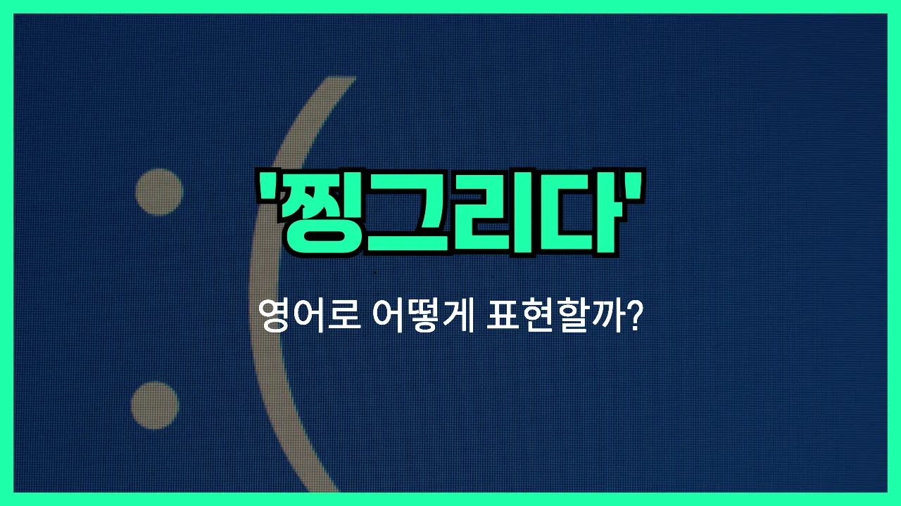

## 🌟 영어 표현 - frown

안녕하세요 👋 오늘은 얼굴 표정과 관련된 영어 표현을 하나 소개해드리려고 해요. 바로 '**frown**'이라는 단어인데요. 이 단어는 '**찡그리다**', '**인상쓰다**', '**얼굴을 찌푸리다**'라는 뜻을 가지고 있어요.

'**frown**'은 기분이 좋지 않거나, 뭔가 마음에 들지 않을 때, 또는 걱정이 있을 때 자연스럽게 얼굴이 굳어지면서 이마에 주름이 생기는 표정을 말해요. 우리가 흔히 "얼굴을 찡그리다"라고 할 때 딱 맞는 표현이에요!

이 단어는 주로 동사로 사용되지만, 명사로도 '찡그린 얼굴'이라는 뜻으로 쓸 수 있어요. 예를 들어, 누군가가 슬픈 소식을 들었을 때, 또는 무언가에 불만이 있을 때 'frown'이라는 단어를 쓸 수 있답니다.

## 📖 예문

1. "그녀는 걱정스러운 표정으로 나를 바라봤어요."

   "She [looked at](/blog/in-english/319.look-at/) me with a frown."

2. "그 소식을 듣고 그는 얼굴을 찡그렸어요."

   "He frowned when he heard the [news](/blog/in-english/536.news/)."

## 💬 연습해보기

<ul data-interactive-list>

  <li data-interactive-item>
    시험 점수 보고 찡그리기 시작했어요. 실망한 게 눈에 보이더라고요.
    She started to frown when she saw her test score. I could tell she was <a href="/blog/in-english/302.disappoint/">disappointed</a>.
  </li>

  <li data-interactive-item>
    사진 찍을 때 왜 항상 찡그려요? 좀 웃어요!
    Why do you always frown when someone takes your picture? Come on, smile!
  </li>

  <li data-interactive-item>
    열쇠 어디 뒀는지 생각나려고 잠깐 찡그렸어요.
    He frowned for a second, <a href="/blog/in-english/117.try-to/">trying to</a> remember where he <a href="/blog/in-english/402.leave/">left</a> his keys.
  </li>

  <li data-interactive-item>
    나쁜 성적 말했더니 엄마가 찡그리시면서 걱정하셨어요.
    My mom frowned at me when I told her about my bad grade. She looked worried.
  </li>

  <li data-interactive-item>
    너무 많이 찡그리지 마요, 주름 생겨요! 할머니가 항상 그러셨거든요.
    Don't frown so much; you're going to get <a href="/blog/in-english/542.wrinkle/">wrinkles</a>! That's what my grandma always says.
  </li>

  <li data-interactive-item>
    수업에 늦게 들어갔더니 찡그리고 계시더라고요. 기분 안 좋으신 것 같았어요.
    He gave me a frown when I walked in <a href="/blog/in-english/391.late/">late</a> to class. I could tell he wasn't happy.
  </li>

  <li data-interactive-item>
    애들이 채소 보며 찡그리고 피자 달라고 했어요.
    The kids frowned at their vegetables and asked if they could have pizza instead.
  </li>

  <li data-interactive-item>
    이른 회의 얘기하니까 사무실 사람들이 다 찡그리기 시작했어요.
    When I mentioned the early meeting, everyone in the office started to frown.
  </li>

  <li data-interactive-item>
    어려운 설명서 읽고 찡그렸어요. 다음에 뭘 해야 할지 전혀 몰랐대요.
    She frowned as she <a href="/blog/in-english/436.read/">read</a> the confusing instructions. She <a href="/blog/in-english/187.have-no-idea/">had no idea</a> what to do next.
  </li>

  <li data-interactive-item>
    밖에 비 오는데 찡그린 얼굴 봤어요. 맑은 날 기대하고 있었나 봐요.
    I <a href="/blog/in-english/061.notice/">noticed</a> a frown on his face when he saw the rain outside. He was hoping for a sunny day.
  </li>

</ul>

## 🤝 함께 알아두면 좋은 표현들

### scowl

'scowl'은 "얼굴을 찡그리다" 또는 "노려보다"라는 뜻이에요. 주로 화가 나거나 불쾌할 때 얼굴을 심하게 찡그리는 모습을 나타낼 때 사용해요. 'frown'보다 더 강한 감정 표현이에요.

- "She scowled at her brother when he took her phone without asking."
- "동생이 허락도 없이 핸드폰을 가져가자 그녀는 얼굴을 심하게 찡그렸어요."

### smile

'smile'은 'frown'의 반대말로, "미소 짓다"라는 뜻이에요. 기쁘거나 즐거울 때, 또는 누군가에게 친근함을 표현할 때 얼굴에 웃는 표정을 짓는 것을 말해요.

- "He smiled warmly when he saw his old friend at the party."
- "파티에서 오랜 친구를 보자 그는 따뜻하게 미소를 지었어요."

### raise one's eyebrows

'raise one's eyebrows'는 "눈썹을 치켜올리다"라는 뜻으로, 놀라거나 의아할 때, 또는 의심스러울 때 자주 쓰는 표현이에요. 'frown'처럼 얼굴 표정으로 감정을 드러내지만, 주로 놀람이나 의문을 나타낼 때 사용해요.

- "She raised her eyebrows when she heard the unexpected [news](/blog/in-english/536.news/)."
- "그녀는 예상치 못한 소식을 듣고 눈썹을 치켜올렸어요."

---

오늘은 '**찡그리다**', '**인상쓰다**', '**얼굴을 찌푸리다**'라는 뜻을 가진 영어 표현 '**frown**'에 대해 알아봤어요. 앞으로 누군가가 얼굴을 찡그릴 때 이 단어를 떠올려보면 좋겠어요 😊

오늘 배운 표현과 예문들을 꼭 최소 3번씩 소리 내서 읽어보세요. 다음에도 더 재미있고 유익한 영어 표현으로 찾아올게요! 감사합니다!

