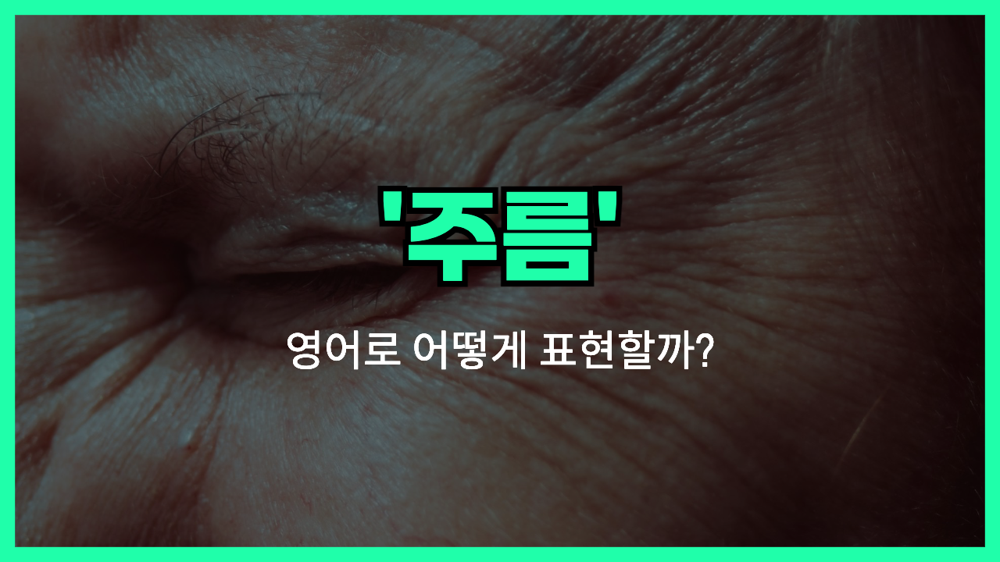

## 🌟 영어 표현 - wrinkle

안녕하세요 👋 오늘은 얼굴이나 옷에 생기는 '주름'을 영어로 어떻게 표현하는지 알아보려고 해요. 바로 '**wrinkle**'이라는 단어인데요~

'**wrinkle**'은 피부에 생기는 잔주름, 나이가 들면서 생기는 주름뿐만 아니라, 옷감에 생기는 구김도 모두 표현할 수 있는 단어예요. 그래서 일상생활에서 정말 자주 쓰이는 표현이랍니다~

예를 들어, 나이가 들면서 얼굴에 생기는 주름을 말할 때 "She has wrinkles around her eyes."라고 할 수 있어요. 또, 셔츠를 다림질하지 않아서 구김이 있을 때는 "My shirt is full of wrinkles."라고 표현해요~

'wrinkle'은 명사로 '주름', '구김'이라는 뜻이고, 동사로는 '주름지다', '구김이 생기다'라는 의미로도 쓸 수 있어요. 상황에 따라 다양하게 활용해 보세요!

## 📖 예문

1. "그녀는 눈가에 주름이 있어요."

   "She has wrinkles around her eyes."

2. "이 셔츠는 주름이 너무 많아요."

   "This shirt has too many wrinkles."

3. "웃을 때마다 이마에 주름이 생겨요."

   "I get wrinkles on my forehead whenever I smile."

## 💬 연습해보기

<ul data-interactive-list>

  <li data-interactive-item>
    이마에 주름 하나 생긴 거 알아차리고 나서 거울에서 눈을 못 떼겠어요.
    I <a href="/blog/in-english/061.notice/">noticed</a> a wrinkle forming on my forehead and now I can't stop <a href="/blog/in-english/319.look-at/">looking at</a> it in the mirror.
  </li>

  <li data-interactive-item>
    잠깐만요, 셔츠 다림질해 줄게요. 여기 주름 좀 잡아야겠어요.
    Let me iron your shirt real <a href="/blog/in-english/439.quick/">quick</a>. There's a wrinkle right here.
  </li>

  <li data-interactive-item>
    할머니가 웃으시는데 얼굴에 있던 주름마다 생기가 확 살아나더라고요.
    My grandma <a href="/blog/in-english/321.laugh/">laughed</a> and you could see every wrinkle in her face light up.
  </li>

  <li data-interactive-item>
    회의 전에 양복 주름을 쓱쓱 펴보려고 했어요.
    He <a href="/blog/in-english/117.try-to/">tried to</a> smooth out the wrinkle in his suit before the meeting.
  </li>

  <li data-interactive-item>
    계획을 다 꿰뚫었다고 생각할 때마다 새로운 변수가 꼭 생겨요.
    There's always a new wrinkle in the plan whenever we think we've got it figured out.
  </li>

  <li data-interactive-item>
    커튼 한가운데에 주름이 쭉 가 있더라고요.
    The curtains had a wrinkle running all the way down the middle.
  </li>

  <li data-interactive-item>
    저거 봤어요? 카페트에 주름이 있어서 조심하세요.
    Did you see that? There's a wrinkle in the carpet—watch your step.
  </li>

  <li data-interactive-item>
    상한 우유 냄새 맡고 콧잔등이 찡그려졌어요.
    Her nose wrinkled when she smelled the spoiled milk.
  </li>

  <li data-interactive-item>
    그가 웃을 때마다 눈가에 작은 주름이 하나씩 생겨요.
    Every time he smiles, a tiny wrinkle appears by his eyes.
  </li>

  <li data-interactive-item>
    영화 타임라인에 뭔가 이상한 점이 있다는 걸 방금 알아챘어요. 좀 말이 안 맞는 느낌이에요.
    I just noticed a wrinkle in the timeline of the movie. It doesn't really add up.
  </li>

</ul>

## 🤝 함께 알아두면 좋은 표현들

### crease

'crease'는 '주름'이나 '구김'을 의미하는 단어로, 옷이나 종이, 얼굴 등에 생긴 선이나 접힌 자국을 말해요. 'wrinkle'과 비슷하게 사용되지만, 주로 옷이나 천에 생긴 구김에 더 자주 쓰여요.

- "There was a [deep](/blog/in-english/428.deep/) crease in his shirt after it came out of the dryer."
- "셔츠가 건조기에서 나오고 나서 깊은 구김이 생겼어요."

### smooth out

'smooth out'은 '주름이나 구김을 펴다'라는 뜻이에요. 무언가의 표면을 매끄럽게 만들어 주름이나 굴곡을 없애는 행동을 나타낼 때 써요. 'wrinkle'의 반대되는 의미로 자주 사용돼요.

- "She tried to smooth out the wrinkles on the tablecloth before the guests [arrived](/blog/in-english/403.arrive/)."
- "손님들이 오기 전에 식탁보의 주름을 펴려고 애썼어요."

### crumple

'crumple'은 '구기다', '구겨지다'라는 뜻으로, 종이나 천, 옷 등이 마구 접히거나 뭉쳐져서 주름이 생기는 상황을 말해요. 'wrinkle'보다 더 심하게 구겨진 상태를 표현할 때 써요.

- "He crumpled the piece of paper and [threw](/blog/in-english/458.throw/) it in the trash."
- "그는 종이 한 장을 구겨서 쓰레기통에 던졌어요."

---

오늘은 '주름', '구김'이라는 뜻을 가진 영어 표현 '**wrinkle**'에 대해 알아봤어요. 앞으로 얼굴이나 옷에 주름이 생겼을 때 이 단어를 떠올려 보세요~ 😊

오늘 배운 표현과 예문들을 꼭 소리 내서 여러 번 읽어보세요. 다음에도 더 유익한 영어 표현으로 찾아올게요! 감사합니다~

