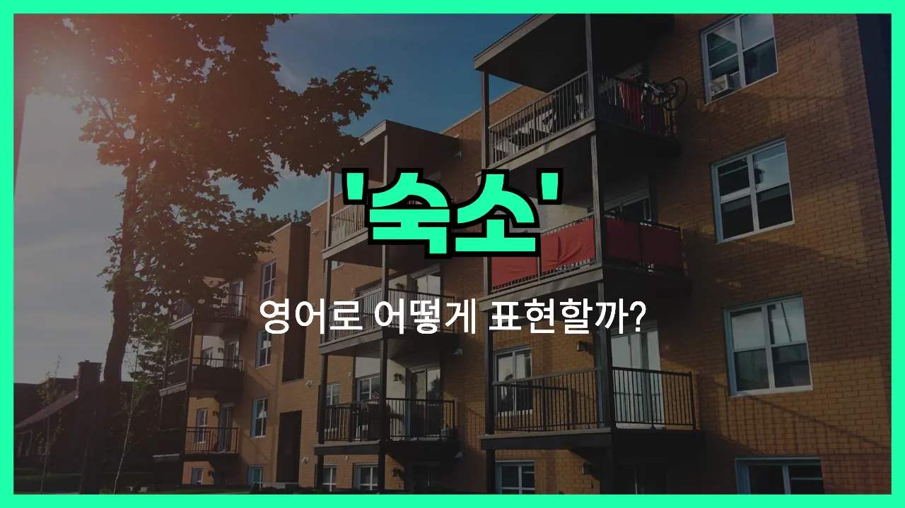

## 🌟 영어 표현 - accommodation

안녕하세요 👋 오늘은 여행이나 출장, 또는 새로운 곳에서 머물 때 꼭 필요한 단어, 바로 '**숙소**'의 영어 표현 '**accommodation**'에 대해 알아보려고 해요.

'**accommodation**'는 기본적으로 **사람이 머무는 장소**를 의미해요. 즉, 호텔, 게스트하우스, 민박, 기숙사 등 우리가 잠시 머무는 모든 공간을 포괄하는 단어예요. 여행을 계획할 때 "숙소를 예약하다"라는 말을 영어로 하고 싶을 때 바로 이 단어를 사용하면 돼요!

또한, accommodation은 단수와 복수 모두로 쓰일 수 있지만, 영국 영어에서는 주로 복수형(accommodations)보다 단수형을 많이 사용해요. 미국 영어에서는 accommodations(복수형)도 자주 쓰인답니다~

## 📖 예문

1. "저희는 시내 중심에 있는 숙소를 예약했어요."

   "We booked accommodation in the city center."

2. "이 호텔은 저렴한 숙소를 제공합니다."

   "This hotel offers affordable accommodation."

3. "출장 중에 머물 숙소가 필요해요."

   "I need accommodation for my business trip."

## 💬 연습해보기

<ul data-interactive-list>

  <li data-interactive-item>
    이번 주말 숙소 확인하려고 호텔에 전화해 볼게요.
    I'm going to call the hotel and double-check our accommodation for this weekend.
  </li>

  <li data-interactive-item>
    컨퍼런스에서 참가자 숙소까지 제공하는지 알아요?
    Do you know if the conference provides accommodation for attendees?
  </li>

  <li data-interactive-item>
    시내 저렴한 숙소 찾고 있는데, 다 예약 끝났더라고요.
    We're <a href="/blog/in-english/173.look-for/">looking for</a> affordable accommodation downtown, but it's all booked up.
  </li>

  <li data-interactive-item>
    비행기 지연돼서 공항 근처에서 급하게 숙소 구했어요.
    My flight got delayed, so I had to find last-minute accommodation near the <a href="/blog/in-english/549.airport/">airport</a>.
  </li>

  <li data-interactive-item>
    전 요리하는 거 좋아해서 주방 딸린 숙소가 제일 좋아요.
    I <a href="/blog/in-english/191.prefer/">prefer</a> accommodation with a kitchen because I like to <a href="/blog/in-english/461.cook/">cook</a> my own <a href="/blog/in-english/528.meal/">meals</a>.
  </li>

  <li data-interactive-item>
    숙소가 프로그램에 포함돼 있나요, 아니면 각자 알아봐야 해요?
    Is accommodation <a href="/blog/in-english/522.include/">included</a> in the program, or do we have to arrange our own?
  </li>

  <li data-interactive-item>
    여기 머무는 동안 숙소 찾는 거 도와줄 필요 있으면 알려 주세요.
    Let me know if you need help finding accommodation while you're here.
  </li>

  <li data-interactive-item>
    저희가 고른 에어비앤비는 최고였어요, 진짜 최고의 숙소였거든요.
    The Airbnb we picked was the best accommodation we've ever stayed in.
  </li>

  <li data-interactive-item>
    친구 집에 머물 거라 따로 숙소 필요 없어요.
    I'm staying with friends, so I don't need other accommodation.
  </li>

  <li data-interactive-item>
    몇몇 대학은 캠퍼스 내에 학생 숙소를 제공하기도 해요.
    Some universities offer student accommodation right on campus.
  </li>

</ul>

## 🤝 함께 알아두면 좋은 표현들

### lodging

'lodging'은 '숙박' 또는 '임시로 머무는 곳'을 의미해요. 주로 여행이나 출장 등에서 하룻밤 이상 머무는 장소를 말할 때 사용해요. 호텔, 모텔, 게스트하우스 등 다양한 형태의 숙소를 모두 포함할 수 있어요.

- "We need to find lodging for our trip to Busan next weekend."
- "우리 다음 주말 부산 여행을 위해 숙박할 곳을 찾아야 해요."

### temporary housing

'[temporary](/blog/in-english/425.temporary/) housing'은 '임시 거주지' 또는 '임시 숙소'를 뜻해요. 집을 수리하거나 이사 중이거나, 갑작스러운 상황으로 인해 잠시 머무는 곳을 말할 때 사용해요. 영구적인 집이 아니라 잠깐 머무는 곳이라는 점이 강조돼요.

- "After the flood, many families had to move into temporary housing until their homes were repaired."
- "홍수 이후에 많은 가족들이 집이 수리될 때까지 임시 거주지로 옮겨야 했어요."

### homelessness

'homelessness'는 '집이 없음', 즉 '노숙'이나 '주거 불안정'을 의미하는 단어예요. accommodation(숙소, 거처)이 없는 상태를 나타내는 반대말로 볼 수 있어요. 사회적 문제나 개인적인 사정으로 인해 안정적인 거주지가 없는 상황을 말할 때 사용해요.

- "The city is [working on](/blog/in-english/370.work-on/) new programs to reduce homelessness."
- "그 도시는 노숙 문제를 줄이기 위한 새로운 프로그램을 추진하고 있어요."

---

오늘은 '**숙소**', '**거처**', '**머무는 곳**'이라는 뜻을 가진 영어 표현 '**accommodation**'에 대해 알아봤어요. 앞으로 여행이나 외국에서 머물 곳을 이야기할 때 이 단어를 꼭 활용해 보세요 😊

오늘 배운 표현과 예문들을 꼭 최소 3번씩 소리 내서 읽어보세요. 다음에도 더 재미있고 유익한 영어 표현으로 찾아올게요! 감사합니다!
