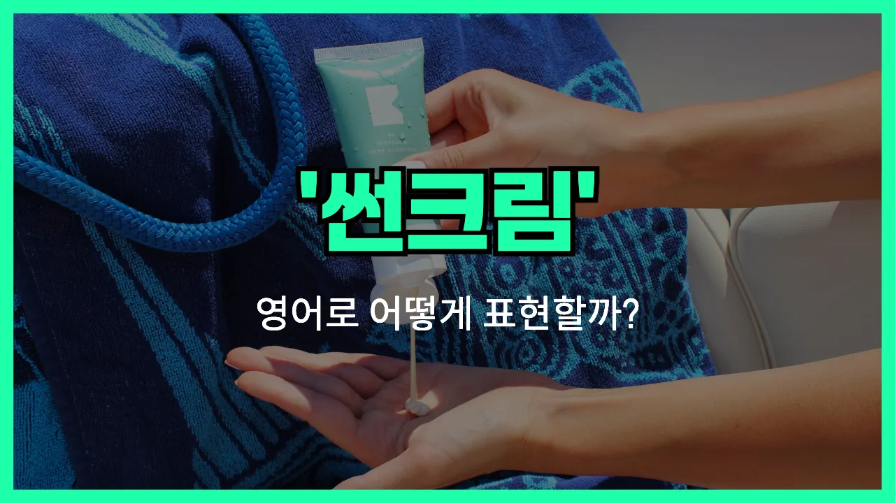

## 🌟 영어 표현 - sunscreen

안녕하세요 👋 오늘은 여름철 필수품인 '**자외선 차단제**'를 영어로 어떻게 표현하는지 알아보려고 해요. 바로 '**sunscreen**'이라는 단어를 사용해요.

'sunscreen'은 햇빛에 포함된 자외선(UV)으로부터 피부를 보호해주는 제품을 말해요. 우리말로는 '자외선 차단제', '선크림', 또는 '썬블록'이라고도 부르죠. 해변에 놀러 가거나 야외 활동을 할 때 꼭 챙겨야 하는 아이템이에요!

이 단어는 명사로 쓰이며, 보통 'apply sunscreen'처럼 '바르다'라는 동사와 함께 자주 사용돼요. 피부를 태양으로부터 보호하고 싶을 때 꼭 필요한 표현이에요.

## 📖 예문

1. "외출하기 전에 자외선 차단제를 꼭 발라요."

   "Be sure to apply sunscreen before going outside."

2. "해변에 갈 때 선크림을 챙겼어요."

   "I [packed](/blog/in-english/301.pack/) sunscreen when I went to the beach."

## 💬 연습해보기

<ul data-interactive-list>

  <li data-interactive-item>
    오늘 진짜 햇빛 쨍쨍해요. 밖에 나가기 전에 선크림 꼭 발라야 돼요.
    It's really sunny today. Don't <a href="/blog/in-english/023.forget/">forget</a> to <a href="/blog/in-english/261.put-on/">put on</a> some sunscreen before you go outside.
  </li>

  <li data-interactive-item>
    여름엔 항상 가방에 선크림 가지고 다녀요.
    I always keep sunscreen in my bag during the summer.
  </li>

  <li data-interactive-item>
    해변에 있을 땐 두세 시간마다 선크림 다시 발라야 해요.
    You should reapply sunscreen every couple of hours if you're at the beach.
  </li>

  <li data-interactive-item>
    아침에 선크림 집에 두고 오는 걸 깜빡했어요.
    Oops, I forgot my sunscreen at home this morning.
  </li>

  <li data-interactive-item>
    제 선크림 빌릴래요? 백팩에 하나 더 있어요.
    Do you want to <a href="/blog/in-english/466.borrow/">borrow</a> my sunscreen? I have an <a href="/blog/in-english/265.extra/">extra</a> one in my backpack.
  </li>

  <li data-interactive-item>
    엄마가 흐린 날에도 선크림 바르라고 잔소리해요.
    My mom <a href="/blog/in-english/114.remind/">reminds</a> me to use sunscreen even on cloudy days.
  </li>

  <li data-interactive-item>
    선크림 부족하면 코만 항상 탔어요.
    My nose always gets burnt if I don't use enough sunscreen.
  </li>

  <li data-interactive-item>
    이 선크림 방수 된대서 샀는데, 믿음직하진 않아요.
    This sunscreen is supposed to be waterproof, but I'm not sure I trust it.
  </li>

  <li data-interactive-item>
    선크림 성분 중에 알레르기 있는 거 있어요, 아니면 괜찮아요?
    Are you allergic to any ingredients in sunscreen or is it okay for you?
  </li>

  <li data-interactive-item>
    어제 축제에서 공짜로 선크림 샘플 나눠줬어요.
    They were giving out free sunscreen samples at the festival yesterday.
  </li>

</ul>

## 🤝 함께 알아두면 좋은 표현들

### sunblock

'sunblock'은 'sunscreen'과 비슷하게 자외선을 차단해주는 제품을 의미해요. 하지만 'sunblock'은 피부에 자외선이 닿지 않도록 물리적으로 막아주는 역할을 더 강조하는 단어예요. 보통 강한 자외선 차단 효과를 원할 때 사용해요.

- "If you have sensitive skin, you might [prefer](/blog/in-english/191.prefer/) using sunblock [instead of](/blog/in-english/169.instead-of/) regular sunscreen."
- "피부가 예민하다면 일반 선크림 대신 선블록을 쓰는 게 더 나을 수 있어요."

### go bare-faced

'go bare-faced'는 '아무것도 바르지 않고 맨 얼굴로 다니다'라는 뜻이에요. 즉, 선크림이나 화장품을 전혀 바르지 않은 상태를 말해요. 피부에 아무것도 바르지 않고 자연스럽게 다니는 걸 강조할 때 써요.

- "She [decided to](/blog/in-english/062.decide-to/) go bare-faced to the beach, skipping sunscreen and makeup."
- "그녀는 해변에 갈 때 선크림이나 화장품을 바르지 않고 맨 얼굴로 가기로 했어요."

### reapply sunscreen

'reapply sunscreen'은 '선크림을 다시 바르다'라는 뜻이에요. 선크림은 시간이 지나면 효과가 줄어들기 때문에, 야외 활동 중에 여러 번 덧발라야 한다는 점을 강조할 때 자주 쓰는 표현이에요.

- "Don't forget to reapply sunscreen every two hours when you're outside."
- "밖에 있을 때는 두 시간마다 선크림을 꼭 다시 발라야 해요."

---

오늘은 '**자외선 차단제**', '**선크림**'이라는 뜻을 가진 영어 표현 '**sunscreen**'에 대해 알아봤어요. 여름뿐만 아니라 사계절 내내 피부를 보호하려면 이 단어를 꼭 기억해두면 좋겠어요 😊

오늘 배운 표현과 예문들을 꼭 최소 3번씩 소리 내서 읽어보세요. 다음에도 더 재미있고 유익한 영어 표현으로 찾아올게요! 감사합니다!
