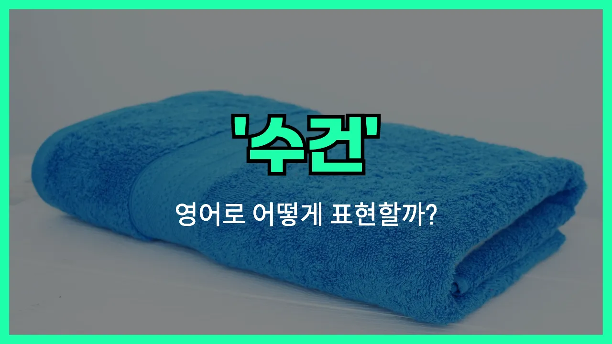

## 🌟 영어 표현 - towel

안녕하세요 👋 오늘은 일상에서 자주 쓰는 물건 중 하나인 '**수건**'의 영어 표현에 대해 알아보려고 해요. 바로 '**towel**'이라는 단어인데요. 이 단어는 우리가 샤워를 하고 몸을 닦거나, 손을 씻은 후에 물기를 닦을 때 사용하는 천을 의미해요.

'**towel**'은 목욕 수건, 손수건, 주방에서 쓰는 행주 등 다양한 종류의 수건을 모두 포괄하는 단어예요. 상황에 따라 'bath towel(목욕 수건)', 'hand towel(손수건)', 'kitchen towel(행주)'처럼 구체적으로 표현할 수도 있어요.

이 단어는 명사로 주로 사용되며, '수건으로 닦다'라는 뜻으로 동사로도 쓸 수 있어요. 예를 들어, 'to towel off'는 '수건으로 닦다'라는 의미예요.

## 📖 예문

1. "수건 좀 빌릴 수 있을까요?"

   "Can I [borrow](/blog/in-english/466.borrow/) a towel?"

2. "샤워 후에 몸을 수건으로 닦았어요."

   "I dried my body with a towel after taking a shower."

3. "주방에 깨끗한 행주가 있어요."

   "There is a clean kitchen towel in the kitchen."

## 💬 연습해보기

<ul data-interactive-list>

  <li data-interactive-item>
    헐, 체육관에 수건 두고 올 줄이야. 완전 땀 범벅 됐어요.
    I can't believe I <a href="/blog/in-english/023.forget/">forgot</a> my towel at the <a href="/blog/in-english/431.gym/">gym</a>. Now I'm all sweaty.
  </li>

  <li data-interactive-item>
    나 좀 도와줄래요? 옷장에 있는 수건 하나 좀 가져다 줄래요? 방금 샤워 끝났거든요.
    Do you mind grabbing me a towel from the closet? I just got out of the shower.
  </li>

  <li data-interactive-item>
    내 강아지 진짜 웃기게도 내가 몸 말릴 때마다 내 수건 훔쳐가요.
    My dog always steals my towel when I'm <a href="/blog/in-english/117.try-to/">trying to</a> dry off.
  </li>

  <li data-interactive-item>
    해변 의자에 수건 하나 있어요, 필요하면 앉아도 돼요.
    There's a towel on the beach chair if you need to sit down.
  </li>

  <li data-interactive-item>
    내 음료수 다 엎질렀어요. 수건 좀 건네줄 수 있나요?
    I spilled my drink everywhere. Can you hand me a towel?
  </li>

  <li data-interactive-item>
    아이고, 차에 수건 두고 와서 자연 건조 중이에요.
    Oh man, I <a href="/blog/in-english/402.leave/">left</a> my towel in the car. Now I have to drip-dry.
  </li>

  <li data-interactive-item>
    깨끗한 수건 다 떨어져서 티셔츠로 임시방편 했어요.
    We <a href="/blog/in-english/340.run-out-of/">ran out of</a> clean towels, so I had to use a T-shirt instead.
  </li>

  <li data-interactive-item>
    뛴 뒤에 차가운 수건 건네줬는데 그거 완전 최고였어요.
    He handed me a cold towel after my run. That felt amazing.
  </li>

  <li data-interactive-item>
    이 새 수건들 엄청 부들부들해요. 어디서 샀어요?
    These new towels are super soft. Where did you get them?
  </li>

  <li data-interactive-item>
    그녀가 머리 감고 나서 수건으로 머리를 감싸더라고요.
    She wrapped her hair up in a towel after washing it.
  </li>

</ul>

## 🤝 함께 알아두면 좋은 표현들

### bathrobe

'bathrobe'는 목욕 후에 입는 가운을 의미해요. 수건처럼 몸의 물기를 닦는 용도이지만, 옷처럼 입을 수 있어서 좀 더 편리하고 따뜻하게 몸을 감쌀 수 있어요.

- "After her shower, she [put on](/blog/in-english/261.put-on/) a soft bathrobe and relaxed on the couch."
- "샤워하고 나서 부드러운 목욕 가운을 입고 소파에 앉아 쉬었어요."

### paper towel

'paper towel'은 일회용으로 사용하는 종이 수건이에요. 주로 주방이나 화장실에서 손을 닦거나 물기를 닦아낼 때 사용해요. 천으로 된 수건과 달리 한 번 쓰고 버릴 수 있어서 위생적이에요.

- "Could you hand me a paper towel to clean up this spill?"
- "이거 쏟은 거 닦으려고 종이 타월 좀 건네줄래요?"

### air dry

'air dry'는 수건이나 드라이기 없이 자연스럽게 공기 중에서 마르는 것을 의미해요. 예를 들어, 머리카락이나 손, 몸을 닦지 않고 그냥 두어서 마르게 하는 거예요. 수건을 사용하는 것과는 반대되는 개념이에요.

- "I usually let my hair air dry [instead of](/blog/in-english/169.instead-of/) using a towel or a hair dryer."
- "저는 보통 수건이나 드라이기 대신에 머리를 자연스럽게 말려요."

---

오늘은 '**수건**'이라는 뜻을 가진 영어 단어 '**towel**'에 대해 알아봤어요. 일상에서 정말 자주 쓰이는 단어이니 꼭 기억해두면 좋겠어요 😊

오늘 배운 표현과 예문들을 소리 내서 여러 번 읽어보세요. 다음에도 더 유익한 영어 표현으로 찾아올게요! 감사합니다!
