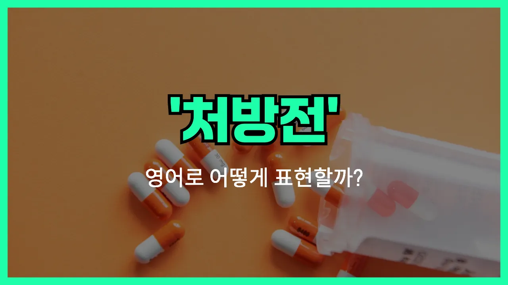

## 🌟 영어 표현 - prescription

안녕하세요 👋 오늘은 병원이나 약국에서 자주 듣는 단어, '**처방전**'의 영어 표현에 대해 알아보려고 해요. 바로 '**prescription**'이라는 단어인데요~

'**prescription**'은 의사가 환자에게 필요한 약을 지정해서 써주는 문서, 즉 **처방전**을 의미해요. 병원에서 진료를 받고 나서 약을 타러 갈 때 꼭 필요한 종이죠~

또한, 이 단어는 '처방하다'라는 동사 '**prescribe**'와도 관련이 있어요. 'prescription'은 명사로 '처방전', 'prescribe'는 동사로 '처방하다'라는 뜻이에요~

실생활에서는 약국에서 "처방전 있으세요?"라고 물어볼 때, "Do you have a prescription?"이라고 해요. 또, 의사가 약을 처방해줄 때는 "I'll write you a prescription."이라고 말할 수 있어요~

## 📖 예문

1. "이 약은 처방전이 필요해요."

   "This [medicine](/blog/in-english/567.medicine/) [requires](/blog/in-english/155.require/) a prescription."

2. "의사가 저에게 처방전을 써줬어요."

   "The [doctor](/blog/in-english/563.doctor/) gave me a prescription."

## 💬 연습해보기

<ul data-interactive-list>

  <li data-interactive-item>
    의사 선생님이 항생제 처방전을 줬어요. 일 끝나고 약국 들러서 약 받았답니다.
    The <a href="/blog/in-english/563.doctor/">doctor</a> gave me a prescription for antibiotics. I had to stop by the <a href="/blog/in-english/550.pharmacy/">pharmacy</a> after work to pick it up.
  </li>

  <li data-interactive-item>
    그 약은 처방전 필요해요, 아니면 그냥 약국에서 살 수 있는 거예요?
    Do you need a prescription for that medication, or is it over-the-counter?
  </li>

  <li data-interactive-item>
    가방 어딘가에서 처방전을 잃어버렸어요. 다시 의사 선생님께 전화해야 돼요.
    I <a href="/blog/in-english/457.lose/">lost</a> my prescription somewhere in my bag. Now I have to call the doctor again.
  </li>

  <li data-interactive-item>
    제 보험은 일부 처방전만 커버해줘서 약 받는 게 좀 복잡해요.
    My insurance only covers certain prescriptions. It makes getting medicine kind of complicated.
  </li>

  <li data-interactive-item>
    약국에서 처방전 준비됐다고 전화 왔어요. 집 가는 길에 찾아갈게요.
    The pharmacy called to say my prescription is ready. I'll pick it up on my way home.
  </li>

  <li data-interactive-item>
    처방전 재조제 가능한가요, 아니면 먼저 의사 선생님한테 가야 해요?
    Can you refill my prescription, or do I need to see the doctor first?
  </li>

  <li data-interactive-item>
    알레르기 약 다 떨어져서 처방전 빨리 갱신되길 바라고 있어요.
    I <a href="/blog/in-english/340.run-out-of/">ran out of</a> my allergy medicine, so I <a href="/blog/성공하면-좋겠어-영어표현/">hope</a> my prescription gets renewed soon.
  </li>

  <li data-interactive-item>
    그 처방전 약이 생각보다 훨씬 비쌌어요.
    That prescription was way more <a href="/blog/in-english/317.expensive/">expensive</a> than I expected.
  </li>

  <li data-interactive-item>
    오늘 아침에 처방전 안 가져가서 몸이 별로 안 좋아 보여요.
    He <a href="/blog/in-english/023.forget/">forgot</a> to take his prescription this morning, so he's not feeling great today.
  </li>

  <li data-interactive-item>
    의사 선생님이 처방전을 전자 방식으로 보내줘서 서류 따로 안 가져가도 됐어요.
    My doctor <a href="/blog/in-english/292.send/">sent</a> the prescription electronically, so I didn't have to bring in any paperwork.
  </li>

</ul>

## 🤝 함께 알아두면 좋은 표현들

### doctor's order

'doctor's order'는 의사가 환자에게 내리는 공식적인 지시나 처방을 의미해요. 약을 복용하는 방법이나 치료법, 생활 습관에 대한 조언 등도 포함될 수 있어요. 일상 대화에서는 약 처방뿐만 아니라 의사의 모든 지시를 가리킬 때도 써요.

- "You should always follow your doctor's orders to recover quickly."
- "빨리 회복하려면 항상 의사 선생님의 지시를 따라야 해요."

### over-the-counter (OTC) medicine

'over-the-counter (OTC) medicine'은 처방전 없이 약국에서 바로 살 수 있는 일반 의약품을 뜻해요. 즉, 의사의 처방 없이도 구입할 수 있는 약을 말해요. 감기약, 진통제 등이 여기에 해당돼요.

- "You don't need a prescription for this painkiller; it's [available](/blog/in-english/188.available/) over the counter."
- "이 진통제는 처방전 없이도 살 수 있는 약이라서 그냥 약국에서 구입할 수 있어요."

### self-medicate

'self-medicate'는 의사의 처방이나 지시 없이 스스로 약을 먹거나 치료하는 것을 의미해요. 보통 건강에 좋지 않은 습관으로 여겨지며, 위험할 수 있다는 뉘앙스가 있어요.

- "It's not safe to self-medicate without consulting a doctor first."
- "의사랑 먼저 상담하지 않고 혼자 약을 먹는 건 안전하지 않아요."

---

오늘은 '**처방전**'이라는 뜻을 가진 영어 표현 '**prescription**'에 대해 알아봤어요. 병원이나 약국에서 꼭 필요한 단어이니 기억해두면 정말 유용할 거예요~ 😊

오늘 배운 표현과 예문들을 꼭 소리 내서 여러 번 읽어보세요. 다음에도 더 알차고 재미있는 영어 표현으로 찾아올게요! 감사합니다~

