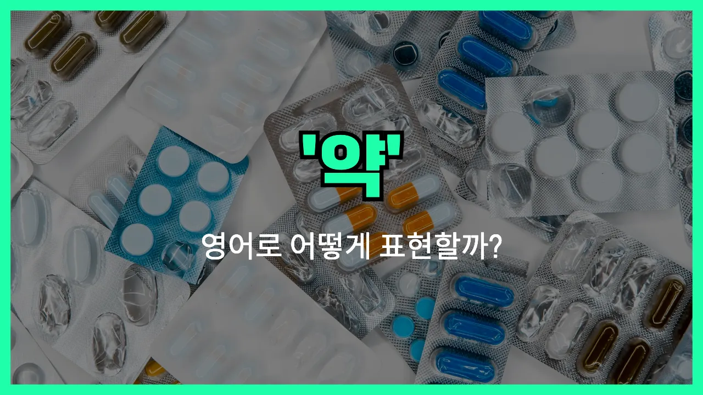

## 🌟 영어 표현 - medicine

안녕하세요 👋 오늘은 우리가 일상에서 자주 사용하는 단어, 바로 '**약**'의 영어 표현 '**medicine**'에 대해 알아보려고 해요.

'**medicine**'은 아플 때 먹거나 바르는 **의약품** 또는 **치료제**를 의미해요. 병원이나 약국에서 처방받는 약뿐만 아니라, 감기약, 두통약 등 다양한 약을 모두 포괄하는 단어예요.

이 단어는 명사로 사용되며, 건강이 좋지 않을 때 "약을 먹다", "약을 바르다"와 같은 상황에서 자연스럽게 쓸 수 있어요. 예를 들어, "I need to take my medicine."이라고 하면 "나 약 먹어야 해요."라는 뜻이에요.

또한, 'medicine'은 일반적으로 **치료 목적**의 약을 의미하지만, 때로는 전통 약이나 자연에서 얻은 약초 등도 포함할 수 있어요.

## 📖 예문

1. "이 약을 하루에 두 번 드세요."

   "Take this medicine twice a day."

2. "감기에 좋은 약이 있나요?"

   "Do you have any medicine for a cold?"

## 💬 연습해보기

<ul data-interactive-list>

  <li data-interactive-item>
    감기 걸린 것 같아요. 목 아플 때 먹는 약 있어요?
    I think I'm coming down with a cold. Do you have any medicine for a <a href="/blog/in-english/077.sore-throat/">sore throat</a>?
  </li>

  <li data-interactive-item>
    알레르기 때문에 의사 선생님이 새 약 처방해 줬어요.
    My <a href="/blog/in-english/563.doctor/">doctor</a> prescribed some new medicine for my allergies.
  </li>

  <li data-interactive-item>
    저녁 먹고 꼭 약 챙겨 먹어요, 알겠죠?
    <a href="/blog/in-english/232.make-sure/">Make sure</a> you take your medicine after dinner, okay?
  </li>

  <li data-interactive-item>
    오늘 아침에 약 먹었는지 기억이 잘 안 나요.
    I can't remember if I took my medicine this morning or not.
  </li>

  <li data-interactive-item>
    이 약 먹으면 졸릴 수도 있나요?
    Is this medicine supposed to make me feel sleepy?
  </li>

  <li data-interactive-item>
    어릴 때 엄마가 꼭 체리 맛 약 먹게 했는데, 저는 좀 좋아했어요.
    My mom always made me take that cherry-flavored medicine when I was a kid. I kind of liked it.
  </li>

  <li data-interactive-item>
    두통에 쓸 수 있는 일반의약품 약 있어요?
    Do you have any over-the-counter medicine for headaches?
  </li>

  <li data-interactive-item>
    여행 중에 약을 집에 두고 와서 갑자기 많이 아파졌어요.
    He <a href="/blog/in-english/023.forget/">forgot</a> his medicine at home, so he started to feel really sick during the trip.
  </li>

  <li data-interactive-item>
    약이 효과가 없으면 다시 병원에 가 보세요.
    If the medicine doesn't help, you should go back to your <a href="/blog/in-english/563.doctor/">doctor</a>.
  </li>

  <li data-interactive-item>
    나가는 김에 약국에서 제 약 좀 찾아줄 수 있어요?
    Can you <a href="/blog/in-english/178.pick-up/">pick up</a> my medicine from the <a href="/blog/in-english/550.pharmacy/">pharmacy</a> while you're out?
  </li>

</ul>

## 🤝 함께 알아두면 좋은 표현들

### remedy

'remedy'는 "치료법" 또는 "치유책"이라는 뜻이에요. 약뿐만 아니라 어떤 문제를 해결하는 방법이나 자연적인 치료법을 말할 때도 자주 써요.

- "She [prefers](/blog/in-english/191.prefer/) using natural remedies for her headaches [instead of](/blog/in-english/169.instead-of/) taking medicine."
- "그녀는 두통이 있을 때 약을 먹는 것보다 자연적인 치료법을 더 선호해요."

### prescription

'[prescription](/blog/in-english/566.prescription/)'은 "처방전" 또는 "처방약"이라는 뜻이에요. 의사가 환자에게 필요한 약을 지정해서 주는 것을 말해요. 약국에서 약을 받을 때 꼭 필요한 경우가 많아요.

- "The doctor gave me a [prescription](/blog/in-english/566.prescription/) for antibiotics to treat my infection."
- "의사 선생님이 내 감염을 치료하기 위해 항생제 처방전을 써주셨어요."

### poison

'poison'은 "독" 또는 "독약"이라는 뜻으로, 약과는 반대되는 개념이에요. 몸에 해를 끼치거나 병을 일으키는 물질을 말해요. 약이 몸을 낫게 한다면, poison은 오히려 해롭게 만들죠.

- "Be careful not to mix those chemicals, as they could create a dangerous poison."
- "그 화학약품들을 섞지 않도록 조심하세요, 위험한 독이 생길 수도 있어요."

---

오늘은 '**약**', '**의약품**', '**치료제**'라는 뜻을 가진 영어 표현 '**medicine**'에 대해 알아봤어요. 아플 때나 병원에 갈 때 꼭 필요한 단어니까 기억해두면 정말 유용할 거예요 😊

오늘 배운 표현과 예문들을 꼭 최소 3번씩 소리 내서 읽어보세요. 다음에도 더 재미있고 유익한 영어 표현으로 찾아올게요! 감사합니다!

