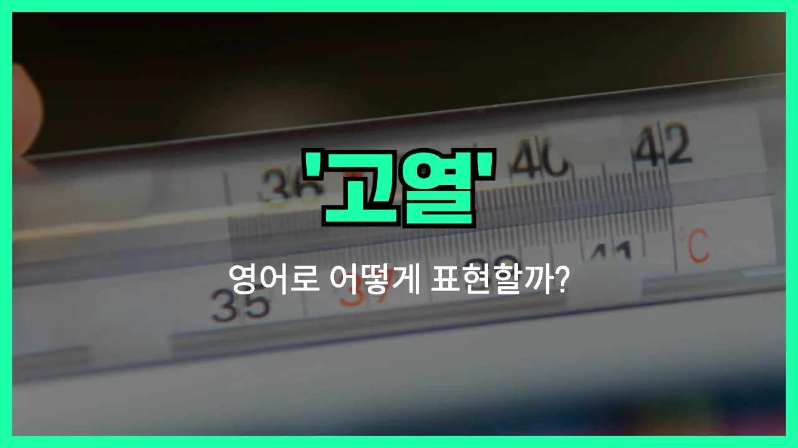

## 🌟 영어 표현 - fever

안녕하세요 👋 오늘은 우리가 자주 겪을 수 있는 증상 중 하나인 '**열**'에 대해 영어로 어떻게 표현하는지 알아보려고 해요. 바로 '**fever**'라는 단어를 사용해요.

'**fever**'는 몸의 온도가 정상보다 높아진 상태, 즉 **고열**이나 **발열**을 의미해요. 감기, 독감, 감염 등 여러 가지 이유로 열이 날 때 이 단어를 쓸 수 있어요!

일상 대화나 병원에서 증상을 설명할 때 정말 자주 쓰이는 표현이니 꼭 기억해두면 좋아요. 예를 들어, "저 열이 있어요"라고 말하고 싶을 때 "I have a fever."라고 하면 돼요.

또한, 열이 심할 때는 "high fever"라고 해서 "고열"을 표현할 수 있어요. 반대로, 미열은 "low-grade fever"라고 해요.

## 📖 예문

1. "저는 어젯밤에 열이 났어요."

   "I had a fever last night."

2. "그 아이는 고열이 있어요."

   "The child has a high fever."

## 💬 연습해보기

<ul data-interactive-list>

  <li data-interactive-item>
    뭔가 몸이 안 좋은 것 같아요. 열이 좀 있어요.
    I think I might be coming down with something. I've got a bit of a fever.
  </li>

  <li data-interactive-item>
    아들이 어젯밤에 열이 나서 오늘 학교를 안 갔어요.
    My son had a fever last night, so we kept him home from school today.
  </li>

  <li data-interactive-item>
    정말 외출할 거예요? 아직 열이 있잖아요.
    Are you sure you want <a href="/blog/in-english/450.to-go/">to go</a> out? You <a href="/blog/in-english/254.still/">still</a> have a fever.
  </li>

  <li data-interactive-item>
    추위가 몰려오더니 갑자기 열이 확 나버렸어요.
    I started having chills and then the fever hit me hard.
  </li>

  <li data-interactive-item>
    열이 떨어지지 않아서 거의 잠을 못 잤어요.
    I <a href="/blog/in-english/078.barely/">barely</a> slept because my fever just wouldn't break.
  </li>

  <li data-interactive-item>
    아까는 괜찮아 보였는데 갑자기 열이 확 났어요.
    She seemed fine <a href="/blog/in-english/397.earlier/">earlier</a>, but then she spiked a fever out of nowhere.
  </li>

  <li data-interactive-item>
    열이 더 오르면 병원에 가는 게 좋을 것 같아요.
    If your fever gets any higher, we should <a href="/blog/in-english/281.probably/">probably</a> see a <a href="/blog/in-english/563.doctor/">doctor</a>.
  </li>

  <li data-interactive-item>
    며칠째 미열이 계속돼서 진짜 짜증 나요.
    I've had this low-grade fever for a couple days now. It's so <a href="/blog/in-english/364.annoying/">annoying</a>.
  </li>

  <li data-interactive-item>
    열 내리려고 타이레놀 먹고 푹 쉬어요.
    Take some Tylenol for the fever and get plenty of rest.
  </li>

  <li data-interactive-item>
    열이 계속 나서 아침 내내 아파서 병가 냈어요.
    He <a href="/blog/vocab-1/032.call-in-sick/">called in sick</a> because he was running a fever all morning.
  </li>

</ul>

## 🤝 함께 알아두면 좋은 표현들

### high temperature

'high temperature'는 'fever'와 비슷하게 몸의 온도가 정상보다 높아진 상태를 의미해요. 주로 감기나 감염 등으로 인해 체온이 올라갔을 때 사용해요.

- "She stayed home from school because she had a high temperature."
- "그녀는 열이 나서 학교에 가지 않았어요."

### chills

'chills'는 'fever'와 반대되는 개념으로, 몸이 오싹오싹 춥고 떨리는 증상을 말해요. 보통 열이 오르기 전이나 감기에 걸렸을 때 몸이 떨릴 때 사용해요.

- "He started to feel chills before the fever set in."
- "그는 열이 나기 전에 몸이 오싹오싹 떨리기 시작했어요."

### normal body temperature

'normal body temperature'는 'fever'의 반의어로, 몸의 온도가 정상 범위에 있을 때를 의미해요. 건강한 상태를 나타낼 때 자주 써요.

- "After taking the [medicine](/blog/in-english/567.medicine/), her body returned to a normal body temperature."
- "약을 먹고 나서 그녀의 체온이 정상으로 돌아왔어요."

---

오늘은 '**열**', '**고열**', '**발열**'이라는 뜻을 가진 영어 표현 '**fever**'에 대해 알아봤어요. 몸이 아플 때 이 표현을 사용하면 상황을 더 정확하게 전달할 수 있겠죠? 😊

오늘 배운 표현과 예문들을 꼭 최소 3번씩 소리 내서 읽어보세요. 다음에도 더 유익한 영어 표현으로 찾아올게요! 감사합니다!
