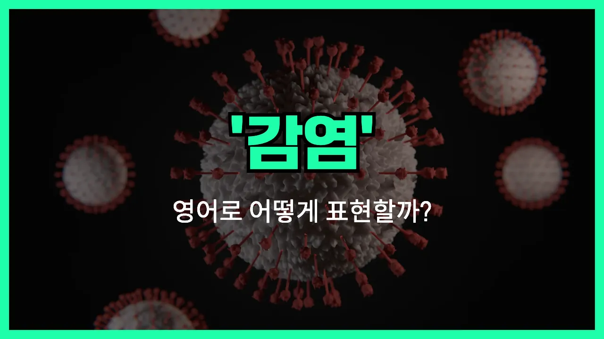

## 🌟 영어 표현 - infection

안녕하세요 👋 오늘은 일상에서 자주 듣는 단어, '**감염**'의 영어 표현 '**infection**'에 대해 알아보려고 해요.

'**infection**'은 **병균이나 바이러스가 몸에 들어와서 병을 일으키는 것**을 의미해요. 즉, 세균이나 바이러스, 곰팡이 등이 우리 몸에 침입해서 건강에 문제를 일으키는 상황을 말할 때 사용해요.

이 단어는 병원, 학교, 뉴스 등 다양한 곳에서 자주 들을 수 있어요. 예를 들어, 감기나 독감, 상처가 덧날 때도 모두 'infection'이라는 단어를 쓸 수 있어요.

또한, 'infection'은 명사로 '감염'이라는 뜻이고, 동사로는 'infect(감염시키다)'가 있어요. 상황에 따라 적절하게 사용해 보세요!

## 📖 예문

1. "상처가 감염됐어요."

   "The wound is infected."

2. "감염을 막기 위해 손을 자주 씻으세요."

   "[Wash](/blog/in-english/485.wash/) your hands frequently to [prevent](/blog/in-english/290.prevent/) infection."

3. "독감 감염이 빠르게 퍼지고 있어요."

   "The flu infection is spreading rapidly."

## 💬 연습해보기

<ul data-interactive-list>

  <li data-interactive-item>
    제 의사 선생님이 제 목 감염은 가벼운 수준이라서 크게 걱정할 건 없대요.
    My <a href="/blog/in-english/563.doctor/">doctor</a> said my <a href="/blog/in-english/077.sore-throat/">sore throat</a> was just a mild infection, nothing too <a href="/blog/in-english/146.serious/">serious</a>.
  </li>

  <li data-interactive-item>
    무릎 긁혔을 때 감염되는지 계속 체크했어요.
    After I scraped my knee, I <a href="/blog/in-english/225.keep-an-eye-on/">kept an eye on</a> it for signs of infection.
  </li>

  <li data-interactive-item>
    오늘은 일이 힘들겠어요. 부비동 감염이 생겨서요.
    I can't come to work today. I have a sinus infection.
  </li>

  <li data-interactive-item>
    그 상처 조심해야 해요. 빨갛게 붓거나 그러면 감염일 수도 있거든요.
    Be careful with that cut. If it gets red or swollen, it might be an infection.
  </li>

  <li data-interactive-item>
    그녀는 귀 감염 때문에 항생제를 처방받았어요.
    She was prescribed antibiotics for her ear infection.
  </li>

  <li data-interactive-item>
    수의사가 고양이 발에 감염이 있다고 했어요.
    The vet said the cat has an infection in her paw.
  </li>

  <li data-interactive-item>
    원예 후에는 항상 손을 씻어서 감염되는 걸 막아요.
    I always wash my hands after gardening to avoid getting an infection.
  </li>

  <li data-interactive-item>
    약은 다 먹으라고 하더라고요, 감염이 다시 올 수도 있어서요.
    They told me to <a href="/blog/in-english/295.finish/">finish</a> all my <a href="/blog/in-english/567.medicine/">medicine</a> or the infection might come back.
  </li>

  <li data-interactive-item>
    감염은 특히 아이들이 조심하지 않으면 금방 퍼질 수 있어요.
    Infections can spread quickly if you're not careful, especially in kids.
  </li>

  <li data-interactive-item>
    걱정하지 마세요, 그냥 가벼운 감염이에요. 항생제 먹으면 금방 나을 거예요.
    Don't worry, it's just a small infection. The antibiotics should clear it up soon.
  </li>

</ul>

## 🤝 함께 알아두면 좋은 표현들

### contagion

'contagion'은 "전염" 또는 "감염"이라는 뜻으로, 주로 질병이 한 사람에서 다른 사람에게 퍼지는 상황을 강조할 때 사용해요. 감염의 확산이나 전파에 초점을 맞춘 표현이에요.

- "The doctors were [worried about](/blog/in-english/209.worry-about/) the rapid contagion in the [crowded](/blog/in-english/393.crowded/) city."
- "의사들은 붐비는 도시에서 전염이 빠르게 퍼지는 것을 걱정했어요."

### immunity

'immunity'는 "면역"이라는 뜻으로, 감염에 반대되는 개념이에요. 즉, 바이러스나 세균 등에 감염되지 않도록 몸이 스스로를 보호하는 능력을 말해요.

- "After getting the vaccine, she developed immunity to the virus."
- "백신을 맞고 나서 그녀는 그 바이러스에 대한 면역이 생겼어요."

### sterilization

'sterilization'은 "살균" 또는 "멸균"이라는 뜻으로, 감염을 예방하거나 막기 위해 세균이나 바이러스를 완전히 없애는 과정을 말해요. 병원이나 실험실 등에서 자주 쓰이는 표현이에요.

- "All surgical instruments must go through sterilization before use."
- "모든 수술 도구는 사용 전에 반드시 살균 과정을 거쳐야 해요."

---

오늘은 '**감염**'이라는 뜻을 가진 영어 표현 '**infection**'에 대해 알아봤어요. 건강을 지키기 위해서 이 단어를 자주 접하게 되니, 꼭 기억해 두면 좋겠어요 😊

오늘 배운 표현과 예문들을 소리 내서 여러 번 읽어보세요. 다음에도 더 유익한 영어 표현으로 찾아올게요! 감사합니다!
