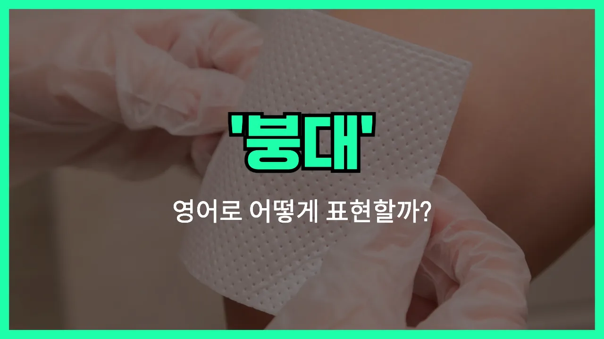

## 🌟 영어 표현 - bandage

안녕하세요 👋 오늘은 일상에서 자주 쓰이는 단어인 '**붕대**'의 영어 표현 '**bandage**'에 대해 알아보려고 해요.

'**bandage**'는 상처가 났을 때 그 부위를 감싸서 보호하거나 지혈할 때 사용하는 천이나 재질을 말해요. 즉, **상처를 감싸고 보호하는 도구**를 의미해요!

이 단어는 병원, 약국, 또는 집에서 다쳤을 때 등 다양한 상황에서 자연스럽게 사용돼요. 예를 들어, 손가락을 베었을 때 "Can you give me a bandage?"라고 말할 수 있어요.

또는, "He wrapped a bandage around his ankle."라고 하면 "그는 발목에 붕대를 감았어요."라는 뜻이에요.

'**bandage**'는 명사로 '붕대'라는 뜻이고, 동사로는 '붕대를 감다'라는 의미로도 쓸 수 있으니 상황에 맞게 활용해 보세요!

## 📖 예문

1. "상처에 붕대를 감아야 해요."

   "You need to put a bandage on the [wound](/blog/in-english/584.wound/)."

2. "그녀는 무릎에 붕대를 감고 있어요."

   "She is wearing a bandage on her knee."

## 💬 연습해보기

<ul data-interactive-list>

  <li data-interactive-item>
    밴드 있어요? 밖에서 농구하다가 무릎 좀 까졌거든요.
    Do you have a bandage? I scraped my knee playing basketball outside.
  </li>

  <li data-interactive-item>
    상처 좀 심해 보여요. 밴드 붙이는 게 좋을 것 같아요.
    That cut looks pretty bad. You should put a bandage on it.
  </li>

  <li data-interactive-item>
    만일을 대비해서 항상 가방에 밴드 몇 개는 챙겨 다녀요.
    I always keep a couple of bandages in my bag, just <a href="/blog/in-english/253.in-case/">in case</a>.
  </li>

  <li data-interactive-item>
    내 손가락 밴드 좀 감아 줄래요? 요리하다가 깎였거든요.
    Can you help me bandage my finger? I <a href="/blog/in-english/314.accidentally/">accidentally</a> <a href="/blog/vocab-1/008.cut-it/">cut it</a> while <a href="/blog/in-english/461.cook/">cooking</a>.
  </li>

  <li data-interactive-item>
    간호사가 상처 소독하고 새 밴드 붙여 줬어요.
    The <a href="/blog/in-english/564.nurse/">nurse</a> cleaned the wound and put a fresh bandage over it.
  </li>

  <li data-interactive-item>
    감염되지 않게 매일 밴드 갈아주는 게 좋아요.
    You should change your bandage every day so it doesn't get infected.
  </li>

  <li data-interactive-item>
    등산 중에 발목을 삐었는데 다행히 누가 밴드를 갖고 있었어요.
    He twisted his ankle during the hike, but luckily someone had a bandage.
  </li>

  <li data-interactive-item>
    보도턱에 걸려서 팔꿈치에 밴드 붙여야 해요.
    I tripped over the curb, and now I need a bandage for my elbow.
  </li>

  <li data-interactive-item>
    엄마는 상처가 빨리 낫도록 밴드 감는 법을 항상 잘 아세요.
    Mom always knows how to bandage a scratch so it heals faster.
  </li>

  <li data-interactive-item>
    걱정 마요, 작은 상처예요. 밴드 하나 붙이면 금방 나아요.
    Don't worry, it's just a small cut. A little bandage will <a href="/blog/in-english/524.fix/">fix</a> it right up.
  </li>

</ul>

## 🤝 함께 알아두면 좋은 표현들

### dress a wound

'dress a wound'는 "상처를 소독하고 붕대 등으로 치료하다"라는 뜻이에요. 단순히 붕대를 감는 것뿐만 아니라, 상처를 깨끗이 하고 필요한 처치를 하는 전체 과정을 말해요.

- "The nurse carefully dressed the wound to [prevent](/blog/in-english/290.prevent/) [infection](/blog/in-english/577.infection/)."
- "간호사가 감염을 막기 위해 상처를 꼼꼼히 치료해줬어요."

### leave a wound open

'[leave](/blog/in-english/402.leave/) a wound open'은 "상처를 덮지 않고 그대로 두다"라는 의미예요. 때로는 상처가 더 빨리 낫거나 덜 감염되게 하려고 붕대나 거즈로 덮지 않고 두는 경우를 말해요.

- "The [doctor](/blog/in-english/563.doctor/) advised to leave the wound open so it could heal faster."
- "의사 선생님이 상처가 더 빨리 낫게 그냥 두라고 하셨어요."

### apply a plaster

'apply a plaster'는 "반창고를 붙이다"라는 뜻이에요. 작은 상처나 베인 곳에 간단하게 붙이는 반창고를 사용할 때 쓰는 표현이에요. 일상에서 자주 쓰여요.

- "She applied a plaster to her finger after accidentally cutting it while cooking."
- "요리하다가 손가락을 베어서 반창고를 붙였어요."

---

오늘은 '**붕대**'라는 뜻을 가진 영어 표현 '**bandage**'에 대해 알아봤어요. 혹시 다치거나 누군가를 도와줄 때 이 표현을 떠올리면 좋겠어요 😊

오늘 배운 표현과 예문들을 꼭 최소 3번씩 소리 내서 읽어보세요. 다음에도 더 재미있고 유익한 영어 표현으로 찾아올게요! 감사합니다!

