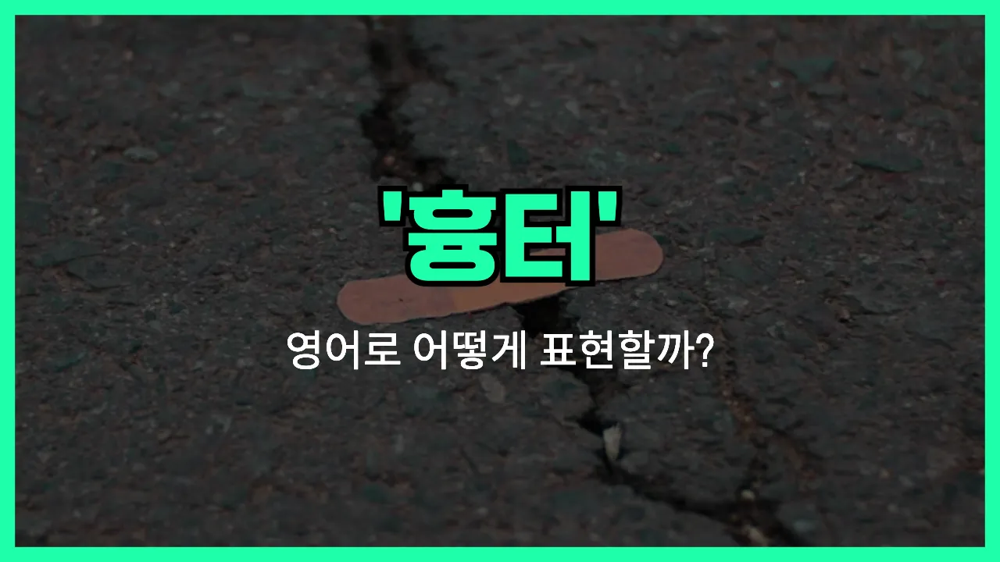

## 🌟 영어 표현 - scar

안녕하세요 👋 오늘은 '흉터', '상처 자국'이라는 뜻을 가진 영어 표현을 소개해드릴게요. 바로 '**scar**'라는 단어예요.

'**scar**'는 피부에 남은 상처 자국, 즉 **다친 후에 남는 흔적**을 의미해요. 단순히 피부에 남는 자국뿐만 아니라, 마음에 남는 상처(트라우마)에도 비유적으로 쓸 수 있어요!

일상 대화에서는 넘어지거나 다쳤을 때 남은 자국을 말할 때 자주 사용해요. 예를 들어, 어릴 때 다친 무릎에 남은 자국을 설명할 때 "I have a scar on my knee from when I was a child."라고 할 수 있어요.

또한, 'scar'는 동사로도 쓰여서 '흉터를 남기다'라는 뜻이 돼요. 예를 들어, "The accident scarred him for life."라고 하면 '그 사고가 평생 그에게 상처를 남겼다'는 의미예요.

## 📖 예문

1. "그녀의 얼굴에 작은 흉터가 있어요."

   "She has a small scar on her face."

2. "수술 후에 흉터가 남았어요."

   "There is a scar [left](/blog/in-english/402.leave/) after the [surgery](/blog/in-english/572.surgery/)."

## 💬 연습해보기

<ul data-interactive-list>

  <li data-interactive-item>
    어릴 때 자전거에서 넘어져서 무릎에 흉터가 있어요.
    I've got a scar on my knee from when I fell off my bike as a kid.
  </li>

  <li data-interactive-item>
    그가 그 얘기는 별로 안 하려고 하는데, 헤어진 일이 마음에 깊은 상처를 남긴 게 느껴져요.
    He doesn't like to talk about it, but you can tell the breakup left an emotional scar.
  </li>

  <li data-interactive-item>
    그 개에게 물린 상처가 팔에 흉한 자국을 남겼어요.
    That dog bite left a nasty scar on her arm.
  </li>

  <li data-interactive-item>
    작년 수술한 자국이 아직도 남아 있어요.
    She's <a href="/blog/in-english/254.still/">still</a> got scars from her surgery last year.
  </li>

  <li data-interactive-item>
    이제는 흉터가 거의 안 보이지만, 예전에는 훨씬 눈에 띄었어요.
    You can <a href="/blog/in-english/078.barely/">barely</a> see the scar now, but it <a href="/blog/in-english/171.used/">used</a> to be a lot more noticeable.
  </li>

  <li data-interactive-item>
    어떤 흉터는 시간이 지나면서 희미해지지만, 어떤 건 평생 남아요.
    Some scars fade with time, but others stick around forever.
  </li>

  <li data-interactive-item>
    그는 농담으로 넘기지만, 그 경험이 정말 그를 마음에 상처 입혔다는 게 보여요.
    He jokes about it, but you can tell that whole <a href="/blog/in-english/415.experience/">experience</a> really scarred him.
  </li>

  <li data-interactive-item>
    그 사고는 제 형에게 신체적뿐 아니라 정신적으로도 큰 상처를 남겼어요.
    The accident scarred my brother, not just physically, but mentally too.
  </li>

  <li data-interactive-item>
    맞아요, 저도 수두 자국이 있어요. 그 자국들이 전혀 없어지지 않더라고요.
    Yeah, I've got scars from chickenpox. They never really went away.
  </li>

  <li data-interactive-item>
    어릴 때 그 영화 봐서 평생 마음에 트라우마가 남았어요.
    Watching that movie as a little kid scarred me for life.
  </li>

</ul>

## 🤝 함께 알아두면 좋은 표현들

### wound

'[wound](/blog/in-english/584.wound/)'는 '상처'라는 뜻으로, 신체적이거나 감정적인 상처 모두를 의미할 수 있어요. 'scar'가 상처가 아물고 남은 흔적이라면, 'wound'는 아직 치유되지 않은 상태의 상처를 말해요.

- "The wound on his arm took weeks to heal."
- "그의 팔에 난 상처는 몇 주나 지나서야 아물었어요."

### heal

'heal'은 '치유되다', '낫다'라는 뜻이에요. 'scar'가 상처가 남아 흔적으로 남는 것이라면, 'heal'은 상처가 완전히 회복되어 흔적이 없어지는 것을 강조해요. 즉, 'scar'의 반대 개념이에요.

- "It took her a long time to heal after the accident."
- "그녀는 사고 이후에 회복하는 데 오랜 시간이 걸렸어요."

### trauma

'trauma'는 '트라우마', 즉 심리적 충격이나 정신적인 상처를 의미해요. 'scar'가 신체적 흔적일 수도 있지만, 'trauma'는 주로 마음에 남는 깊은 상처를 말할 때 써요.

- "The trauma from his childhood still affects him today."
- "그는 어린 시절의 트라우마가 아직도 영향을 주고 있어요."

---

오늘은 '흉터', '상처 자국'이라는 뜻을 가진 영어 표현 '**scar**'에 대해 알아봤어요. 혹시 다치거나 상처가 남았을 때 이 단어를 떠올려보면 좋겠어요 😊

오늘 배운 표현과 예문들을 꼭 최소 3번씩 소리 내서 읽어보세요. 다음에도 더 재미있고 유익한 영어 표현으로 찾아올게요! 감사합니다!

