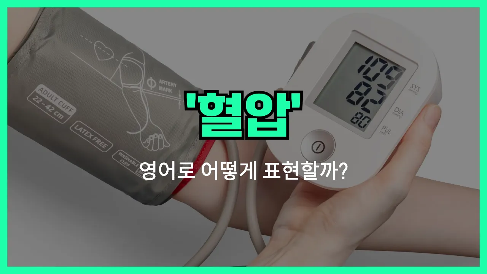

## 🌟 영어 표현 - blood pressure

안녕하세요 👋 오늘은 건강과 관련된 중요한 영어 표현, 바로 '**혈압**'에 대해 알아보려고 해요. 영어로 '혈압'은 '**blood pressure**'라고 해요. 이 표현은 우리 몸의 혈관을 따라 흐르는 피가 혈관 벽에 미치는 압력을 의미해요.

'Blood pressure'는 건강검진이나 병원에서 자주 듣게 되는 단어예요. 특히 고혈압(High blood pressure)이나 저혈압(Low blood pressure)처럼 건강 상태를 설명할 때 꼭 필요한 표현이에요!

예를 들어, 병원에서 "혈압을 재다"는 영어로 "measure blood pressure" 또는 "check blood pressure"라고 할 수 있어요. 또, "혈압이 높아요"는 "My blood pressure is high."라고 표현해요.

## 📖 예문

1. "혈압을 재고 싶어요."

   "I want to check my blood pressure."

2. "혈압이 정상이에요."

   "My blood pressure is normal."

3. "고혈압이 있어요."

   "I have high blood pressure."

## 💬 연습해보기

<ul data-interactive-list>

  <li data-interactive-item>
    어제 병원 다녀왔는데 혈압 재봤어요.
    I went to the <a href="/blog/in-english/563.doctor/">doctor</a> yesterday and they checked my blood pressure.
  </li>

  <li data-interactive-item>
    집에서 혈압 재는 방법 알아요?
    Do you know how to measure blood pressure at home?
  </li>

  <li data-interactive-item>
    우리 아빠 요즘 몇 주간 혈압이 좀 높으셨대요.
    My dad's blood pressure has been a little high the last few weeks.
  </li>

  <li data-interactive-item>
    운동을 자주 하면 혈압을 낮출 수 있다고 하더라고요.
    They say exercising <a href="/blog/in-english/252.regularly/">regularly</a> can help lower your blood pressure.
  </li>

  <li data-interactive-item>
    어지럼증 느꼈으면 혈압 한번 꼭 체크해 보는 게 좋을 것 같아요.
    You should <a href="/blog/in-english/281.probably/">probably</a> get your blood pressure checked if you've been feeling dizzy.
  </li>

  <li data-interactive-item>
    직접 관리하려고 혈압계 하나 샀어요.
    I bought a blood pressure cuff just <a href="/blog/in-english/253.in-case/">in case</a> I need to monitor it myself.
  </li>

  <li data-interactive-item>
    가끔 스트레스가 혈압에 진짜 영향을 줘요.
    <a href="/blog/in-english/270.sometimes/">Sometimes</a> stress can really affect my blood pressure levels.
  </li>

  <li data-interactive-item>
    병원 가면 항상 긴장돼서 혈압이 올라가요.
    I usually get <a href="/blog/in-english/115.nervous/">nervous</a> at the doctor's office and my blood pressure goes up.
  </li>

  <li data-interactive-item>
    혈압이 보통 어느 정도가 정상인지 아세요?
    What's considered a normal blood pressure <a href="/blog/in-english/436.read/">reading</a> anyway?
  </li>

  <li data-interactive-item>
    그분은 혈압 조절하려고 매일 약 먹으세요.
    She takes medication every day to keep her blood pressure under control.
  </li>

</ul>

## 🤝 함께 알아두면 좋은 표현들

### hypertension

'hypertension'은 "고혈압"을 의미하는 의학 용어예요. 혈압이 정상 범위보다 높을 때를 말하며, 건강에 여러 가지 위험을 초래할 수 있어서 주의가 필요해요.

- "My doctor told me I have hypertension and need to watch my diet."
- "의사 선생님이 저보고 고혈압이 있으니까 식단을 조심해야 한다고 하셨어요."

### hypotension

'hypotension'은 "저혈압"을 뜻하는 단어예요. 혈압이 정상보다 낮은 상태를 말하며, 어지러움이나 피로 같은 증상이 나타날 수 있어요.

- "She sometimes feels dizzy because of her hypotension."
- "그녀는 저혈압 때문에 가끔 어지러움을 느껴요."

### vital signs

'vital signs'는 "생명 징후"라는 뜻으로, 혈압뿐만 아니라 맥박, 호흡, 체온 등 건강 상태를 확인할 때 측정하는 기본적인 신체 지표들을 통틀어 말해요.

- "The [nurse](/blog/in-english/564.nurse/) checked my vital signs before the doctor came in."
- "간호사 선생님이 의사 선생님이 오시기 전에 제 생명 징후를 확인하셨어요."

---

오늘은 건강을 지키는 데 꼭 알아야 할 영어 표현 '**blood pressure**'에 대해 알아봤어요. 병원이나 건강 관련 대화에서 이 표현을 자연스럽게 써보면 좋겠어요 😊

오늘 배운 표현과 예문들을 꼭 소리 내서 여러 번 읽어보세요. 다음에도 더 유익한 영어 표현으로 찾아올게요! 감사합니다!

