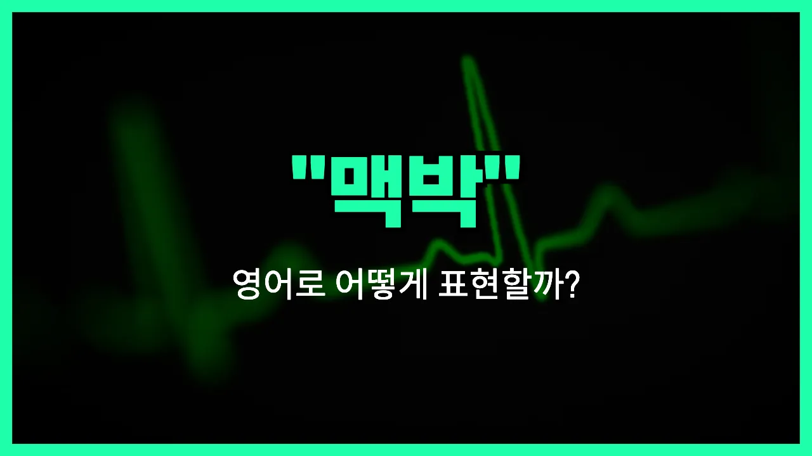

## 🌟 영어 표현 - pulse

안녕하세요 👋 오늘은 우리가 일상에서 자주 듣는 단어, '**맥박**'을 영어로 어떻게 표현하는지 알아보려고 해요. 바로 '**pulse**'라는 단어인데요. 이 단어는 **심장이 뛰면서 혈관을 따라 느껴지는 박동**을 의미해요. 즉, 손목이나 목에서 느껴지는 '두근두근'하는 맥의 움직임을 말할 때 사용해요!

'Pulse'는 주로 건강, 의학, 운동 등 다양한 상황에서 쓰여요. 예를 들어, 병원에서 간호사가 "맥박을 재다"라고 할 때 "check your pulse"라고 표현해요. 또, 운동을 하다가 심장이 빨리 뛸 때 "My pulse is racing"이라고 말할 수 있어요.

이 단어는 명사로 '맥박', '박동'이라는 뜻으로 쓰이고, 동사로는 '맥박이 뛰다', '진동하다'라는 의미도 있어요. 상황에 따라 다양하게 활용할 수 있으니 꼭 기억해 두세요!

## 📖 예문

1. "의사가 내 맥박을 쟀어요."

   "The [doctor](/blog/in-english/563.doctor/) checked my pulse."

2. "운동 후에 맥박이 빨라졌어요."

   "My pulse became faster after exercising."

## 💬 연습해보기

<ul data-interactive-list>

  <li data-interactive-item>
    운동하고 나서 심장이 막 뛰고 귀에서 두근거림이 느껴졌어요.
    My heart was racing and I could feel my pulse pounding in my ears after that workout.
  </li>

  <li data-interactive-item>
    잠깐 맥박 좀 체크해볼게요. 팔은 편하게 해주세요.
    Let me check your pulse for a second. Just relax your arm.
  </li>

  <li data-interactive-item>
    그 소식에 진짜 심장이 막 뛰었어요. 전혀 예상 못했거든요!
    That <a href="/blog/in-english/536.news/">news</a> really got my pulse up. I didn't expect it at all!
  </li>

  <li data-interactive-item>
    도시가 정말 신나는 분위기예요. 뉴욕 밤 거리에 맥박이 느껴져요.
    The city has such an exciting vibe. You can really feel the pulse of New York at night.
  </li>

  <li data-interactive-item>
    손목에서 맥박을 못 찾는 게 정상일까요?
    Is it normal if you can't find your pulse in your wrist?
  </li>

  <li data-interactive-item>
    저는 최신 음악에 대해 감을 잘 잡고 있는 것 같아요.
    I feel like I've got my finger on the pulse <a href="/blog/in-english/269.when-it-comes-to/">when it comes to</a> new music.
  </li>

  <li data-interactive-item>
    테스트 결과가 나오는 걸 보고 그녀 맥박이 빨라졌어요.
    Her pulse quickened when she saw the test results coming in.
  </li>

  <li data-interactive-item>
    이 영화는 내내 심장 박동을 빠르게 만들어요.
    This movie keeps your pulse racing the whole time.
  </li>

  <li data-interactive-item>
    콘서트에서 관중들의 흥분된 분위기를 느낄 수 있었어요.
    I could sense the pulse of excitement in the crowd at the concert.
  </li>

  <li data-interactive-item>
    그는 긴장하려고 했지만, 큰 면접 전에 맥박이 확실히 빨라졌어요.
    He <a href="/blog/in-english/117.try-to/">tried to</a> stay <a href="/blog/in-english/380.calm/">calm</a>, but his pulse was definitely speeding up before the big interview.
  </li>

</ul>

## 🤝 함께 알아두면 좋은 표현들

### heartbeat

'heartbeat'은 '심장 박동' 또는 '심장이 뛰는 소리'를 의미해요. 'pulse'와 비슷하게 몸의 생명 신호를 나타내는 말로, 주로 감정이 격해지거나 긴장될 때 심장이 빨리 뛰는 상황을 묘사할 때도 자주 써요.

- "My heartbeat raced when I saw my exam results."
- "시험 결과를 봤을 때 심장이 엄청 빨리 뛰었어요."

### flatline

'flatline'은 원래 의료 용어로 심장 박동이 멈춰서 심전도 그래프가 일직선이 되는 상태를 말해요. 일상적으로는 '활기가 없다', '정체되어 있다'는 의미로도 쓰여서 'pulse'의 반대 느낌을 줄 때 사용해요.

- "The party started to flatline after midnight, so people began to [leave](/blog/in-english/402.leave/)."
- "자정이 지나고 나서 파티 분위기가 완전히 가라앉아서 사람들이 하나둘 떠나기 시작했어요."

### vibe

'vibe'는 '분위기'나 '느낌'을 뜻하는데, 어떤 장소나 사람, 상황에서 느껴지는 에너지나 활기를 표현할 때 써요. 'pulse'처럼 생동감이나 활력을 나타낼 때 자주 사용돼요.

- "This café has such a cool vibe; I love coming here to relax."
- "이 카페는 분위기가 정말 좋아서 여기 와서 쉬는 걸 정말 좋아해요."

---

오늘은 '맥박', '맥', '심장박동'이라는 뜻을 가진 영어 표현 '**pulse**'에 대해 알아봤어요. 건강이나 운동 이야기할 때 이 단어를 떠올리면 좋겠어요 😊

오늘 배운 표현과 예문들을 꼭 소리 내서 여러 번 읽어보세요. 다음에도 더 유익한 영어 표현으로 찾아올게요! 감사합니다!
