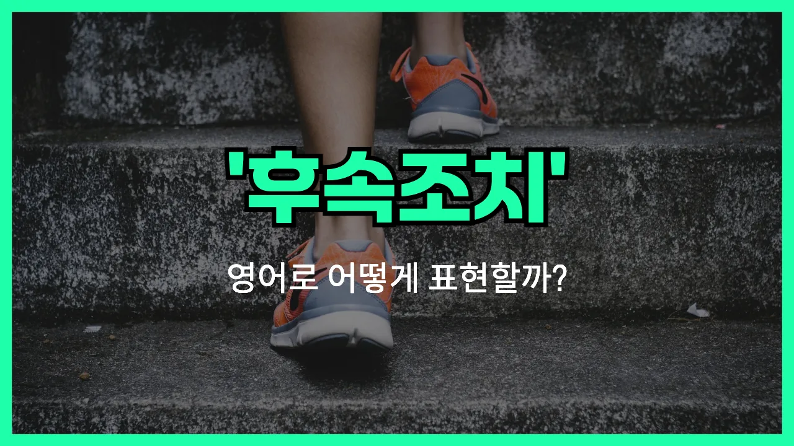

## 🌟 영어 표현 - follow up

안녕하세요 👋 오늘은 일상이나 업무에서 자주 쓰이는 영어 표현 '**follow up**'에 대해 이야기해보려고 해요. '**follow up**'은 우리말로 '**후속 조치하다**', '**추적하다**', '**확인하다**'라는 뜻을 가지고 있어요.

이 표현은 어떤 일이나 요청, 약속 등이 잘 진행되고 있는지 **다시 확인하거나 추가로 조치할 때** 자주 사용돼요. 예를 들어, 누군가에게 이메일을 보냈는데 답장이 오지 않을 때 다시 연락하는 것도 'follow up'이라고 해요.

또한, 업무에서 프로젝트 진행 상황을 체크하거나, 병원에서 진료 후 추가 검사를 받는 상황 등 다양한 곳에서 자연스럽게 쓸 수 있어요. 예를 들어, "I'll follow up with you next week."라고 하면 "다음 주에 다시 연락드릴게요."라는 의미가 돼요.

## 📖 예문

1. "회의 후에 후속 조치를 하겠습니다."

   "I will follow up after the meeting."

2. "고객에게 다시 연락해서 확인해 주세요."

   "Please follow up with the customer to confirm."

## 💬 연습해보기

<ul data-interactive-list>

  <li data-interactive-item>
    프로젝트 관련해서 다음 주에 다시 연락할게요. 저한테 답변 없으면 리마인더 하나만 보내줘요.
    I'll follow up with you next week about the project. Just <a href="/blog/in-english/292.send/">send</a> me a reminder if you don't hear back from me.
  </li>

  <li data-interactive-item>
    혹시 벌써 병원에 연락해 봤어요? 검사 결과 잘 받았길 바랄게요.
    Have you followed up with your <a href="/blog/in-english/563.doctor/">doctor</a> yet? I <a href="/blog/성공하면-좋겠어-영어표현/">hope</a> you got your test results.
  </li>

  <li data-interactive-item>
    인터뷰 후에 후속 연락을 안 해서 관심 없는 줄 알았나 봐요.
    He <a href="/blog/in-english/023.forget/">forgot</a> to follow up after the interview, so they <a href="/blog/in-english/281.probably/">probably</a> thought he wasn't interested.
  </li>

  <li data-interactive-item>
    어제 보낸 이메일에 대해 다시 확인해봐야 해요. 아직 답장이 없네요.
    I need to follow up on that email I sent yesterday. They <a href="/blog/in-english/254.still/">still</a> haven't replied.
  </li>

  <li data-interactive-item>
    회의 끝나고 유용한 노트랑 링크 보내서 잘 챙겨줬어요.
    After our meeting, she followed up with some helpful notes and links.
  </li>

  <li data-interactive-item>
    지금은 시간이 없어서 고객 지원 쪽에 대신 문의 좀 해줄 수 있어요?
    Can you follow up with customer support for me? I don't have time <a href="/blog/in-english/525.right-now/">right now</a>.
  </li>

  <li data-interactive-item>
    오늘 오후에 그 채용 지원서 다시 확인해볼 거예요. 좋은 결과 있길 바라요!
    I'm going to follow up on that job application this afternoon. Fingers crossed!
  </li>

  <li data-interactive-item>
    선생님이 학생한테 추가 도움이 필요한지 확인 차 다시 연락했어요.
    The teacher followed up with the student to see if she needed <a href="/blog/in-english/265.extra/">extra</a> help.
  </li>

  <li data-interactive-item>
    환급 관련해서 꼭 다시 확인해 봐야 돼요. 추가 정보가 필요할 수도 있거든요.
    Don't forget to follow up about your reimbursement. They might need more info.
  </li>

  <li data-interactive-item>
    좋은 대화 나눴는데 아직 후속 조치를 못 했어요.
    We had a good conversation, but I haven't had a chance to follow up yet.
  </li>

</ul>

## 🤝 함께 알아두면 좋은 표현들

### check in

'check in'은 상대방의 상태나 진행 상황을 확인하기 위해 연락하거나 방문하는 것을 의미해요. 주로 누군가의 안부를 묻거나, 이전에 진행된 일에 대해 간단히 확인할 때 사용해요.

- "I just wanted to check in and see how your project is going."
- "그냥 네 프로젝트가 어떻게 되고 있는지 확인하고 싶어서 연락했어요."

### let it go

'let it go'는 어떤 일이나 상황에 대해 더 이상 신경 쓰지 않고 그냥 넘기거나 잊어버리는 것을 의미해요. 즉, 추가적인 확인이나 조치를 하지 않고 그만두는 상황에서 사용해요. 'follow up'의 반대되는 의미예요.

- "If you don't get a response, maybe it's best to just let it go."
- "답장이 없으면 그냥 넘기는 게 제일 나을 수도 있어요."

### touch base

'touch base'는 누군가와 잠깐 연락해서 상황을 확인하거나 정보를 주고받는다는 뜻이에요. 주로 업무상에서 간단히 소통하거나, 진행 상황을 공유할 때 많이 써요.

- "Let's touch base next week to discuss the details."
- "다음 주에 자세한 내용을 논의하려고 잠깐 연락해보자고요."

---

오늘은 '**후속 조치하다**', '**추적하다**', '**확인하다**'라는 뜻을 가진 영어 표현 '**follow up**'에 대해 알아봤어요. 앞으로 업무나 일상에서 뭔가를 다시 확인하거나 추가로 조치할 일이 있을 때 이 표현을 떠올려 보세요 😊

오늘 배운 표현과 예문들을 꼭 최소 3번씩 소리 내서 읽어보세요. 다음에도 더 재미있고 유익한 영어 표현으로 찾아올게요! 감사합니다!

