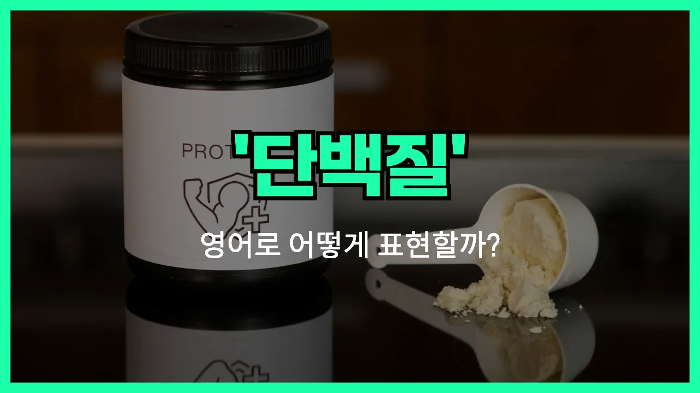

## 🌟 영어 표현 - protein

안녕하세요 👋 오늘은 우리가 건강을 위해 자주 듣는 단어, '**단백질**'의 영어 표현에 대해 알아보려고 해요. 바로 '**protein**'이라는 단어인데요. 이 단어는 우리 몸을 구성하는 중요한 영양소 중 하나를 의미해요.

'**Protein**'은 근육, 피부, 머리카락, 손톱 등 우리 몸의 여러 부분을 만드는 데 꼭 필요한 성분이에요. 그래서 운동을 하거나 건강을 챙길 때 '단백질을 충분히 섭취하세요'라는 말을 자주 듣게 되죠. 영어로도 똑같이 'protein'이라고 해요!

이 단어는 음식, 건강, 운동 등 다양한 상황에서 자연스럽게 사용돼요. 예를 들어, 달걀, 닭가슴살, 두부, 콩 등은 모두 단백질이 풍부한 음식이에요. 영어로는 'Eggs are a good source of protein.'처럼 표현할 수 있어요.

또한, '단백질 보충제'는 영어로 'protein supplement'라고 해요. 운동하는 분들이 자주 찾는 제품이죠!

## 📖 예문

1. "이 음식에는 단백질이 많이 들어 있어요."

   "This food contains a lot of protein."

2. "운동 후에는 단백질을 섭취하는 것이 좋아요."

   "It's good to consume protein after exercising."

## 💬 연습해보기

<ul data-interactive-list>

  <li data-interactive-item>
    요즘 헬스장 다니면서 단백질을 좀 더 챙겨 먹으려고 노력하고 있어요.
    I'm <a href="/blog/in-english/117.try-to/">trying to</a> eat more protein lately since I started going to the <a href="/blog/in-english/431.gym/">gym</a>.
  </li>

  <li data-interactive-item>
    그릭 요거트가 단백질 공급원이 엄청 좋다는 거 알고 있었어요?
    Did you know Greek yogurt is a great source of protein?
  </li>

  <li data-interactive-item>
    아침 스무디에 단백질 파우더를 보통 좀 넣어요.
    I usually add some protein powder to my morning smoothie.
  </li>

  <li data-interactive-item>
    의사 선생님이 고기를 별로 안 먹으니까 단백질을 더 챙기라고 하더라고요.
    My <a href="/blog/in-english/563.doctor/">doctor</a> said I should get more protein because I don't eat a lot of meat.
  </li>

  <li data-interactive-item>
    계란은 단백질도 많고 가격도 착해서 좋아요.
    Eggs have a lot of protein and they're pretty cheap too.
  </li>

  <li data-interactive-item>
    얘는 항상 이거에 단백질이 충분한지 꼭 물어봐요.
    He's always asking if something has enough protein in it.
  </li>

  <li data-interactive-item>
    샐러드를 만들긴 했는데 단백질을 깜빡해서 아직도 배가 고파요.
    I made a salad, but I <a href="/blog/in-english/023.forget/">forgot</a> to add any protein so I'm <a href="/blog/in-english/254.still/">still</a> <a href="/blog/in-english/437.hungry/">hungry</a>.
  </li>

  <li data-interactive-item>
    그녀는 주중에 단백질 보충하려고 닭가슴살을 미리 준비해 놓는 걸 좋아해요.
    She likes to <a href="/blog/in-english/528.meal/">meal</a> prep grilled chicken for <a href="/blog/in-english/265.extra/">extra</a> protein during the week.
  </li>

  <li data-interactive-item>
    아침 먹을 시간이 없을 때는 가끔 단백질 바를 챙겨 먹기도 해요.
    <a href="/blog/in-english/270.sometimes/">Sometimes</a> I grab a protein bar if I'm <a href="/blog/in-english/174.in-a-hurry/">in a hurry</a> and can't eat breakfast.
  </li>

  <li data-interactive-item>
    근육을 키우고 싶으면 단백질 섭취를 정말 잘 신경 써야 해요.
    If you want to build muscle, you really have to watch your protein intake.
  </li>

</ul>

## 🤝 함께 알아두면 좋은 표현들

### lean protein

'lean protein'은 "저지방 단백질"을 의미해요. 지방 함량이 낮고 단백질이 풍부한 식품(닭가슴살, 생선, 두부 등)을 가리킬 때 자주 써요. 건강이나 다이어트에 신경 쓸 때 많이 사용하는 표현이에요.

- "Chicken breast is a great source of lean protein for people trying to eat healthy."
- "닭가슴살은 건강하게 먹으려는 사람들에게 좋은 저지방 단백질 공급원이에요."

### carbohydrate

'carbohydrate'는 "탄수화물"을 뜻해요. 단백질과는 반대되는 영양소로, 주로 에너지원으로 사용돼요. 식단이나 영양에 대해 이야기할 때 단백질과 함께 자주 비교해서 쓰는 말이에요.

- "If you want to [lose](/blog/in-english/457.lose/) weight, you might need to reduce your carbohydrate intake."
- "살을 빼고 싶으면 탄수화물 섭취를 줄여야 할 수도 있어요."

### plant-based protein

'plant-based protein'은 "식물성 단백질"을 의미해요. 고기나 동물성 식품이 아닌 콩, 두부, 견과류 등 식물에서 얻는 단백질을 말할 때 써요. 채식주의자나 건강을 생각하는 사람들이 자주 사용하는 표현이에요.

- "Many vegetarians get their protein from plant-based sources like beans and lentils."
- "많은 채식주의자들은 콩이나 렌틸콩 같은 식물성 식품에서 단백질을 얻어요."

---

오늘은 '**단백질**'이라는 뜻을 가진 영어 표현 '**protein**'에 대해 알아봤어요. 건강이나 식단에 대해 이야기할 때 이 단어를 꼭 기억해두면 좋겠어요 😊

오늘 배운 표현과 예문들을 꼭 최소 3번씩 소리 내서 읽어보세요. 다음에도 더 재미있고 유익한 영어 표현으로 찾아올게요! 감사합니다!

