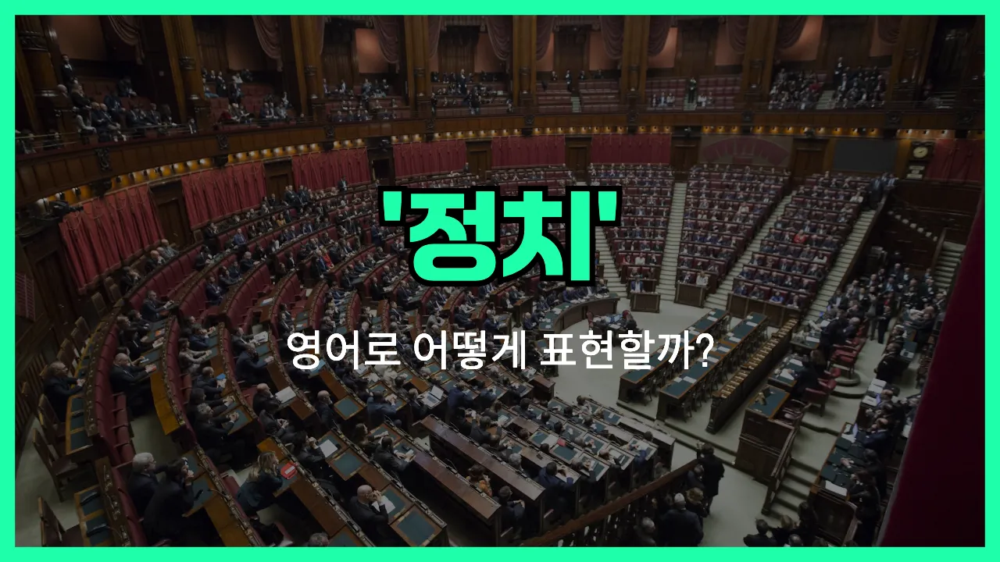

## 🌟 영어 표현 - politics

안녕하세요 👋 오늘은 우리가 자주 듣는 단어인 '**정치**'를 영어로 어떻게 표현하는지 알아보려고 해요. 바로 '**politics**'라는 단어를 사용해요.

'**politics**'는 나라나 사회의 중요한 문제를 결정하는 과정, 즉 **정치 활동이나 정치 체계**를 의미해요. 정부, 선거, 정책, 정당 등과 관련된 모든 활동을 포괄하는 단어예요.

이 단어는 뉴스, 토론, 학교 수업 등 다양한 상황에서 자주 등장해요. 예를 들어, "나는 정치에 관심이 많아요."라고 말하고 싶을 때 "I'm interested in politics."라고 표현할 수 있어요.

또한, 'politics'는 때로는 **정계**라는 뜻으로도 쓰여요. 예를 들어, "그는 정계에 입문했어요."는 "He entered politics."라고 할 수 있어요.

## 📖 예문

1. "정치는 모든 사람의 삶에 영향을 미쳐요."

   "Politics affects everyone's life."

2. "요즘 정치에 대해 많이 배우고 있어요."

   "I'm [learning](/blog/in-english/245.learn/) a lot about politics [these days](/blog/in-english/417.these-days/)."

## 💬 연습해보기

<ul data-interactive-list>

  <li data-interactive-item>
    솔직히 정치 얘기는 별로 안 하려고 해요. 하면 다들 싸우기만 하더라고요.
    <a href="/blog/in-english/336.honestly/">Honestly</a>, I try not to get <a href="/blog/in-english/274.involve/">involved</a> in politics too much. It just gets people <a href="/blog/in-english/132.argue/">arguing</a>.
  </li>

  <li data-interactive-item>
    우리 아빠는 저녁 식탁에서 정치 얘기 엄청 좋아하셔서 다들 짜증 내요.
    My dad loves to talk about politics at the dinner table. It drives everyone crazy.
  </li>

  <li data-interactive-item>
    최근 정치 이슈 들었어요? 요즘 뉴스가 진짜 난리예요.
    Did you hear about the latest in politics? The <a href="/blog/in-english/536.news/">news</a> has been wild lately.
  </li>

  <li data-interactive-item>
    정치 이야기가 항상 막 뜨거운 논쟁으로 끝나지 않았으면 좋겠어요.
    <a href="/blog/in-english/118.i-wish/">I wish</a> politics didn't always <a href="/blog/vocab-1/039.end-up/">end up</a> in such heated debates.
  </li>

  <li data-interactive-item>
    고등학교 때 정치 조금 배웠는데 대체로 헷갈리기만 했어요.
    We learned a little bit about politics in my high school, but most of it confused me.
  </li>

  <li data-interactive-item>
    친구들이랑 만날 땐 정치 이야기 안 하려고 해요. 그래야 분위기 편하니까요.
    My friends and I avoid talking politics when we <a href="/blog/in-english/127.hang-out/">hang out</a>. It just keeps things chill.
  </li>

  <li data-interactive-item>
    회사에서 특히 선거철 되면 항상 정치 얘기 나와요.
    Politics comes up all the time at work, especially during election season.
  </li>

  <li data-interactive-item>
    정치에 관심 있어요, 아니면 그냥 빠지고 싶은 편이에요?
    Are you interested in politics, or do you <a href="/blog/in-english/191.prefer/">prefer</a> to stay out of it?
  </li>

  <li data-interactive-item>
    가끔은 정치가 그냥 티비에서 사람들이 서로 소리 지르는 것 같아 보여요.
    <a href="/blog/in-english/270.sometimes/">Sometimes</a> I feel like politics is just a bunch of people yelling at each other on TV.
  </li>

  <li data-interactive-item>
    정치 이해하고 싶으면 뉴스 일주일만 봐 보세요. 완전 피곤해요!
    If you ever want to understand politics, just try watching the news for a week. It's exhausting!
  </li>

</ul>

## 🤝 함께 알아두면 좋은 표현들

### government

'government'는 "정부"를 의미하며, 정치와 밀접하게 연관된 단어예요. 정치가 국가를 운영하는 방식이나 과정이라면, 정부는 실제로 그 과정을 실행하는 조직이나 기관을 말해요.

- "The government announced new policies to [improve](/blog/in-english/394.improve/) education."
- "정부가 교육을 개선하기 위한 새로운 정책을 발표했어요."

### apolitical

'apolitical'은 "정치에 관심이 없는" 또는 "정치와 무관한"이라는 뜻이에요. 정치에 관여하지 않거나 정치적인 논의에 참여하지 않는 태도나 사람을 가리킬 때 사용해요.

- "She prefers to stay apolitical and doesn't discuss elections."
- "그녀는 정치에 관심이 없어서 선거 얘기는 하지 않아요."

### partisan

'partisan'은 "특정 정당이나 정치적 입장을 강하게 지지하는 사람"을 의미해요. 정치에서 한쪽 편을 들거나 편파적인 태도를 보일 때 자주 쓰여요.

- "The debate became heated as both sides grew more partisan."
- "토론이 진행될수록 양쪽 모두 더 편파적으로 변해서 분위기가 뜨거워졌어요."

---

오늘은 '**정치**'라는 뜻을 가진 영어 표현 '**politics**'에 대해 알아봤어요. 앞으로 뉴스나 책에서 이 단어를 보면 오늘 배운 내용을 떠올려 보세요 😊

오늘 배운 표현과 예문들을 꼭 최소 3번씩 소리 내서 읽어보세요. 다음에도 더 재미있고 유익한 영어 표현으로 찾아올게요! 감사합니다!
