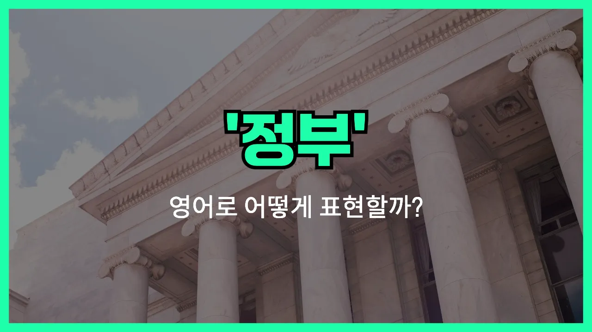

## 🌟 영어 표현 - government

안녕하세요 👋 오늘은 우리가 자주 듣는 단어인 '**정부**'의 영어 표현 '**government**'에 대해 알아보려고 해요.

'**government**'는 한 나라나 지역을 다스리고 관리하는 조직이나 기관을 의미해요. 즉, **행정**이나 **국가**의 운영을 담당하는 주체를 말할 때 쓰는 단어예요!

이 단어는 정치, 사회, 뉴스 등 다양한 상황에서 자주 등장해요. 예를 들어, 새로운 정책이 발표될 때 "The government announced a new policy."라고 할 수 있어요.

또한, "정부가 경제를 지원하고 있어요."라는 말을 영어로 표현하면 "The government is supporting the economy."가 돼요.

'**government**'는 주로 명사로 사용되며, 국가의 공식적인 조직이나 행정 체계를 나타낼 때 아주 유용하게 쓸 수 있어요. 상황에 따라 중앙정부(central government), 지방정부(local government) 등으로도 확장해서 사용할 수 있으니 참고해 주세요!

## 📖 예문

1. "정부가 새로운 법을 만들었어요."

   "The government made a new law."

2. "정부는 국민의 안전을 최우선으로 생각해요."

   "The government puts the safety of its people first."

## 💬 연습해보기

<ul data-interactive-list>

  <li data-interactive-item>
    정부가 새로운 세금 정책을 방금 발표했어요. 오늘 아침 뉴스에서 다 나오더라고요.
    The government just announced a new tax policy. It's all over the <a href="/blog/in-english/536.news/">news</a> this morning.
  </li>

  <li data-interactive-item>
    아빠가 정부에서 일하시니까 어릴 때 이사도 많이 다녔어요.
    My dad works for the government, so we had to move a lot when I was a kid.
  </li>

  <li data-interactive-item>
    허리케인에 정부가 어떻게 대응했는지 봤어요? 저는 꽤 잘한 것 같아요.
    Did you see how the government responded to the hurricane? I think they did a pretty good job.
  </li>

  <li data-interactive-item>
    사람들이 정부가 의료비에 더 많이 써야 한다고 항상 논쟁하잖아요.
    People are always debating whether the government should <a href="/blog/in-english/258.spend/">spend</a> more on healthcare.
  </li>

  <li data-interactive-item>
    정부 지원 신청하려고 하는데 서류가 너무 복잡해서 힘들어요.
    I'm <a href="/blog/in-english/117.try-to/">trying to</a> apply for some government <a href="/blog/in-english/511.assistance/">assistance</a>, but the forms are so complicated.
  </li>

  <li data-interactive-item>
    어제 시내에서 정부 반대하는 큰 시위가 있었어요.
    There was a big protest downtown against the government yesterday.
  </li>

  <li data-interactive-item>
    정부가 내 정보를 잘 지켜줄 거라고 믿어요?
    Do you trust the government to keep your information safe?
  </li>

  <li data-interactive-item>
    다음 달에 정부가 마을에 있는 오래된 건물 몇 개를 폐쇄할 거래요.
    The government is shutting down some old buildings in town next month.
  </li>

  <li data-interactive-item>
    시민 수업에서 정부 구조에 대해 배우고 있어요.
    In my civics class, we're <a href="/blog/in-english/245.learn/">learning</a> about how the government is structured.
  </li>

  <li data-interactive-item>
    대중교통에 문제가 생기면 항상 정부가 욕 먹잖아요.
    Whenever there's an issue with public transportation, everyone blames the government.
  </li>

</ul>

## 🤝 함께 알아두면 좋은 표현들

### administration

'administration'은 '정부'와 비슷하게 사용되지만, 주로 특정 정부의 집행부나 행정 조직을 가리킬 때 써요. 예를 들어, 대통령이나 총리가 이끄는 집권 세력을 말할 때 자주 사용돼요.

- "The new administration plans to [introduce](/blog/in-english/262.introduce/) several economic reforms."
- "새 행정부는 여러 가지 경제 개혁을 도입할 계획이에요."

### the private sector

'the private sector'는 '민간 부문'이라는 뜻으로, 정부(공공 부문)와 반대되는 개념이에요. 즉, 개인이나 기업이 운영하는 부분을 말할 때 사용해요.

- "Many people believe the private sector is more [efficient](/blog/in-english/286.efficient/) than the government."
- "많은 사람들이 민간 부문이 정부보다 더 효율적이라고 생각해요."

### public authority

'public authority'는 '공공 기관'이나 '공공 권한'을 의미해요. 정부와 비슷하게 공공의 이익을 위해 일하는 조직이나 기관을 가리킬 때 사용돼요.

- "The public authority is responsible for maintaining the city's parks."
- "공공 기관이 도시 공원을 관리하는 책임을 맡고 있어요."

---

오늘은 '**정부**'라는 뜻을 가진 영어 표현 '**government**'에 대해 알아봤어요. 앞으로 뉴스나 기사에서 이 단어가 나오면 바로 이해할 수 있겠죠? 😊

오늘 배운 표현과 예문들을 꼭 최소 3번씩 소리 내서 읽어보세요. 다음에도 더 재미있고 유익한 영어 표현으로 찾아올게요! 감사합니다!

