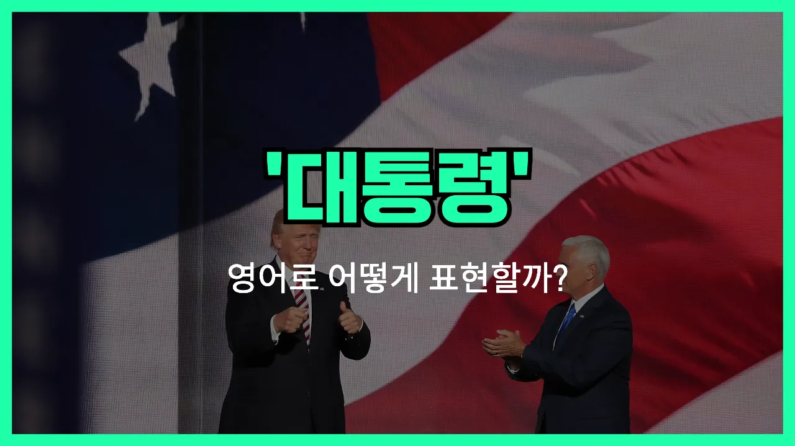

## 🌟 영어 표현 - president

안녕하세요 👋 오늘은 우리가 자주 듣는 단어, '**대통령**'을 영어로 어떻게 표현하는지 알아볼 거예요. 바로 '**president**'라는 단어를 사용해요.

'**president**'는 한 나라의 최고 지도자인 '대통령'을 뜻할 때 가장 많이 쓰여요. 하지만 이 단어는 회사나 단체의 '회장', '총재'와 같이 어떤 조직의 대표를 의미할 때도 자주 사용돼요!

예를 들어, 미국 대통령을 말할 때는 'the President of the United States'라고 하고, 회사의 회장을 말할 때는 'the president of the company'라고 해요.

이처럼 '**president**'는 정치뿐만 아니라 비즈니스, 학교 등 다양한 분야에서 대표를 가리키는 데 쓰이는 아주 중요한 단어예요.

## 📖 예문

1. "그는 미국의 대통령이에요."

   "He is the president of the United States."

2. "우리 회사의 회장은 내일 회의에 참석해요."

   "The president of our company will attend the meeting tomorrow."

## 💬 연습해보기

<ul data-interactive-list>

  <li data-interactive-item>
    어젯밤에 대통령님이 TV에서 연설하셨어요. 부모님은 거실에서 보고 계셨죠.
    The president gave a speech on TV last night. My parents were watching it in the living room.
  </li>

  <li data-interactive-item>
    다음 대선에서 대통령 투표할 생각 있어요? 누굴 더 좋아할지 아직 못 정했어요.
    Are you planning to <a href="/blog/in-english/615.vote/">vote</a> for president in the next <a href="/blog/in-english/614.election/">election</a>? I can't decide who I like more.
  </li>

  <li data-interactive-item>
    제 조카가 학교에서 반장으로 뽑혔어요. 진짜 신나했어요!
    My nephew got elected class president at his school. He was so excited!
  </li>

  <li data-interactive-item>
    우리 회사 사장님이 은퇴하신대요. 모두 깜짝 놀랐어요.
    The president of our company just announced he's retiring. Everyone's in shock.
  </li>

  <li data-interactive-item>
    미국 초대 대통령이 누구인지 말할 수 있어요? 그 질문은 늘 퀴즈에 나와요.
    Can you name who the first president of the United States was? That question always comes up in trivia.
  </li>

  <li data-interactive-item>
    야간 프로그램에서 대통령님 농담했는데, 은근 재미있었어요.
    They made a joke about the president during the <a href="/blog/in-english/391.late/">late</a> night show. It was actually pretty funny.
  </li>

  <li data-interactive-item>
    우리 아파트 동대표가 회장 있는데 회의에선 한 번도 본 적 없어요.
    Our homeowners association has a president, but no one ever sees him at the meetings.
  </li>

  <li data-interactive-item>
    대통령님이 진짜 다 결정한다고 생각해요, 아니면 팀워크가 더 중요한가요?
    Do you think the president really makes all the big decisions, or is it more of a team effort?
  </li>

  <li data-interactive-item>
    대통령님이 세계 지도자들과 악수하는 사진 봤어요. 되게 공식적이더라고요.
    I saw a picture of the president <a href="/blog/in-english/460.shake/">shaking</a> hands with world leaders. It looked so official.
  </li>

  <li data-interactive-item>
    누구랑 저녁식사 할 수 있다면 대통령님이 꼭 들어갈 것 같아요. 이야기를 직접 듣고 싶거든요.
    If I could have dinner with anyone, I think the president would be high on my list. Just to hear their <a href="/blog/in-english/537.story/">stories</a>.
  </li>

</ul>

## 🤝 함께 알아두면 좋은 표현들

### head of state

'head of state'는 "국가의 대표자" 또는 "국가 원수"라는 뜻이에요. 대통령뿐만 아니라 왕이나 여왕 등 국가를 대표하는 모든 최고 지도자를 가리킬 때 쓰여요. 공식적인 자리나 뉴스에서 자주 사용돼요.

- "The head of state attended the international summit to discuss climate change."
- "국가 원수가 기후 변화에 대해 논의하기 위해 국제 정상 회의에 참석했어요."

### prime minister

'[prime minister](/blog/in-english/610.prime-minister/)'는 "총리"라는 뜻으로, 대통령과는 달리 내각을 이끄는 정부 수반을 의미해요. 대통령제 국가가 아닌, 의원내각제 국가에서 주로 사용되는 표현이에요.

- "The prime minister announced new economic policies during the [press conference](/blog/in-english/606.press-conference/)."
- "총리가 기자회견에서 새로운 경제 정책을 발표했어요."

### citizen

'citizen'은 "시민" 또는 "국민"이라는 뜻으로, 대통령과는 반대되는 개념이에요. 즉, 국가를 이끄는 사람이 아니라 국가의 구성원 중 한 명을 의미해요.

- "Every citizen has the right to vote in the election."
- "모든 시민은 선거에서 투표할 권리가 있어요."

---

오늘은 '대통령', '회장', '총재'라는 뜻을 가진 영어 표현 '**president**'에 대해 알아봤어요. 앞으로 뉴스나 영화에서 이 단어가 나오면 바로 이해할 수 있겠죠? 😊

오늘 배운 표현과 예문들을 꼭 소리 내서 여러 번 읽어보세요. 다음에도 더 유익한 영어 표현으로 찾아올게요! 감사합니다!
