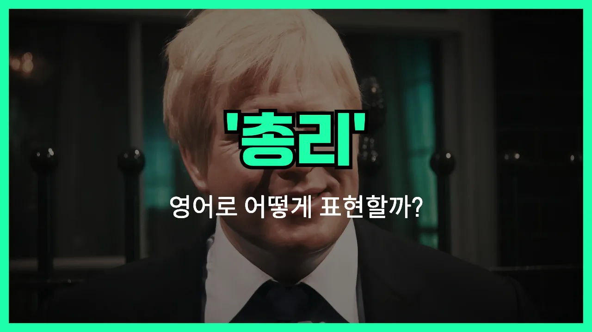

## 🌟 영어 표현 - prime minister

안녕하세요 👋 오늘은 '총리'라는 뜻을 가진 영어 표현을 알아보려고 해요. 바로 '**prime minister**'라는 단어인데요. 이 표현은 한 나라의 정부를 이끄는 **최고 행정 책임자**를 의미해요. 우리나라에서는 '국무총리'라고 부르기도 하고, 영국, 캐나다, 호주 등 여러 나라에서 사용되는 공식 직함이에요!

'prime'는 '최고의', '주요한'이라는 뜻이고, 'minister'는 '장관'이나 '관리'를 의미해요. 그래서 'prime minister'는 '최고의 장관', 즉 **정부의 수장**이라는 의미로 쓰여요.

이 표현은 정치, 뉴스, 역사 등 다양한 상황에서 자주 등장해요. 예를 들어, "The prime minister will visit the United States next week."라고 하면 "총리가 다음 주에 미국을 방문할 예정이에요."라는 뜻이에요.

## 📖 예문

1. "영국의 총리는 오늘 연설을 했어요."

   "The prime minister of the UK gave a speech today."

2. "새로운 총리가 임명되었어요."

   "A new prime minister has been appointed."

## 💬 연습해보기

<ul data-interactive-list>

  <li data-interactive-item>
    어젯밤에 총리님이 TV에서 연설하셨어요. 오늘 아침에 직장에서 모두 그 이야기를 하더라고요.
    The prime minister gave a speech on TV last night. Everyone at work was talking about it this morning.
  </li>

  <li data-interactive-item>
    지난주에 총리님이 우리 도시에 오신 거 봤어요? 뉴스에서 난리가 났었어요.
    Did you see the prime minister visit our city last week? It was all over the <a href="/blog/in-english/536.news/">news</a>.
  </li>

  <li data-interactive-item>
    솔직히 말하면 지금 총리님 이름을 항상 까먹거든요. 검색해야 해요.
    <a href="/blog/in-english/336.honestly/">Honestly</a>, I can never remember the name of the current prime minister. I always have to Google it.
  </li>

  <li data-interactive-item>
    곧 총리님이 법에 대해 새로운 변화를 발표할 거라고 하더라고요.
    They said the prime minister might announce some new changes to the law soon.
  </li>

  <li data-interactive-item>
    우리 아빠는 총리님이 경제를 위해 한 일들을 정말 존경하세요.
    My dad really admires the prime minister for what she's done with the economy.
  </li>

  <li data-interactive-item>
    학교에서 총리님이 일을 잘하는지 토론회를 했어요.
    The students at school had a debate about whether the prime minister is <a href="/blog/vocab-1/025.do-a-good-job/">doing a good job</a>.
  </li>

  <li data-interactive-item>
    캐나다에 갔을 때 대통령 대신 총리님이 있다는 걸 알게 됐어요.
    When I visited Canada, I <a href="/blog/in-english/245.learn/">learned</a> that they have a prime minister <a href="/blog/in-english/169.instead-of/">instead of</a> a <a href="/blog/in-english/609.president/">president</a>.
  </li>

  <li data-interactive-item>
    총리님 인터뷰 봤는데 진짜 소탈해 보였어요.
    I watched an interview with the prime minister, and he seemed really down to earth.
  </li>

  <li data-interactive-item>
    사람들이 항상 우리 총리님을 다른 나라 지도자랑 비교하더라고요.
    People are always comparing our prime minister to leaders of other countries.
  </li>

  <li data-interactive-item>
    선거 때 다들 다음 총리가 누가 될지 계속 추측하고 있었어요.
    During the <a href="/blog/in-english/614.election/">election</a>, everyone was speculating about who would become the next prime minister.
  </li>

</ul>

## 🤝 함께 알아두면 좋은 표현들

### head of government

'head of [government](/blog/in-english/608.government/)'는 "정부의 수장" 또는 "행정부의 최고 책임자"라는 뜻이에요. 보통 한 나라의 행정권을 실질적으로 행사하는 사람을 가리키며, 영국이나 일본처럼 총리가 있는 나라에서는 총리를, 미국처럼 대통령 중심제인 나라에서는 대통령을 의미할 수 있어요.

- "The head of [government](/blog/in-english/608.government/) is responsible for setting national policies and leading the cabinet."
- "정부의 수장은 국가 정책을 정하고 내각을 이끄는 역할을 해요."

### president

'[president](/blog/in-english/609.president/)'는 "대통령"이라는 뜻으로, 일부 국가에서는 총리 대신 대통령이 국가의 행정 수반 역할을 해요. 대통령은 국민의 직접 선거로 뽑히는 경우가 많고, 총리와는 달리 국가 원수와 행정부 수반의 역할을 동시에 맡는 경우가 많아요.

- "In the United States, the president serves as both the head of state and the head of government."
- "미국에서는 대통령이 국가 원수이자 행정부의 수장 역할을 동시에 해요."

### monarch

'monarch'는 "군주"라는 뜻으로, 왕이나 여왕처럼 세습적으로 국가를 다스리는 사람을 말해요. 총리와는 달리, 군주는 주로 상징적인 역할을 하거나, 일부 국가에서는 실질적인 권력을 행사하기도 해요. 총리와는 반대되는 개념으로 볼 수 있어요.

- "In the United Kingdom, the monarch is the head of state, while the prime minister is the head of government."
- "영국에서는 군주가 국가 원수이고, 총리가 정부의 수장이에요."

---

오늘은 '총리', '수상', '행정수반'이라는 뜻을 가진 영어 표현 '**prime minister**'에 대해 알아봤어요. 앞으로 뉴스나 기사에서 이 표현이 나오면 바로 이해할 수 있겠죠? 😊

오늘 배운 표현과 예문들을 꼭 최소 3번씩 소리 내서 읽어보세요. 다음에도 더 재미있고 유익한 영어 표현으로 찾아올게요! 감사합니다!
