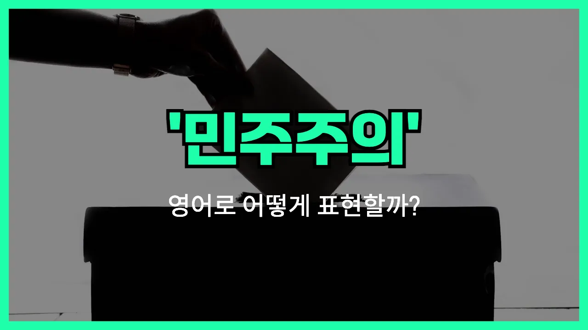

## 🌟 영어 표현 - democracy

안녕하세요 👋 오늘은 '민주주의'라는 뜻을 가진 영어 표현을 알아보려고 해요. 바로 '**democracy**'라는 단어인데요~

'**democracy**'는 국민이 직접 또는 대표를 통해 나라의 중요한 일을 결정하는 정치 체제를 의미해요. 즉, **국민의 자유와 평등을 바탕으로 모두가 참여할 수 있는 정치 시스템**을 말해요~

이 단어는 정치, 사회, 역사 등 다양한 분야에서 자주 사용돼요. 예를 들어, 한 나라가 국민의 의견을 존중하고 자유롭게 선거를 치르는 경우 "That country is a democracy."라고 표현할 수 있어요~

또한, "We should protect our democracy."라고 하면 "우리는 우리의 민주주의를 지켜야 해요."라는 의미가 돼요~

## 📖 예문

1. "한국은 민주주의 국가예요."

   "Korea is a democracy."

2. "모든 시민은 민주주의에서 중요한 역할을 해요."

   "Every citizen plays an [important](/blog/in-english/318.important/) role in a democracy."

## 💬 연습해보기

<ul data-interactive-list>

  <li data-interactive-item>
    민주주의는 권력 가진 사람들만 말하는 게 아니라 모든 사람이 의견을 낼 수 있다는 뜻이에요.
    Democracy means everyone gets a say, not just the ones <a href="/blog/in-english/044.in-charge/">in charge</a>.
  </li>

  <li data-interactive-item>
    오늘 학교에서 민주주의에 대해 배웠는데, 우리 정부가 어떻게 움직이는지 알게 되는 중요한 내용이에요.
    We <a href="/blog/in-english/245.learn/">learned</a> about democracy in school today. It's a big part of how our <a href="/blog/in-english/608.government/">government</a> works.
  </li>

  <li data-interactive-item>
    솔직히 민주주의가 가끔은 복잡하고 뒤죽박죽 같을 때도 있지만, 다른 방법보다는 훨씬 낫다고 생각해요.
    <a href="/blog/in-english/336.honestly/">Honestly</a>, I think democracy is <a href="/blog/in-english/352.messy/">messy</a> <a href="/blog/in-english/270.sometimes/">sometimes</a>, but it's better than the alternative.
  </li>

  <li data-interactive-item>
    민주주의가 제대로 작동하려면 투표 참여율이 진짜 중요해요.
    Voter turnout is important if we want our democracy to work like it should.
  </li>

  <li data-interactive-item>
    진짜 민주주의가 뭔지에 대해 많은 논쟁이 있어요.
    There's a lot of debate about what true democracy looks like.
  </li>

  <li data-interactive-item>
    우리 부모님은 우리가 민주주의 사회에 사는 게 얼마나 행운인지 항상 말씀하세요.
    My parents always tell me how lucky we are to live in a democracy.
  </li>

  <li data-interactive-item>
    민주주의는 모두가 동의해야 해서 느리게 느껴질 때도 있는데, 그게 바로 민주주의의 핵심이에요.
    Sometimes democracy feels slow because everyone has to <a href="/blog/in-english/342.agree/">agree</a>, but that's kind of the point.
  </li>

  <li data-interactive-item>
    민주주의에서는 항상 내가 원하는 대로 되는 건 아니지만, 적어도 내 목소리는 존중받는다는 점이 좋아요.
    With democracy, you might not always get your way, but <a href="/blog/in-english/167.at-least/">at least</a> your voice matters.
  </li>

  <li data-interactive-item>
    민주주의를 지키려고 애쓰는 나라들을 많이 봤어요.
    <a href="/blog/일주일-내내-비가온적도-있어-영어표현/">I've seen</a> countries struggle to keep their democracy strong.
  </li>

  <li data-interactive-item>
    요즘은 소셜 미디어가 민주주의 작동 방식에 진짜 큰 변화를 가져왔어요.
    Social media really changes how democracy works <a href="/blog/in-english/417.these-days/">these days</a>.
  </li>

</ul>

## 🤝 함께 알아두면 좋은 표현들

### republic

'republic'는 "공화국"이라는 뜻으로, 국민이 주권을 가지고 대표를 선출해 국가를 운영하는 정치 체제를 말해요. 민주주의와 비슷하게 국민의 의사가 중요하지만, 주로 대통령제나 의회제를 통해 대표자가 국가를 이끌어요.

- "France is a republic where the [president](/blog/in-english/609.president/) is elected by the people."
- "프랑스는 국민이 대통령을 직접 뽑는 공화국이에요."

### authoritarianism

'authoritarianism'은 "권위주의"라는 뜻으로, 소수의 지도자나 한 명의 권력자가 국민의 의견을 무시하고 강압적으로 통치하는 체제를 말해요. 민주주의와는 반대되는 개념이에요.

- "Under authoritarianism, citizens have little say in how the country is run."
- "권위주의 체제에서는 국민이 나라 운영에 거의 의견을 낼 수 없어요."

### dictatorship

'dictatorship'은 "독재정치" 또는 "독재 체제"를 의미해요. 한 사람이 모든 권력을 쥐고 국민의 자유와 권리를 제한하는 정치 형태로, 민주주의와는 완전히 반대되는 개념이에요.

- "The country suffered for years under a harsh dictatorship."
- "그 나라는 오랜 기간 동안 가혹한 독재정치 아래에서 고통받았어요."

---

오늘은 '민주주의'라는 뜻을 가진 영어 표현 '**democracy**'에 대해 알아봤어요. 자유와 평등, 그리고 국민의 참여를 강조할 때 이 단어를 떠올리면 좋겠죠? 😊

오늘 배운 표현과 예문들을 꼭 최소 3번씩 소리 내서 읽어보세요. 다음에도 더 재미있고 유익한 영어 표현으로 찾아올게요! 감사합니다!
